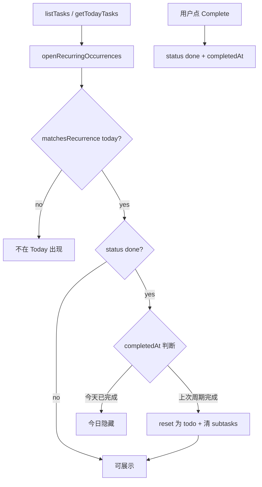

# Recurring Task 实现计划

> 为 Northstar 增加 recurring task：支持 daily / weekly（多选周几），采用「同一条任务、新周期 lazy reset」模型；Today 页只展示「今天该做」的任务；用户可配置错过周期是否补做（默认不补做）。

## 产品决策

| 决策 | 选择 |
|------|------|
| 数据模型 | **同一条任务**：完成后再到下次周期自动 reset 为 `todo`，保留 time entries 历史 |
| 错过周期 | **可配置** `recurrence_carry_over`；默认 **不补做**（等到下一个选定周几再出现） |

---

## 现状

- 任务模型在 [`src/lib/db/schema.ts`](src/lib/db/schema.ts)：`status`、`dueAt`、`completedAt`，**无 recurrence 字段**
- **Today 不是日历**：[`takeTopTasks`](src/lib/services/task-sorting.ts) 取 `status !== "done"` 的前 5 条 priority 任务，与「今天是否该做」无关
- **完成后不会复现**：`updateTask` 设 `status: "done"` + `completedAt`，无 reset 逻辑
- Priority 引擎 [`src/lib/priority/index.ts`](src/lib/priority/index.ts) 用 `dueAt` 算 deadline；`recentlyDonePenalty` 预留但未实现

---

## 推荐架构



**核心原则**：不新建 task 行；在新周期到来时 **lazy reset**（列表/Today 加载时触发），保留 time entries 历史。

---

## 1. 数据模型

在 `tasks` 表新增字段（Drizzle + [`init-sql.ts`](src/lib/db/init-sql.ts) + 新 migration `drizzle/0001_add_recurrence.sql`）：

| 字段 | 类型 | 默认 | 含义 |
|------|------|------|------|
| `recurrence_type` | TEXT | `'none'` | `none` \| `daily` \| `weekly` |
| `recurrence_days` | TEXT | null | JSON `[1,3,5]`，ISO 周几 1=Mon … 7=Sun；仅 `weekly` 使用 |
| `recurrence_carry_over` | INTEGER | 0 | 错过是否补做；**默认 false（不补做）** |

新增纯函数模块 [`src/lib/tasks/recurrence.ts`](src/lib/tasks/recurrence.ts)：

```typescript
type RecurrenceType = "none" | "daily" | "weekly";

function matchesRecurrenceDay(task, date: Date): boolean;
function isCompletedForToday(task, date: Date): boolean;
function shouldShowOnToday(task, date: Date): boolean;
function needsOccurrenceReset(task, date: Date): boolean;
```

**日/周匹配规则**：

- `daily`：每天都匹配
- `weekly`：`recurrence_days` 包含当天 weekday（至少选 1 天）
- `none`：行为与现在一致（非 done 即 active）

**补做逻辑**（`recurrence_carry_over`）：

- `false`（默认）：只在 `matchesRecurrenceDay` 为 true 的日子出现在 Today；错过则等到下一个选定周几
- `true`：若未完成且已过最近一次应做日，则在之后每天都继续出现在 Today，直到完成

**Reset 内容**（`openRecurringOccurrences`）：

- `status → "todo"`，`completedAt → null`
- 该 task 下所有 subtasks `isDone → false`（保留 subtask 定义与 sort order）
- 不改动 `createdAt`、time entries、priority 字段（recalc 时自然更新）

---

## 2. Service 层

修改 [`src/lib/services/tasks.ts`](src/lib/services/tasks.ts)：

- **`createTask`**：接受 `recurrenceType?`, `recurrenceDays?`, `recurrenceCarryOver?`
- **`updateTask`**：允许 PATCH recurrence 字段（编辑已有任务）
- **`openRecurringOccurrences(db, now?)`**：扫描 `recurrence_type != 'none'` 且 `needsOccurrenceReset` 的任务，批量 reset（在 transaction 内）
- **`listTasks` / `getTodayTasks`**：开头调用 `openRecurringOccurrences`

修改 [`src/lib/services/task-sorting.ts`](src/lib/services/task-sorting.ts)：

- 新增 `filterTasksDueToday(tasks, now?)` 替代 Today 用的单纯 `filterActiveTasks`
- `takeTopTasks` 改为：先 `filterTasksDueToday`，再 priority sort + slice

**Complete 行为不变**：仍 `PATCH { status: "done" }`；Today 侧通过 `isCompletedForToday` 隐藏，下一周期由 lazy reset 重新打开。

---

## 3. Priority 引擎微调

修改 [`src/lib/priority/index.ts`](src/lib/priority/index.ts)：

- 对 **今天该做的 recurring task**，若 `dueAt` 为空，临时用 **当天 end-of-day** 参与 `deadlinePressure`（让 recurring 在 Today 有合理 urgency）
- 可选：实现 `recentlyDonePenalty`——今日已完成的不进入 rerank（与 Today filter 一致，主要防 Tasks 板误排）

`rerankAll` 仍排除 `status === "done"`；reset 后任务重新进入 active 集合。

---

## 4. API

| 端点 | 变更 |
|------|------|
| `POST /api/tasks` | body 增加 recurrence 字段 |
| `PATCH /api/tasks/[id]` | 允许更新 recurrence 字段 |
| `GET /api/tasks` | 无新参数；服务端已 open occurrences |
| `GET /api/tasks/today`（推荐） | 封装 `getTodayTasks`，避免 Today 页双端逻辑漂移 |

---

## 5. UI / i18n

### 创建任务（[`src/app/tasks/page.tsx`](src/app/tasks/page.tsx)）

在标题输入下方增加轻量 recurrence 控件：

- Select：**不重复 / 每天 / 每周**
- 选「每周」时显示 weekday chips（Mon–Sun，多选）
- Toggle：**错过补做**（默认关），附简短说明

### TaskCard（[`src/components/task-card/`](src/components/task-card/)）

- [`task-metadata-badges.tsx`](src/components/task-card/task-metadata-badges.tsx)：显示 badge，如 `Daily`、`Mon, Wed`、可选 `补做`
- 编辑区（header 或 expandable）：允许修改 recurrence（复用同一组件）

### Today 页（[`src/app/today/page.tsx`](src/app/today/page.tsx)）

- 改用 `filterTasksDueToday` 或调用 `GET /api/tasks/today`

### i18n

更新 [`src/lib/i18n/messages/en.ts`](src/lib/i18n/messages/en.ts)、[`zh.ts`](src/lib/i18n/messages/zh.ts)、[`types.ts`](src/lib/i18n/types.ts)：`recurrence.daily`、`recurrence.weekly`、`recurrence.carryOver`、weekday 缩写等。

---

## 6. 测试

新增 [`src/lib/tasks/recurrence.test.ts`](src/lib/tasks/recurrence.test.ts)：

- daily：完成当天隐藏；次日 reset 并出现
- weekly Mon/Wed：周二不出现；周三 reset；默认不补做
- carryOver=true：周一未完成，周二仍出现
- weekly 无选中日：validation 拒绝创建

扩展 tasks service / sorting 集成测试（mock db 或现有 vitest 模式）。

---

## 7. 迁移与部署

- 新 SQL migration + [`migrations.ts`](src/lib/db/migrations.ts) 兼容逻辑
- 本地：`npm run db:migrate`；Turso 同步 migrate
- 现有任务默认 `recurrence_type = 'none'`，行为不变

---

## 不在 MVP 范围内

- Cron 午夜批量 reset（lazy reset 已足够；Vercel Cron 可后续加）
- 每 occurrence 独立 task 实例 / 完成历史页
- recurrence 结束日期、次数上限
- 子任务按 occurrence 独立进度（MVP 统一 reset）

---

## 实现顺序

1. Schema + migration + `recurrence.ts` 纯函数 + 单元测试
2. Service（open/reset/create/update）+ sorting/Today filter
3. API + priority 微调
4. UI（创建表单 + badge + 编辑）+ i18n
5. `npm test` + `npm run build` 验证

---

## Checklist

- [ ] Add recurrence columns to schema, init-sql, drizzle migration
- [ ] Implement `src/lib/tasks/recurrence.ts` + unit tests (daily/weekly/carryOver)
- [ ] `openRecurringOccurrences` + create/update/listTasks/getTodayTasks integration
- [ ] `filterTasksDueToday` + `takeTopTasks`; optional `GET /api/tasks/today`
- [ ] Recurring due-today deadline pressure in priority engine
- [ ] Create/edit recurrence UI, badges, en/zh strings
- [ ] Run `npm test` and `npm run build`
