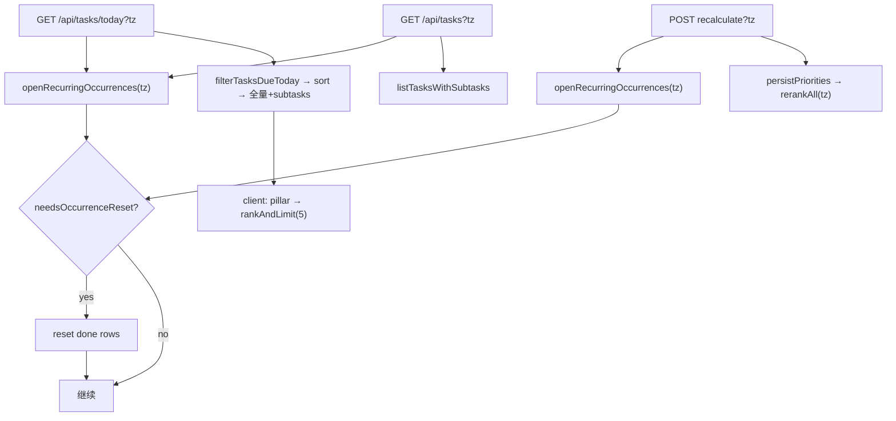

# Recurring Task 实现计划

> 为 Northstar 增加 recurring task：支持 daily / weekly（多选周几），采用「同一条任务、新周期 lazy reset」模型；Today 页只展示「今天该做」的任务；用户可配置错过周期是否补做（默认不补做）。

## 产品决策

| 决策 | 选择 |
|------|------|
| 数据模型 | **同一条任务**：完成后再到下次周期自动 reset 为 `todo`，保留 time entries 历史 |
| 错过周期 | **可配置** `recurrence_carry_over`；**仅 weekly** 可开；默认 **不补做** |
| 时区 | 边界用 IANA `tz`；**浏览器 UI 传 `clientTimezone()`**；**API query 缺省 `America/New_York`（EST/EDT）**；非法 tz → 400 |
| Today 数据源 | **必做** `GET /api/tasks/today?tz=`；**priority 预排序**的 due-today 全量 + subtasks；client **pillar filter → rankAndLimit(5)** |
| Tasks 板 | 不做日历过滤；`GET /api/tasks?tz=` 与 Today **同一 tz 源** |
| `dueAt` 与 recurrence | **互斥**：有 recurrence 则 `dueAt` 恒 null |
| `deferred` | Schema 保留；MVP 无 defer UI，不测 |
| `in_progress` | 与 `todo` 同等（可进 Today / 可 overdue） |
| lazy reset | **`openRecurringOccurrences(tz)`** 在 list / today / **recalculate 前**调用；须幂等 |
| MVP 交互 | Complete 后仍 **full reload**（无 optimistic）；reload 时带 tz |
| Priority + tz | recalculate 前 openOcc → `rerankAll(..., tz)` |

### MVP 已知限制

- [`onboarding/page.tsx`](src/app/onboarding/page.tsx) 用 raw `fetch("/api/tasks")` 无 tz——仅 create，不影响；首屏 Today/Tasks 才 openOcc
- daily 任务昨日 done、今日首次请求前 Tasks 板仍显示 done；`nextScheduledAfter` 可能显示「下次：今天」直到 list 触发 reset

---

## 时区约定

```typescript
// src/lib/tasks/timezone.ts — isomorphic
export const DEFAULT_TIMEZONE = "America/New_York"; // EST/EDT

/** missing/null/"" → DEFAULT；非法 IANA → throw InvalidTimezoneError（API 转 400） */
export function resolveTimezone(tz: string | null | undefined): string;
export function isValidTimezone(tz: string): boolean;
export function clientTimezone(): string;

/** tz 内 calendar +n 天（DST-safe，禁止裸 +86400000ms） */
export function addLocalDays(instant: Date, tz: string, days: number): Date;

/** 该 tz 下 local midnight 对应的 UTC instant（用于 getTime 比较） */
export function startOfLocalDay(instant: Date, tz: string): Date;
export function endOfLocalDay(instant: Date, tz: string): Date;
```

| 调用方 | tz |
|--------|-----|
| 浏览器 Today / Tasks / Recalculate | `clientTimezone()` |
| curl / 缺 `?tz=` | `America/New_York` |
| `?tz=Bad/Zone` | **400** |

**Client**：[`api-client.ts`](src/lib/api-client.ts) 对 `/api/tasks` 前缀 URL 自动 append `tz`（classify / reorder / breakdown 等多带无害）。

**Server**：仅 **list / today / recalculate-priorities** 读取 `tz`；其它 routes **忽略** 多余 `tz` query。

**时间比较**：`completedAt` 等 ISO 字符串 → **`Date.parse()` instant** vs `startOfLocalDay(...).getTime()`。

---

## 现状

- [`schema.ts`](src/lib/db/schema.ts) 无 recurrence 字段
- Today：pillar filter → `takeTopTasks(5)`（将改为 today API + `rankAndLimit`）
- Migration：runner bug + [`0000_drop_is_pinned.sql`](drizzle/0000_drop_is_pinned.sql) 裸 DROP 会在新库失败（§0e 修复）

---

## 推荐架构



---

## 0. Migration 策略（定稿）

**方案 A**：recurrence 列由 `addRecurrenceColumnsIfMissing` JS 条件 ADD；**不创建** `0001.sql`。

**单一入口**：[`applyMigrations`](src/lib/db/migrations.ts) 被 **app 启动**（[`db/index.ts`](src/lib/db/index.ts)）与 **`npm run db:migrate`**（[`src/scripts/migrate.ts`](src/scripts/migrate.ts)）共用——行为一致；Turso 用 `.env.local` 跑 `npm run db:migrate`。

### 0a. `applyMigrations` 流程

```typescript
async function applyMigrations(client, db) {
  await safeDropIsPinnedIfExists(client);
  await migrate(db, { migrationsFolder });           // journal 内仅 no-op 0000
  await addRecurrenceColumnsIfMissing(client);
}
```

### 0b. `safeDropIsPinnedIfExists`

`PRAGMA table_info(tasks)` 含 `is_pinned` → `ALTER TABLE tasks DROP COLUMN is_pinned`。

### 0c. init-sql 与 JS ADD

| 场景 | recurrence 列 |
|------|----------------|
| **全新库** | init-sql `CREATE TABLE tasks` **已含**三列 |
| **已有库（无列）** | `addRecurrenceColumnsIfMissing` |
| **列已存在** | PRAGMA 跳过（不 double ADD） |

### 0d. 验证

1. 删 `data/northstar.db` → 启动 app → `PRAGMA table_info` 含 `recurrence_*`
2. 旧库无 recurrence 列 → `npm run db:migrate`（本地或 Turso）→ 列出现
3. 重复 migrate / 重启 **不报错**
4. Turso prod：deploy 前跑 `npm run db:migrate`

### 0e. 0000 journal 修复（**必做，防新库失败**）

**问题**：fresh DB 上 `migrate()` 仍会执行 journal 内 0000；裸 `DROP COLUMN is_pinned` 失败。

**修复**（二步）：

1. 将 [`drizzle/0000_drop_is_pinned.sql`](drizzle/0000_drop_is_pinned.sql) **替换为 no-op**：
   ```sql
   -- legacy no-op: is_pinned drop handled by safeDropIsPinnedIfExists()
   SELECT 1;
   ```
2. 真实 drop 仅由 **`safeDropIsPinnedIfExists`**（在 `migrate()` **之前**）执行。

已 stamp 0000 的库：`migrate()` 跳过 SQL；若仍有 `is_pinned`，靠 `safeDrop` 兜底（若 stamp 了但列还在——仅 legacy 环境）。

---

## 1. 数据模型

[`schema.ts`](src/lib/db/schema.ts) + init-sql（Drizzle：`recurrenceType: text("recurrence_type")` 等）：

| 字段 | 类型 | 默认 |
|------|------|------|
| `recurrence_type` | TEXT | `'none'` |
| `recurrence_days` | TEXT | null — JSON `[1,3,5]` ISO 1=Mon…7=Sun |
| `recurrence_carry_over` | INTEGER | 0 |

### 类型与映射

```typescript
// src/lib/tasks/recurrence-types.ts — isomorphic，无 drizzle
export type RecurrenceType = "none" | "daily" | "weekly";
export type RecurrenceTaskFields = {
  recurrenceType: RecurrenceType;
  recurrenceDays: string | null;
  recurrenceCarryOver: boolean;
  status: string;
  completedAt: string | null;
};

export function parseRecurrenceDays(json: string | null): number[] | null;

/** Drizzle Task / API row → RecurrenceTaskFields；filter/openOcc/rerank 边界统一调用 */
export function toRecurrenceFields(task: {
  recurrenceType: RecurrenceType;
  recurrenceDays: string | null;
  recurrenceCarryOver: boolean;
  status: string;
  completedAt: string | null;
}): RecurrenceTaskFields;
```

[`recurrence.ts`](src/lib/tasks/recurrence.ts) 只接受 `RecurrenceTaskFields`；**不 import** `@/lib/db/schema`。

[`enrich-tasks.ts`](src/lib/tasks/enrich-tasks.ts) `TaskRow` 扩展三字段；[`test-fixtures.ts`](src/lib/test-fixtures.ts) `makeTask` 同步。

### 纯函数（`recurrence.ts` 再 export 或 re-export timezone helpers）

`matchesRecurrenceDay`, `lastScheduledOnOrBefore`, `nextScheduledAfter`, `isCompletedForToday`, `isOccurrenceOverdue`, `needsOccurrenceReset`, `shouldShowOnToday`, `virtualDeadlineForPriority`

### 核心定义

**`isCompletedForToday`**：

```
status === 'done' && completedAt != null
&& Date.parse(completedAt) >= startOfLocalDay(now, tz).getTime()
```

**`needsOccurrenceReset`**（**仅** `status === 'done'`）：

```
if recurrenceType === 'none' || status !== 'done': return false
if !matchesRecurrenceDay(task, now, tz): return false
if isCompletedForToday: return false
if completedAt != null && Date.parse(completedAt) < startOfLocalDay(now, tz).getTime(): return true
return false
```

**`shouldShowOnToday`**（`in_progress` ≡ `todo`）：

```
if recurrenceType === 'none': return status not in ('done', 'deferred')
if status === 'deferred': return false
if isCompletedForToday: return false
if matchesRecurrenceDay: return true
if weekly && recurrenceCarryOver && status !== 'done' && isOccurrenceOverdue: return true
return false
```

**`isOccurrenceOverdue`**（`status !== 'done'`）：

```
last = lastScheduledOnOrBefore(now, tz)
if !last: return false
if completedAt && Date.parse(completedAt) >= last.getTime(): return false
return now.getTime() >= last.getTime()
```

**`nextScheduledAfter`**（用 `addLocalDays`，非 +86400000ms）：

```
if recurrenceType === 'none': return null
cursor = startOfLocalDay(now, tz)
if status === 'done' && isCompletedForToday: cursor = addLocalDays(cursor, tz, 1)
for i in 0..365:
  if matchesRecurrenceDay(task, cursor, tz): return startOfLocalDay(cursor, tz)
  cursor = addLocalDays(cursor, tz, 1)
return null
```

**`virtualDeadlineForPriority`**：

```
if recurrenceType === 'none' || status === 'done': return null
if !shouldShowOnToday(task, now, tz): return null
return endOfLocalDay(now, tz)
```

**Validation**（[`src/lib/api/tasks/schemas.ts`](src/lib/api/tasks/schemas.ts) Zod）：weekly days ≥1；非法 JSON → 400；daily 强制 `recurrenceCarryOver=false`；PATCH daily 时清零 carryOver。

---

## 2. Service 层

[`tasks.ts`](src/lib/services/tasks.ts)（server-only）：

```typescript
openRecurringOccurrences(db, tz, now?)
// 全表 recurring；toRecurrenceFields + needsOccurrenceReset；transaction reset

listDueTodayTasksWithSubtasks(tz, now?)
// openOcc → filterTasksDueToday → sortTasks(priority) → attach subtasks

listTasksWithSubtasks(status?, sort?, tz?)
// openOcc → 全量

recalculatePriorities(tz)
// openOcc → persistPriorities(tz)
```

**删除**旧 `getTodayTasks(limit)` 或改为 `listDueTodayTasksWithSubtasks` 的 alias（无 slice）。

### Sorting

[`task-sorting.ts`](src/lib/services/task-sorting.ts)：

```typescript
filterTasksDueToday(tasks, tz, now?)  // map toRecurrenceFields → shouldShowOnToday
rankAndLimit(tasks, limit)              // sortTasks(priority) + slice；不过滤 status
takeTopTasks(tasks, limit)              // 保留：filterActiveTasks + rankAndLimit（旧 server/测试）
```

**Today client**：API due-pool 已无「今日已完成」→ **`rankAndLimit(filtered, 5)`**（非 `takeTopTasks`）。

> **测试说明**：`rankAndLimit` 单测可含 `done` 行以区分 `takeTopTasks`；**生产 Today 路径不会传入 done**。

---

## 3. Priority

[`persistPriorities(tz)`](src/lib/services/task-priority-sync.ts) → `rerankAll(..., tz)`：

```typescript
const virtualDue = virtualDeadlineForPriority(toRecurrenceFields(task), now, tz);
deadlinePressure(virtualDue?.toISOString() ?? task.dueAt, now);
```

`rerankAll` 仍排除 `status === 'done'`（openOcc 在 recalculate 前已 reset 该出现的任务）。

---

## 4. API

| 端点 | 读 `tz` | 行为 |
|------|---------|------|
| `GET /api/tasks?tz=` | ✓ | openOcc → listTasksWithSubtasks |
| **`GET /api/tasks/today?tz=`** | ✓ | openOcc → listDueTodayTasksWithSubtasks |
| **`POST .../recalculate-priorities?tz=`** | ✓ | openOcc → persistPriorities(tz) |
| POST/PATCH `/api/tasks` | — | Zod recurrence；ignore 多余 tz |
| classify / reorder / breakdown / … | — | ignore 多余 tz |

**Today 页**：`GET /api/tasks/today?tz=...` → enrich → pillar filter → `rankAndLimit(5)`。

---

## 5. UI / i18n

- **创建**（[`tasks/page.tsx`](src/app/tasks/page.tsx)）：不重复 / 每天 / 每周 + weekday chips；**carryOver 仅 weekly**
- **编辑**（TaskCard）：recurrence 控件 + PATCH；badge 用 `nextScheduledAfter` + `clientTimezone()`
- done recurring：「本周期已完成 · 下次 …」
- i18n：`recurrence.*`, `weekday.*`, `recurrence.subtaskResetHint`, `recurrence.carryOverWeeklyOnly`

---

## 6. 测试

[`recurrence.test.ts`](src/lib/tasks/recurrence.test.ts) — `tz=America/New_York`，冻结 `now`：

| 场景 | 期望 |
|------|------|
| daily，当天 complete | 不 show；次日 reset + show |
| daily，todo 跨日 | show，不 reset |
| daily，昨日 done、今日 openOcc 前 | badge next=今天；openOcc 后 todo |
| weekly Mon/Wed，周二 | 不 show |
| weekly Mon/Wed，周一 complete | 周一 hide；周三 reset + show |
| weekly Mon/Wed，Mon todo，Wed | Wed show |
| carryOver weekly Mon-only，Mon todo 周二 | 周二 show |
| `needsOccurrenceReset` + `status=todo` | never reset |
| 同日 openOcc 两次 | 仅首次 write |
| `nextScheduledAfter` Mon done → Tue 看 | next = Wed 00:00 local |
| `virtualDeadline` recurring todo 非 due 日 | null |
| `virtualDeadline` due 日 todo | endOfLocalDay |
| `completedAt` ISO vs startOfLocalDay | 跨 UTC 边界 |
| invalid `recurrence_days` | API 400 |
| invalid/missing `tz` | 400 / DEFAULT NY |
| `rankAndLimit` vs `takeTopTasks` | **单测**：前者可含 done；后者排除 |
| Today pillar → rankAndLimit(5) | 条数正确 |
| recalculate 前 openOcc | Wed schedule 当日 reset |
| migrate 新库 / 旧库 / Turso | §0d 四条 |

[`task-sorting.test.ts`](src/lib/services/task-sorting.test.ts)：保留 `takeTopTasks`；新增 `rankAndLimit`。

---

## 7. 部署

1. §0e 0000 no-op + `applyMigrations` 三步骤
2. schema + init-sql
3. `npm run db:migrate`（**本地 + Turso**）
4. `npm test` + `npm run build`

---

## 不在 MVP

defer UI、occurrence 历史、one-off due Today 过滤、optimistic UI、DST 专项测试（实现仍须 DST-safe day 算术）

---

## 实现顺序

1. `timezone.ts`（含 `addLocalDays`）+ `recurrence-types.ts` + §0 migration
2. `recurrence.ts` + tests
3. `openRecurringOccurrences` + services + 删旧 `getTodayTasks`
4. `rankAndLimit` + APIs + api-client tz + Today 页
5. `rerankAll(tz)` + fixtures/TaskRow
6. UI（create + edit + badges）+ Zod + i18n
7. 验证 §0d + test + build

---

## Checklist

- [ ] §0e：0000.sql → no-op；`safeDrop` + `addRecurrenceColumnsIfMissing`；migrate 脚本与 startup 共用
- [ ] `timezone.ts`：`addLocalDays`, `startOfLocalDay`, `endOfLocalDay`, `resolveTimezone`
- [ ] schema + init-sql + `recurrence-types.ts` + `toRecurrenceFields`
- [ ] `recurrence.ts` + full unit tests（§6 全表）
- [ ] `openRecurringOccurrences` on list / today / recalculate
- [ ] `listDueTodayTasksWithSubtasks`；移除旧 `getTodayTasks(limit)` slice
- [ ] `GET /api/tasks/today` + `rankAndLimit` on Today client
- [ ] api-client auto `tz`；list/today/recalc 读 tz，其它 ignore
- [ ] `persistPriorities(tz)` + `virtualDeadlineForPriority`
- [ ] `src/lib/api/tasks/schemas.ts` Zod
- [ ] UI：create + TaskCard edit recurrence + badges
- [ ] `makeTask` / `TaskRow`；migrate **本地 + Turso**；`npm test`；`npm run build`
