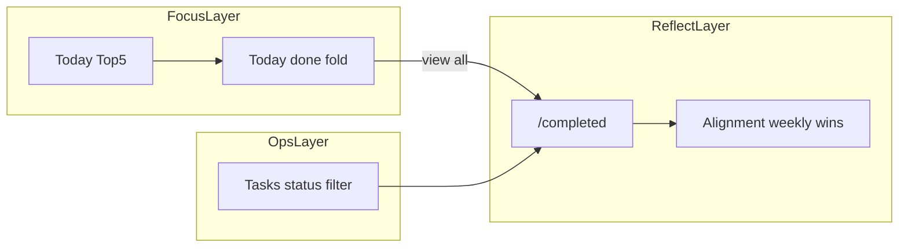
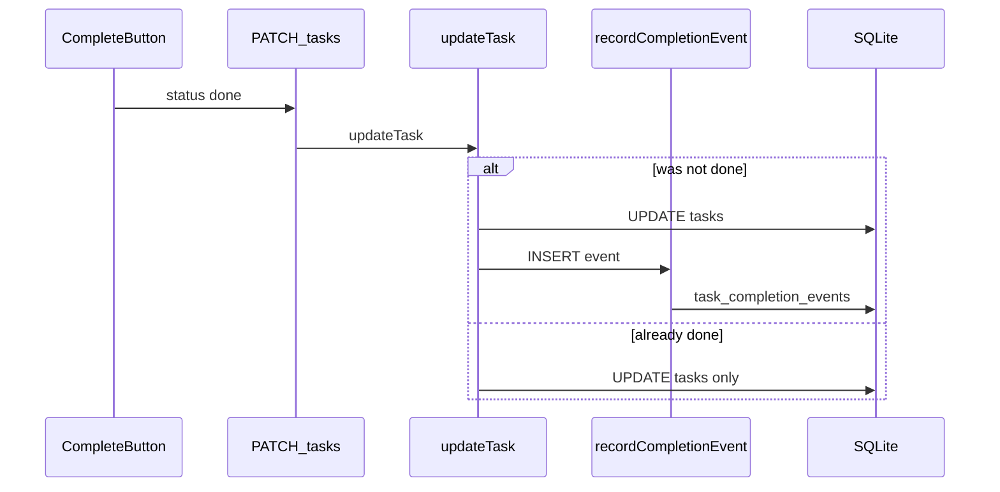

# 已完成任务可见性 — 实现计划

> 从 Northstar「战略对齐 + 今日聚焦」定位出发，补齐 **完成可见性**：Today 即时反馈、Tasks 运营视图、独立完成记录页、Alignment 本周汇总。  
> 依赖 recurring 已落地（[`design.md`](design.md) §6–§8）；本计划 **不改动** recurrence reset 语义，只追加 **不可变完成事件** 与 UI。

---

## 产品决策

| 决策 | 选择 |
|------|------|
| Today Top 5 | **仍只展示待办**；完成项不进 Top 5 |
| 即时反馈 | Today 底部 **可折叠**「今日已完成 · N」 |
| 运营视图 | Tasks 页 **状态分段**（默认「进行中」）+ **重新打开** |
| 完整历史 | 新页 **`/completed`** + nav 入口 |
| 战略叙事 | Alignment **「本周完成」** 按 pillar 摘要（不替代 `/completed`） |
| 持久化 | 新表 **`task_completion_events`**；reset / reopen **不删** event |
| 与 time_entries | **并列**：entries = 投了时间；events = 标记完成。Alignment 两者都展示 |
| tz | 与 tasks API 一致：query `tz` 缺省 `America/New_York`；浏览器 `clientTimezone()` |

### 不应做

- 把已完成塞回 Today Top 5（破坏聚焦）
- 无限 GTD 归档 / 全文搜索 / 导出（Phase 2）
- 按 event 撤销完成（仅 **reopen 当前 task 行**）
- 用 event 替代 time_entries 做对齐计算



---

## 现状与缺口

| 能力 | 现状 | 缺口 |
|------|------|------|
| Tasks 板 | `GET /api/tasks` 含 done；[`tasks/page.tsx`](src/app/tasks/page.tsx) 无 status 筛选 | done 沉底，无样式，用户以为「消失」 |
| Today | `GET /api/tasks/today` 仅 due-today **未完成** | 点完成后无反馈 |
| 重新打开 | `updateTask` 可清 `completedAt`；无 UI | 误完成无法恢复 |
| Recurring | lazy reset 清 `status/completedAt` | **无法**从 task 行追溯已 reset 周期 |
| API | 已有 `?status=done` | UI 未用；无按时间范围查历史 |
| Alignment | time logged + 拖延雷达 | 缺「完成了什么」叙事 |

[`design.md` §7.5](design.md) 写 Tasks 展示 active/done，**UI 未实现可发现的完成视图** — 本次要补的产品债。

---

## 1. 数据模型

### 1.1 新表 `task_completion_events`

与 [`time_entries`](src/lib/db/schema.ts) 并列；**openRecurringOccurrences 不删**。

| 字段 | 类型 | 说明 |
|------|------|------|
| `id` | TEXT PK | |
| `task_id` | TEXT NOT NULL | FK → tasks.id |
| `completed_at` | TEXT NOT NULL | ISO 完成瞬间 |
| `occurrence_date` | TEXT NOT NULL | 本地日 `YYYY-MM-DD`（分组 / 去重展示键，见 §1.2） |
| `task_title` | TEXT NOT NULL | 快照 |
| `pillar_id` | TEXT | 快照，可 null |
| `pillar_name` | TEXT | 快照，可 null；避免策略改名/删除后历史漂移 |
| `pillar_color` | TEXT | 快照，可 null；历史列表无需依赖当前 strategy |
| `focus_track` | TEXT | 快照，可 null |
| `recurrence_type` | TEXT NOT NULL | 完成时 `none` \| `daily` \| `weekly` |
| `created_at` | TEXT NOT NULL | 写入时间 |

**索引**（查询性能）：

- `(occurrence_date DESC)`
- `(pillar_id, occurrence_date DESC)`
- `(task_id, completed_at DESC)`

**不做 UNIQUE**：同一天 reopen 后再完成 → **两条 event**（诚实审计；UI 可合并展示「最后一次」optional，MVP 全展示）。

**快照原则**：event 展示优先用 `pillar_name` / `pillar_color` 快照；当前 strategy 只作为缺失快照时的 fallback。这样 `/completed` 是历史记录，不会因为后续 strategy 调整而改写过去。

### 1.2 `occurrence_date` 计算（定稿）

在 `recordCompletionEvent(task, tz, now)` 内：

```
if recurrenceType === 'none' || recurrenceType === 'daily':
  occurrence_date = localDate(completed_at, tz)   // YYYY-MM-DD
if recurrenceType === 'weekly':
  last = lastScheduledOnOrBefore(toRecurrenceFields(task), now, tz)
  occurrence_date = localDate(last ?? completed_at, tz)
```

 weekly 用 **schedule 日** 而非完成点击日，避免「Wed 补点 Mon 任务」在历史里归错天。

**MVP 限制（需测试覆盖）**：多日 weekly + carry-over 无法从当前 `tasks` 行精确知道用户补的是哪一个历史 occurrence。MVP 采用 `lastScheduledOnOrBefore(...)`，即归到点击时刻之前最近一个 scheduled day；若未来要支持选择补哪天，需要在 UI/API 传 `occurrenceDate`。

### 1.3 写入时机与幂等

**仅**在 `status` **从非 done → done** 时 INSERT；判断旧状态、更新 task、写 event 必须在 **同一 transaction** 内完成：

| 路径 | 位置 |
|------|------|
| TaskCard Complete | [`updateTask`](src/lib/services/tasks.ts) |
| 子任务全勾选 auto-done | [`updateSubtask`](src/lib/services/tasks.ts) → `updateTask(..., { status: 'done' })` |

**不写入**：`openRecurringOccurrences` reset、reopen（`done → todo`）、已是 done 的重复 PATCH。

**并发/重复点击语义**：transaction 内先读当前 task；只有读到的 `existing.status !== 'done' && patch.status === 'done'` 才 insert。重复 PATCH done、双击 Complete、子任务 auto-done 重入都不得产生第二条 event。

**reopen 语义**：当前 task 行回到 todo；**历史 event 保留**（含误操作记录）。UI 文案说明即可。

### 1.4 迁移

- [`schema.ts`](src/lib/db/schema.ts) 新增 Drizzle table + `TaskCompletionEvent` type
- [`init-sql.ts`](src/lib/db/init-sql.ts) 新库含全表 + indexes
- [`migrations.ts`](src/lib/db/migrations.ts) 新增 idempotent `addCompletionEventsTableIfMissing`（`CREATE TABLE IF NOT EXISTS` + `CREATE INDEX IF NOT EXISTS`，与 recurrence 列同模式）
- **不回填** 无 event 的旧历史
- **可选 deploy 脚本**：对当前 `status=done && completedAt IS NOT NULL` 补一条 event（跑一次，`occurrence_date` 按 §1.2 推算）

---

## 2. Domain / Service

新模块 [`src/lib/services/completions.ts`](src/lib/services/completions.ts)（server-only）：

```typescript
recordCompletionEvent(tx, task, tz, now?)  // 内部：算 occurrence_date + insert；只在 updateTask transaction 内调用
listCompletionEvents({ since, until, pillarId?, tz, limit? })
summarizeCompletionsByPillar({ since, until, tz })  // Alignment
```

时区 helper（[`timezone.ts`](src/lib/tasks/timezone.ts) 追加）：

- `localDateString(instant, tz): string` — `YYYY-MM-DD`
- `startOfLocalWeek(instant, tz): Date` — **周一 00:00 本地**（与 recurrence ISO weekday 一致）

**语义分离**（避免混用）：

| 数据源 | 用途 |
|--------|------|
| `GET /api/tasks?status=done` | Tasks **已完成** 分段：当前仍为 done 的行（含 recurring 本周期） |
| `GET /api/completions?...` | `/completed`、Today 折叠、Alignment：**不可变** event log |

### 2.1 `tz` 传递链（必须补齐）

completion event 的 `occurrence_date` 依赖用户时区，所以所有可能触发完成的写路径都要带 `tz`：

| 路径 | 调整 |
|------|------|
| `PATCH /api/tasks/[id]?tz=` | route 解析 `tz`，调用 `updateTask(id, patch, { tz })` |
| `PATCH /api/subtasks/[id]?tz=` | route 解析 `tz`，调用 `updateSubtask(id, patch, { tz })`，用于子任务 auto-done |
| `api-client.ts` | auto-append `tz` 的前缀从 `/api/tasks` 扩展到 `/api/tasks`、`/api/subtasks`、`/api/completions` |
| service 内部调用 | `updateSubtask(..., { tz })` 自动完成时继续传给 `updateTask(..., { tz })` |

非法 `tz` 的错误映射复用 `tzErrorResponse`；没有传时仍 fallback `DEFAULT_TIMEZONE`。

---

## 3. API

| 方法 | 路径 | 读 `tz` | 说明 |
|------|------|---------|------|
| GET | `/api/completions?since=&until=&pillarId=&tz=` | ✓ | 主列表；`since/until` 为 **occurrence_date** 闭区间 `YYYY-MM-DD` |
| GET | `/api/completions/summary?since=&until=&tz=` | ✓ | 按 pillar 聚合 `{ pillarId, count, topTitles[] }` |

**Client**：[`api-client.ts`](src/lib/api-client.ts) 对 `/api/completions` 前缀同样 auto-append `tz`（与 `/api/tasks` 一致）。

非法 `tz` → 400（复用 [`parse-tz-query.ts`](src/lib/api/tasks/parse-tz-query.ts) + [`tz-error.ts`](src/lib/api/tasks/tz-error.ts)）。

**查询校验**：`since/until` 必须是 `YYYY-MM-DD`；`until < since` 返回 400；`limit` 设置上限（建议 200）避免全量历史一次拉爆。

---

## 4. UI

### 4.1 Today —「今日已完成」

- 文件：[`today/page.tsx`](src/app/today/page.tsx)
- 加载：`Promise.all([ /api/tasks/today, /api/completions?since=today&until=today ])`
- 默认 **折叠**；展开只读列表（标题、pillar 色、完成时刻）
- 底部链 `/completed?range=today`
- **不进 Top 5**；仍用 `rankAndLimit(5)`

### 4.2 Tasks — 状态分段

- 新组件 [`task-status-filter.tsx`](src/components/task-status-filter.tsx)：`进行中` \| `已完成` \| `全部`（**默认进行中**）
- **进行中**：`status !== 'done'`；保留拖拽排序
- **已完成**：`status === 'done'`；**禁用拖拽**；`completedAt` 降序；卡片 muted + [`TaskRecurrenceBadge`](src/components/task-recurrence-badge.tsx)
- **全部**：现有 manual 行为
- [`task-action-bar.tsx`](src/components/task-card/task-action-bar.tsx)：`done` 时显示 **重新打开** → `PATCH { status: 'todo' }`

实现建议：Tasks 页先继续拉 `/api/tasks?sort=manual` 全量，在客户端按 status 分段；`已完成` tab 不使用 [`SortableTaskList`](src/components/sortable-task-list.tsx)，直接普通列表渲染。若后续数据量变大，再新增 `status=active` 服务端过滤。

### 4.3 `/completed` — 完成记录

- 新页 [`src/app/completed/page.tsx`](src/app/completed/page.tsx)
- Nav：[`app-nav.tsx`](src/components/app-nav.tsx) 增加 **完成 / Completed**（独立入口，符合 full_history 预期）
- 过滤：pillar（`CategoryFilter`）+ 时间 **今天 \| 本周 \| 全部**（默认本周；`since=startOfLocalWeek`）
- 列表：按 `occurrence_date` 分组降序；行用 [`completion-list-item.tsx`](src/components/completion-list-item.tsx)
- Pillar 名称/颜色：API 直接返回 event 快照 `pillarName` / `pillarColor`；当前 strategy 只作缺失快照 fallback
- 只读；标题链到 `/tasks`（可选 hash / query 高亮，MVP 仅 nav 到 Tasks）
- 空态 + i18n

### 4.4 Alignment —「本周完成」

- 文件：[`alignment/page.tsx`](src/app/alignment/page.tsx)
- `GET /api/completions/summary?since=<weekStart>&until=<today>`
- Card：每 pillar 完成数 + Top 3 标题；`pillar_id null` → **未归类**
- 与「本周 logged time」并列，subtitle 区分 **做了** vs **投了时间**



---

## 5. i18n

[`types.ts`](src/lib/i18n/types.ts) / [`en.ts`](src/lib/i18n/messages/en.ts) / [`zh.ts`](src/lib/i18n/messages/zh.ts) 新增：

- `nav.completed`
- `completed.title`, `completed.today`, `completed.thisWeek`, `completed.all`, `completed.empty`, `completed.groupDate`, `completed.unassigned`
- `tasks.statusActive`, `tasks.statusDone`, `tasks.statusAll`
- `taskCard.reopen`
- `today.completedToday`, `today.completedCount`
- `alignment.weeklyCompletions`, `alignment.didVsLogged`

---

## 6. 测试

| 场景 | 期望 |
|------|------|
| 首次 done | 1 task row + 1 event |
| 重复 PATCH done | 无第二条 event |
| reopen → 再 done | 2 events |
| recurring Mon done → Wed reset | event 仍在；Tasks 已完成 tab 空（已 todo） |
| weekly occurrence_date | 按 schedule 日，非点击日 |
| weekly 多日 carry-over | MVP 归到最近 scheduled day；行为有测试固定 |
| `/api/completions` tz 边界 | NY 午夜前后 occurrence_date 正确 |
| subtask auto-done tz | `/api/subtasks/[id]?tz=` 自动完成写入正确 occurrence_date |
| 并发/重复 done | transaction 语义下不重复写 event |
| summary by pillar | 计数与 topTitles 正确 |
| Tasks 默认 | 不展示 done |
| reopen | event 不删 |

TDD 优先：[`completions.test.ts`](src/lib/services/completions.test.ts)（`recordCompletionEvent` + 查询）；[`timezone.test.ts`](src/lib/tasks/timezone.test.ts) 补 `startOfLocalWeek` / `localDateString`。

### 6.1 测试文件（TDD 红状态）

| 文件 | 覆盖 |
|------|------|
| [`completion-events.test.ts`](src/lib/tasks/completion-events.test.ts) | `shouldRecordCompletionTransition`、`computeOccurrenceDate`、`buildCompletionEventPayload`、filter/summary/group、§6 场景模拟 |
| [`completions.test.ts`](src/lib/services/completions.test.ts) | service 层 DB 写入/查询（stub） |
| [`parse-completions-query.test.ts`](src/lib/api/completions/parse-completions-query.test.ts) | since/until/limit/tz 校验 |
| [`with-tz-query.test.ts`](src/lib/api/with-tz-query.test.ts) | `/api/tasks` / `/api/subtasks` / `/api/completions` auto tz |
| [`timezone.test.ts`](src/lib/tasks/timezone.test.ts) | `localDateString`、`startOfLocalWeek` |
| [`task-sorting.test.ts`](src/lib/services/task-sorting.test.ts) | `filterTasksByStatus`、`sortDoneTasksByCompletedAt`、done tab 工作流 |
| [`completion-ranges.test.ts`](src/lib/tasks/completion-ranges.test.ts) | Today/Completed/Alignment 日期区间 query |
| [`completion-workflows.test.ts`](src/lib/tasks/completion-workflows.test.ts) | Today 折叠 / Completed 分组 / Alignment 摘要 / 子任务 auto-done 端到端纯函数流 |

纯函数模块：[`completion-events.ts`](src/lib/tasks/completion-events.ts)、[`completion-ranges.ts`](src/lib/tasks/completion-ranges.ts)（isomorphic，无 DB）。helpers：[`completion-test-helpers.ts`](src/lib/tasks/completion-test-helpers.ts)。

**仍留实现阶段**：`completions.ts` 真实 DB/transaction 集成测试；HTTP route handler 可选。

---

## 7. 实现顺序

1. §1 表 + migration + timezone helpers
2. `updateTask` / `updateSubtask` 补 `{ tz }` 参数与 route 解析；`api-client` 补 tz 前缀
3. transaction 内接入 `recordCompletionEvent`
4. `GET /api/completions` + summary
5. **Tasks 状态分段 + Reopen**（最小可用）
6. `/completed` + nav
7. Today 折叠区
8. Alignment 本周 Card
9. 更新 [`design.md`](design.md) §7.5–7.6
10. `npm test` + `npm run build`

---

## 8. 不在 MVP

- event 删除 / 编辑
- 导出 CSV
- 按 completion 驱动 priority（仍用 time_entries + virtual deadline）
- `deferred` 完成流
- [`review_snapshots`](src/lib/db/schema.ts) 周期回顾页

---

## 9. Checklist

- [ ] `task_completion_events` + migration + 索引
- [ ] `schema.ts` / `init-sql.ts` / `migrations.ts` 三处同步
- [ ] `localDateString` / `startOfLocalWeek`
- [ ] `recordCompletionEvent` 幂等 + weekly occurrence_date
- [ ] `updateTask` transaction 写入 event，重复 done 不重复 insert
- [ ] `updateTask` / `updateSubtask` / routes 补 `{ tz }` 传递链
- [ ] `GET /api/completions` + `/summary`
- [ ] `api-client` 对 `/api/tasks` / `/api/subtasks` / `/api/completions` auto `tz`
- [ ] Tasks `TaskStatusFilter` + done 样式 + Reopen + 已完成禁用拖拽
- [ ] `/completed` 页 + nav + pillar/时间过滤
- [ ] Today「今日已完成」折叠
- [ ] Alignment「本周完成」Card
- [ ] i18n en/zh
- [ ] Vitest + `design.md` 更新 + build

---

## 设计评审记录（Critique → 修订）

### 第 1 轮：数据与 API

| 问题 | 修订 |
|------|------|
| `occurrence_date` 未定义，weekly 易归错天 | §1.2 定稿：weekly 用 `lastScheduledOnOrBefore` |
| 重复 PATCH done 可能重复 INSERT | §1.3：仅 **状态迁移** 时写入 |
| 三个 completions 路由冗余 | 合并为 **一个** GET + query；Today 用 `since=until=today` |
| 缺 DB 索引 | §1.1 三条索引 |
| `startOfWeek` 未实现 | §2 明确 `startOfLocalWeek` 放 timezone.ts |

### 第 2 轮：UX 与产品一致性

| 问题 | 修订 |
|------|------|
| Nav 过多 vs 历史预期 | 保留 **独立 `/completed` nav**（用户选 full_history） |
| reopen 后历史是否删除 | **不删** event；§1.3 明确审计语义 |
| Tasks 已完成仍 draggable | §4.2 **禁用拖拽** |
| event vs time_entries 角色混淆 | 产品决策表 + §2 语义分离表 |
| 旧数据 | §1.4 不回填 + 可选 deploy 补录脚本 |

### 第 3 轮：实现可行性（good enough）

| 检查项 | 结论 |
|--------|------|
| 与 recurring reset 冲突？ | 无；events 独立表 |
| Today 性能 | 并行 fetch completions |
| Alignment 与 /completed 重复？ | 摘要 vs 全列表，分工明确 |
| 测试可 TDD？ | §6 表格式场景 + 纯函数优先 |
| MVP 边界清晰？ | §8 + Checklist |

### 第 4 轮：集成细节

| 问题 | 修订 |
|------|------|
| `/api/completions` 缺 tz 自动注入 | §3 补充 `api-client` 前缀规则 |
| Completed 页 pillar 展示 | §4.3 客户端 enrich 或 API 快照 |
| 子任务 auto-done 是否算「完成」？ | **算**；与手动 Complete 同写 event（用户已完成该 task） |

### 第 5 轮：实现风险补强

| 问题 | 修订 |
|------|------|
| `updateTask` 当前没有 `tz` 参数 | §2.1 补完整 `tz` 传递链，写路径 route 都解析 `tz` |
| 子任务 auto-done 走 `/api/subtasks`，原 `api-client` 不加 `tz` | §2.1 / Checklist 扩展 auto-append 前缀 |
| 幂等如果不在 transaction 内，重复点击可能重复 event | §1.3 明确 transaction 内读旧状态 + update + insert |
| Tasks `active = status !== done` 不是现有 API filter | §4.2 明确 MVP 客户端分段，done tab 普通列表禁拖拽 |
| 多日 weekly carry-over 归属无法精确 | §1.2 明确 MVP 归最近 scheduled day，未来再传 `occurrenceDate` |
| 历史事件依赖当前 strategy enrich 会漂移 | §1.1 / §4.3 增加 pillar name/color 快照 |

**结论**：方案在 product / data / API / UI 四层闭环，可进入实现。
