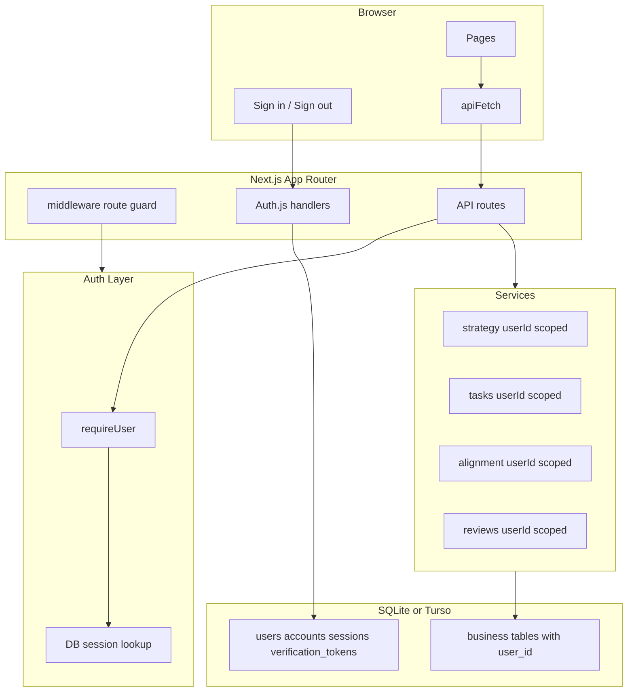

# Northstar 多用户 Auth 计划

## 目标

把 Northstar 从当前“单用户本地优先、无多租户 auth”的 MVP，升级为支持多用户登录、会话管理和数据隔离的产品形态。

方案主线采用 Auth.js / NextAuth 风格的自托管认证，session 存在数据库中，业务数据通过 `user_id` 做租户隔离。目标不是一次性实现企业级组织权限，而是先建立足够安全、可测试、可迁移的个人多用户基础。

## 当前基线

- App：Next.js App Router。
- DB：Drizzle ORM + SQLite / Turso libSQL。
- API：`src/app/api/**/route.ts` 直接调用 service。
- Service：`src/lib/services/*.ts` 负责 DB 读写。
- 当前数据模型没有用户维度：`north_stars`、`strategic_pillars`、`strategy_revisions`、`tasks`、`subtasks`、`time_entries`、`task_completion_events`、`review_snapshots` 都是全局数据。
- 当前高风险点：
  - `strategy.ts` 读取第一条 north star，默认全局唯一。
  - `tasks.ts` 多处全表读取 tasks / subtasks / pillars / time entries。
  - `alignment.ts` 聚合全表数据。
  - `task-priority-sync.ts` 会全表重算并按 task id 更新 priority。
  - `completions.ts` 在记录完成快照时读取全量 pillars。
  - `reviews.ts` 的 live review、saved snapshot、history 都是全局读写。
  - reorder、breakdown、subtask、time entry 等 API 如果只按 id 操作，接入多用户后会有 IDOR 风险。

## 非目标

- 不做团队、组织、共享任务、邀请协作。
- 不做复杂 RBAC；第一阶段只有“当前登录用户访问自己的数据”。
- 不做公开 API token。
- 不迁移到新数据库服务；继续兼容 SQLite / Turso。
- 不把 AI 功能改造成 per-user billing 或 quota 系统。
- 不依赖 middleware 作为唯一安全边界；API 和 service 层仍必须强制校验当前用户。

## 目标架构



## 数据模型

### 新增 auth 表

使用 Auth.js Drizzle adapter 对齐的数据结构，表名保持清晰：

- `users`
  - `id`
  - `name`
  - `email`
  - `email_verified`
  - `image`
  - `created_at`
  - `updated_at`
- `accounts`
  - OAuth 或 email provider 账号绑定。
- `sessions`
  - `session_token`
  - `user_id`
  - `expires`
- `verification_tokens`
  - magic link / email verification 用。

第一阶段建议支持一种低摩擦登录方式：

- 本地开发：可使用 email magic link 的 dev transport，或受控的 credentials dev provider。
- 生产：优先 email magic link；后续再加 GitHub / Google OAuth。

### 业务表增加 `user_id`

需要加用户边界的表：

- `north_stars.user_id`
- `strategic_pillars.user_id`
- `strategy_revisions.user_id`
- `tasks.user_id`
- `subtasks.user_id`
- `time_entries.user_id`
- `task_completion_events.user_id`
- `review_snapshots.user_id`

`subtasks` 虽然能通过 `parent_task_id` 间接找到 owner，也建议冗余 `user_id`。这样删除、更新、reorder、列表查询都能直接加 `user_id` 条件，降低 IDOR 漏洞概率。

### 索引与唯一性

建议索引：

- `idx_north_stars_user_id`
- `idx_pillars_user_sort`
- `idx_tasks_user_status`
- `idx_tasks_user_manual_sort`
- `idx_subtasks_user_parent`
- `idx_time_entries_user_started_at`
- `idx_completion_events_user_occurrence`
- `idx_completion_events_user_task_completed`
- `idx_review_snapshots_user_period`

建议唯一约束：

- `north_stars`：第一阶段每个用户最多一条 active north star，可用 `user_id` 唯一约束。
- `task_completion_events`：`user_id + task_id + completed_at` 防重复。
- `review_snapshots`：如果产品语义仍是每个周期保存一份快照，则使用 `user_id + period_start + period_end` 唯一约束；如果保留多版本历史，则改用普通索引并在 UI 明确展示版本。

## 迁移策略

### 本地已有单用户数据

现有数据没有 owner。迁移时创建一个默认 owner：

- 环境变量：`NORTHSTAR_DEFAULT_USER_EMAIL`
- 默认值仅用于本地开发，例如 `local@northstar.dev`
- 迁移创建或复用该 user。
- 所有 legacy 业务行回填到该 user。

这个选择保留当前用户的本地数据，不强迫清库，也避免把 owner 逻辑散落到运行时代码里。

注意：default user 只解决数据归属，不等于自动登录。接入 email magic link 或 dev credentials 后，使用同一个 email 登录才能看到 legacy 数据。生产环境不要静默创建可登录的默认账号。

### 迁移顺序

1. 新增 auth 表。
2. 业务表新增 nullable `user_id`。
3. 创建默认 legacy user。
4. 回填所有 legacy rows 的 `user_id`。
5. 补索引。
6. 在代码已经全量按 user scope 读写后，再考虑把 `user_id` 收紧为 not null。

SQLite 对 not null column 和复杂 alter 支持有限，收紧约束可以放到第二个迁移批次，避免一次迁移过重。

## Auth 集成

新增文件建议：

- `src/auth.ts`
  - Auth.js 配置。
  - 导出 `auth`、`handlers`、`signIn`、`signOut`。
- `src/app/api/auth/[...nextauth]/route.ts`
  - 暴露 Auth.js route handlers。
- `src/lib/auth/require-user.ts`
  - `requireUser()`：API / server component 使用，未登录抛出 typed error。
  - `getCurrentUserId()`：需要 nullable session 的场景使用。
- `src/lib/auth/errors.ts`
  - 统一 `UnauthorizedError`，API route 映射到 401。
- `middleware.ts`
  - 保护主页面路由。
  - 放行 `/login`、`/api/auth/**`、静态资源。
  - 只负责 UX 级重定向，不作为数据安全边界。

环境变量：

- `AUTH_SECRET`
- `AUTH_URL`
- email provider 所需 SMTP 配置，或 OAuth client id / secret。
- `NORTHSTAR_DEFAULT_USER_EMAIL` 仅用于 legacy 数据迁移和开发。

### Middleware runtime 注意事项

Auth.js 的 database session 需要访问 adapter / DB。Next.js middleware 运行在 Edge-like runtime 时，libSQL / Drizzle adapter 兼容性需要验证。为了避免把 auth 正确性押在 middleware 上：

- API route 必须始终调用 `requireUser()`。
- Server component 页面可以在 Node runtime 中调用 `auth()` 后 redirect。
- middleware 只做轻量入口保护；如果 DB session 在 middleware 中不可用，就退化为页面级 guard。
- 如果强需求是 middleware 中精准识别 session，可以单独评估 JWT session strategy，但这会改变 session 失效语义，不作为第一选择。

## Service 改造原则

核心原则：service 函数显式接收 `userId`，不要在 service 内隐式读 session。

推荐形态：

```ts
export async function listTasks(userId: string, status?: string, sort?: TaskSortMode, tz?: string) {
  // all DB reads and writes include userId
}
```

理由：

- 测试更容易，不需要 mock session。
- 数据边界在函数签名中可见。
- 后续如果支持后台任务或导入脚本，也可以明确传入 owner。

### Strategy

当前逻辑假设全局只有一个 strategy。改造后：

- `hasStrategy(userId)`
- `getStrategy(userId)`
- `saveStrategy(userId, input)`
- `updateNorthStar(userId, input)`
- `applyLifeBalanceTemplate(userId, ...)`

所有查询都加 `where user_id = userId`。

`saveStrategy` 当前会 delete 全部 `strategic_pillars`，必须改为只删除当前用户的 pillars：

```ts
await db.delete(strategicPillars).where(eq(strategicPillars.userId, userId));
```

### Tasks / Subtasks

需要改造：

- `listTasks(userId, ...)`
- `listTasksWithSubtasks(userId, ...)`
- `listDueTodayTasksWithSubtasks(userId, ...)`
- `createTask(userId, input)`
- `updateTask(userId, taskId, patch, options)`
- `deleteTask(userId, taskId)`
- `breakdownTask(userId, taskId, options)`
- `previewBreakdownTask(userId, taskId, options)`
- `applyBreakdownPreview(userId, taskId, proposed, breakdown)`
- `listSubtasks(userId, taskId)`
- `updateSubtask(userId, subtaskId, patch, options)`
- `reorderTasks(userId, orderedIds)`

关键约束：

- 查询 task by id 必须同时匹配 `id` 和 `user_id`。
- subtask 更新必须匹配 `subtasks.user_id`。
- `orderedIds` 必须先查询出当前用户拥有的 tasks；如果数量不匹配，返回 400 或 404，不能部分重排其他用户 id。
- AI breakdown 使用的 north star / pillar context 必须来自同一 user。
- recurring lazy reset 只处理当前 user 的 recurring tasks。

### Priority Sync

当前 `task-priority-sync.ts` 会读取全量 `tasks`、`strategic_pillars`、`time_entries`、`north_stars`，并按 task id 更新 priority。多用户后需要改成：

- `persistPriorities(userId, tz)`
- `applyPriorityResults(db, userId, allTasks, results, ts)`
- `syncActivePriorityFromManualOrder(db, userId, filtered)`
- `applyManualReorderScores(db, userId, orderedIds)`

所有 update 的 `where` 必须包含 `tasks.userId = userId`。否则一次用户 A 的重算可能改写用户 B 的排序和 priority score。

### Time Entries

需要改造：

- `listTimeEntries(userId)`
- `addTimeEntry(userId, input)`
- `exportTimeEntriesCsv(userId, filters)`

`addTimeEntry` 必须验证 `taskId` 属于当前 user，再写入 `time_entries.user_id`。

### Completion Events

需要改造：

- `recordCompletionEvent(tx, userId, task, tz, now)`
- `deleteCompletionEventForTaskCompletion(tx, userId, taskId, completedAt)`
- `listCompletionEvents(userId, filters)`
- `getCompletionSummary(userId, filters)`
- `exportCompletionsCsv(userId, filters)`

completion event 是快照表，但 owner 仍然必须是硬边界。撤销完成时删除条件必须包含 `user_id + task_id + completed_at`。

记录完成快照时，`resolvePillarSnapshotForCompletion` 的 pillars 输入必须是当前用户的 pillars，不能继续 `select().from(strategicPillars)` 全表读取。

### Alignment / Reviews

`getAlignmentDashboard(userId, ...)` 只读取当前用户的 pillars、tasks、time entries、completion events。

`review_snapshots` 保存和读取都加 `user_id`。历史快照不跨用户聚合。

`reviews.ts` 还要注意两个隐性全局点：

- `buildLiveReview(userId, ...)` 需要传入 userId，并把 completions summary 也限制在同一 user。
- `saveReviewSnapshot(userId, ...)` 查找 existing snapshot 时必须匹配 `user_id + period_start + period_end`，不能只按周期覆盖。

## API Route 改造

每个受保护 route 的模式：

```ts
export async function GET(request: Request) {
  try {
    const user = await requireUser();
    const data = await service(user.id, ...);
    return NextResponse.json(data);
  } catch (err) {
    return toApiError(err);
  }
}
```

需要覆盖的 API：

- `/api/strategy`
- `/api/tasks`
- `/api/tasks/[id]`
- `/api/tasks/reorder`
- `/api/tasks/recalculate-priorities`
- `/api/tasks/classify`
- `/api/tasks/[id]/breakdown`
- `/api/tasks/[id]/breakdown/apply`
- `/api/tasks/[id]/subtasks`
- `/api/tasks/[id]/subtasks/reorder`
- `/api/subtasks/[id]`
- `/api/time-entries`
- `/api/time-entries/export`
- `/api/completions`
- `/api/completions/summary`
- `/api/completions/export`
- `/api/alignment`
- `/api/reviews`

`/api/critique` 不读写用户数据，但仍建议要求登录，避免公开 LLM endpoint 被滥用。

## UI 与路由

新增：

- `/login`
  - email 登录或 provider 登录入口。
- header 登录状态
  - 显示用户 email / name。
  - 提供 sign out。
- 未登录访问主应用
  - middleware 重定向到 `/login`。
- 登录后的首次体验
  - 如果 `hasStrategy(userId)` 为 false，进入 `/onboarding`。
  - 如果已有 strategy，进入 `/today`。

现有 `onboarding/page.tsx` 在 finish 后会读取 `/api/strategy` 并创建 seed tasks。接入 auth 后无需在 client 传 user id，API 从 session 派生 user id。

## 安全检查清单

- 所有业务表查询都包含 `user_id`。
- 所有 by-id 更新、删除都同时匹配 `id` 和 `user_id`。
- reorder API 拒绝不属于当前用户的 ids。
- task -> subtask、task -> time entry、task -> completion event 的写入先验证 parent owner。
- Auth cookie 使用 secure、httpOnly、sameSite。
- 生产必须配置 `AUTH_SECRET`。
- 登录错误不泄露账号存在性。
- API 统一返回 401，而不是因为 null session 触发 500。
- CSV export 只导出当前用户数据。
- AI prompt context 不包含其他用户 strategy/tasks。
- priority recalculation 只更新当前用户 tasks。
- review snapshot 保存同周期数据时只覆盖当前用户 snapshot。
- completion event 的 pillar snapshot 只从当前用户 pillars 中解析。

## 测试计划

### Unit / integration

- `requireUser`：
  - 未登录返回 401 映射。
  - 登录返回 user id。
- strategy：
  - 两个用户各自保存 strategy，互不覆盖。
  - `saveStrategy(userA)` 不删除 userB pillars。
- tasks：
  - userA list 看不到 userB tasks。
  - userA 不能 update/delete userB task id。
  - userA reorder 混入 userB id 会失败。
  - breakdown 不能读取 userB task 或 strategy context。
  - priority recalculation 不更新 userB tasks。
- subtasks：
  - userA 不能 patch/delete userB subtask。
  - auto-complete parent 只影响同 user task。
- time entries：
  - userA 不能给 userB task 添加 time entry。
  - export 不包含其他用户 entries。
- completion events：
  - 完成任务写入 user scoped event。
  - reopen 删除同 user 的 matching event，不影响其他用户。
- alignment / reviews：
  - dashboard 聚合只包含当前 user。
  - review snapshot 保存和读取隔离。
  - userA 保存本周 snapshot 不覆盖 userB 同周期 snapshot。
- migration：
  - legacy rows 全部回填到 default user。
  - 重跑迁移幂等。

### Manual smoke

- 未登录访问 `/today` 会跳转登录。
- 登录后无 strategy 进入 onboarding。
- onboarding 完成后生成当前用户的 strategy 和 seed tasks。
- 登出后 API 请求返回 401。
- 两个测试账号分别创建任务，互不可见。

## 分阶段实施

### Phase 1: Auth 基础

- 安装 Auth.js / adapter 相关依赖。
- 新增 auth schema。
- 新增 Auth route handlers。
- 新增 `requireUser` 和 API error mapper。
- 新增 `/login` 和 sign out。

验收：能登录、登出、读取当前用户 session；未登录 API 返回 401。

### Phase 2: 数据模型与迁移

- 给业务表添加 `user_id`。
- legacy 数据回填 default user。
- 添加索引和关键唯一约束。
- 更新 `INIT_SQL` 和 incremental migrations。

验收：旧本地数据仍可通过 default user 访问；新用户数据写入带 `user_id`。

### Phase 3: Service 全面 user scope

- service 函数签名显式加入 `userId`。
- 所有 DB 读写加入 user 条件。
- 修复 strategy 全局唯一假设。
- 修复 tasks、subtasks、time entries、completions、alignment、reviews、priority sync 的 owner 校验。

验收：跨用户 by-id 操作失败；列表和聚合互相隔离。

### Phase 4: API / UI 接线

- API routes 调用 `requireUser()` 并传入 `user.id`。
- middleware 保护页面。
- onboarding 和 header 适配登录状态。
- `apiFetch` 对 401 给出登录态处理。

验收：浏览器里登录后完整主流程可用；登出后主页面不可访问。

### Phase 5: 测试与文档

- 增加多用户隔离测试。
- 增加迁移测试。
- 更新 `design.md` 的“单用户本地优先”描述。
- 更新环境变量说明。

验收：`npm test`、`npm run lint`、核心手动 smoke 通过。

## 自我 Critique v1

### 问题 1：只给业务表加 `user_id` 还不够

如果只改列表查询，by-id update/delete 仍可能越权。特别是 subtasks、breakdown apply、reorder、time entry create 这些接口，很容易通过已知 id 操作别人的数据。

修正：计划中把所有 by-id 写操作都列为必须同时匹配 `id + user_id`，并要求 parent owner 验证。

### 问题 2：`strategy.ts` 的 delete-all 风险很高

当前 `saveStrategy` 会删除所有 `strategic_pillars`。多用户后如果漏改，会直接删除其他用户战略支柱。

修正：把 `saveStrategy(userId)` 和 scoped delete 标为 Phase 3 的关键验收点，并加入双用户测试。

### 问题 3：迁移不能一步强制 not null

SQLite / libSQL 对复杂 alter 有限制，旧数据也需要 owner 回填。直接加 not null 可能让本地库升级失败。

修正：迁移拆成 nullable add -> backfill -> code scoped -> 后续收紧约束。

### 问题 4：Auth provider 选择仍需保持可替换

如果第一版强绑定某个 OAuth provider，本地开发和测试会变重。

修正：认证核心围绕 Auth.js session 和 users 表，provider 作为配置层。开发可用 dev credentials 或 magic link，生产再选 email/OAuth。

### 问题 5：AI endpoint 也需要登录

`/api/critique` 虽不读写数据，但可能调用 LLM。公开会带来滥用风险。

修正：明确要求 `/api/critique` 登录后使用。

## 自我 Critique v2

### 问题 6：middleware + DB session 可能给出虚假的安全感

第一版把 middleware route guard 写进架构图，但没有说明 DB session 在 middleware runtime 里的兼容性风险。如果 middleware 不能稳定访问 libSQL / adapter，登录保护可能表现不一致。

修正：明确 middleware 只做 UX 重定向，API route 的 `requireUser()` 和 service 的 `userId` 参数才是安全边界。页面 guard 可用 server component redirect 补上。

### 问题 7：priority sync 是隐蔽的跨用户写入点

`persistPriorities`、`applyPriorityResults`、`applyManualReorderScores` 当前都可能全表更新。第一版只强调 tasks service，漏掉了独立 priority helper。

修正：新增 Priority Sync 小节，要求所有 priority 更新都带 `userId`，并加入测试。

### 问题 8：review snapshot 的同周期覆盖会跨用户误伤

`saveReviewSnapshot` 当前按 `period_start + period_end` 查 existing。多用户后如果不加 `user_id`，用户 A 保存本周 review 会覆盖用户 B 的同周期 review。

修正：明确 existing snapshot 查询和唯一性都必须包含 `user_id`。

### 问题 9：completion event 的快照解析会读到别人的 pillar

`recordCompletionEvent` 当前读取全量 `strategic_pillars` 来解析完成快照。多用户后即使 task 有 owner，也可能把其他用户 pillar 信息写入快照。

修正：要求 completion record helper 接收 `userId` 并只读取当前用户 pillars。

## Good Enough 标准

这份方案达到 good enough，当且仅当实现后满足：

- 未登录用户无法访问主应用和业务 API。
- 每一条业务数据都有 owner。
- 所有列表、聚合、导出都只返回当前用户数据。
- 所有 by-id 写操作都不能跨用户生效。
- legacy 单用户数据有明确归属，不丢失。
- strategy 不再是全局唯一，而是 per-user 唯一。
- 测试能证明双用户数据隔离。
- middleware 失效或缺失时，业务 API 仍然不会泄露或改写其他用户数据。
- 后台式 helper，包括 priority sync、review snapshot、completion snapshot，也都显式 user scoped。

## 最终建议

先不要直接大面积改 UI。应从数据库 owner 和 service 签名开始，因为这是安全边界。UI 登录态只是入口，真正的多用户正确性取决于 service 层是否强制 user scope。

最小可执行顺序：

1. Auth.js DB session 跑通。
2. 所有业务表拥有 `user_id`，legacy 数据回填。
3. `strategy` 和 `tasks` 先完成 per-user 改造，因为它们是其他功能的根。
4. 再改 `alignment`、`reviews`、CSV export。
5. 最后收紧 route guard、登录页和文档。
