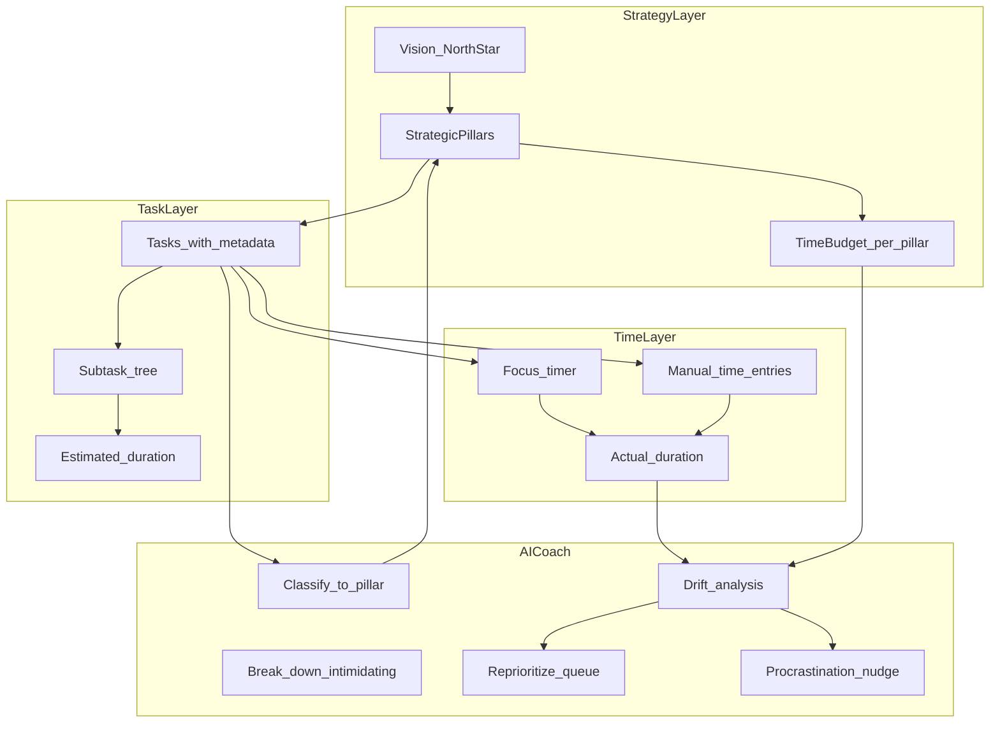
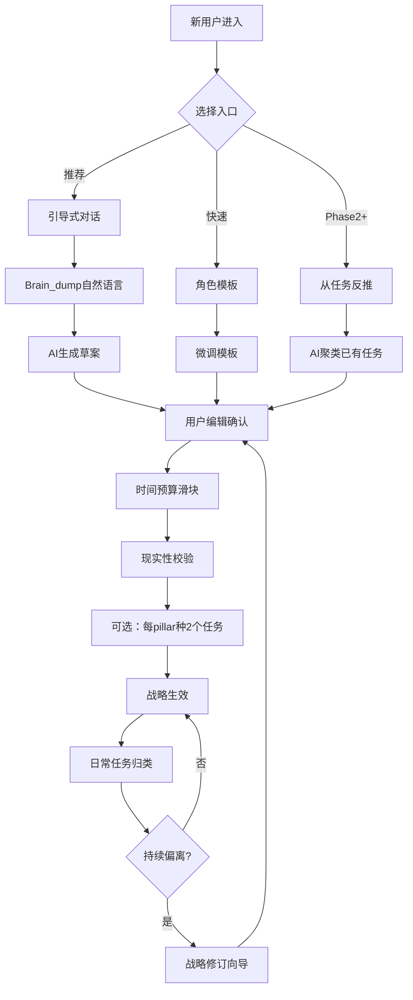
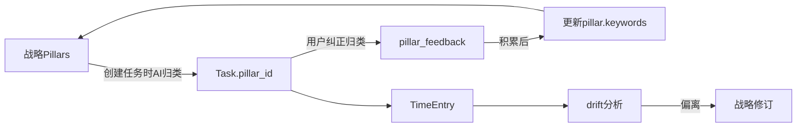
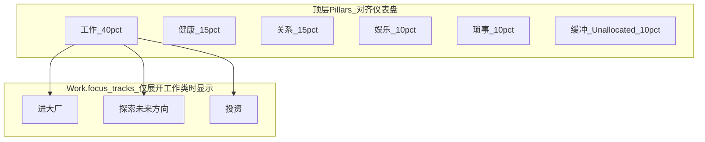
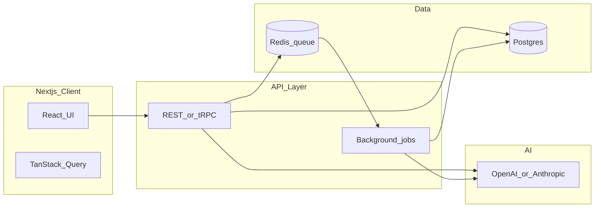

# Northstar — AI-Driven Todo 产品设计

> 以「战略对齐」与「自动排优先级」为双核心的 Web 端 AI 待办应用：用户先定义战略与时间预算，任务与实耗时间持续映射到战略支柱；系统自动计算今日该做什么，并在周回顾中量化偏离、干预拖延。

**平台**：Web（桌面浏览器为主）  
**MVP 双核心**：
1. **战略对齐** — 时间花销 vs 战略偏离分析
2. **自动排优先级** — 无需手动标 P0/P1，系统持续重算「现在最该做哪几件」

---

## 1. 产品定位

**一句话**：不是「帮你记更多事」，而是「确保你的时间花在战略上」。

与 Todoist / Things / Notion Tasks 的差异：

- 普通待办：任务列表 + 截止日期，优先级靠人标
- **Northstar**：战略支柱 → 时间预算 → 任务归属 → **自动优先级引擎** → 今日队列 → 实耗追踪 → **偏离告警** → 动态重排

MVP 有 **两条同等重要的主轴**：
- **战略对齐**：你的时间是否花在战略上？
- **自动排优先级**：面对一堆事，现在最该做哪几件？

拆解、估时、拖延干预是支撑这两条主轴的能力，而非独立功能堆砌。



---

## 2. 核心概念模型（数据层）

建议用 **四层模型**，所有 AI 能力都读写同一套结构化数据，避免「聊天框里说说就算了」。

| 实体 | 关键字段 | 作用 |
|------|----------|------|
| **NorthStar** | `statement`, `horizon` (季度/年度) | 顶层方向，AI 对齐判据 |
| **StrategicPillar** | `name`, `target_pct`, `color`, `keywords[]`, `focus_tracks[]?`, `floor_min?`, `cap_max?` | 时间预算单元；Work 等大类可有子赛道 `focus_tracks` |
| **Task** | `title`, `pillar_id`, `status`, `intimidation_score`, `priority_score`, `estimated_min`, `due_at` | 可执行单元 |
| **Subtask** | `parent_task_id`, `order`, `is_entry_point` | 拆解树；`is_entry_point` 标记「2 分钟可启动」的第一步 |
| **TimeEntry** | `task_id`, `started_at`, `duration_min`, `source` (timer/manual) | 实耗账本 |
| **ReviewSnapshot** | `period`, `planned_pct`, `actual_pct`, `drift_score`, `ai_summary` | 周/日回顾缓存 |

### 战略对齐量化公式

MVP 采用可解释、可调试的公式：

```
actual_pct(pillar) = sum(time_entries for tasks in pillar) / total_logged_time
drift(pillar) = actual_pct - target_pct
alignment_score = 100 - sum(abs(drift)) / 2   # 0–100，越高越对齐
```

### 拖延信号

规则检测 + 可选 AI 增强：

- 任务 `created_at` 距今 > N 天且 `status != done`
- `intimidation_score >= 4` 且连续 3 次被推迟
- 有 `estimated_min` 但累计 `time_entries = 0`

---

## 2.5 用户如何形成战略

战略不是一次性填表，而是 **「说出来 → 结构化 → 量化时间预算 → 用真实任务校验 → 持续修订」** 的闭环。

### 战略的三层结构

用户最终产出三层内容，每层回答不同问题：

| 层级 | 用户回答的问题 | 产物 | 是否必填 |
|------|----------------|------|----------|
| **North Star** | 这个周期结束时，什么算「做成了」？ | 1 句成果陈述 + `horizon`（如 2026 Q2） | 是 |
| **Strategic Pillars** | 为了到达那里，精力主要分给哪几块？ | 3–5 个支柱 + 描述 + `keywords[]` | 是 |
| **Time Budget** | 每周时间 realistically 怎么分？ | 各 pillar `target_pct`，总和 100% | 是 |

**关键设计决策**：MVP 不要求用户写 OKR、里程碑、KPI。战略的可执行形态是 **时间预算**——因为后续所有对齐分析都建立在「你计划花 40% 在 Growth，实际花了多少」上。

### 形成路径（三种入口，MVP 做前两种）



#### 路径 A：引导式对话（默认，5–10 分钟）

分 **5 步**，每步单一焦点，避免一次抛出复杂表单：

**Step 1 — 周期与处境**（30 秒）
- 选择 `horizon`：本季度 / 未来 6 个月
- 选一题情境：「全职创业」「在职 side project」「Senior SDE 职业升级」「学生」「自由职业」
- 可选填：每周可投入总小时数（默认 40h，用于后续现实性校验）

**Step 2 — Brain Dump**（2–3 分钟）
- 一个大文本框，提示语：
  > 随便写：这个周期你最想达成什么？什么让你焦虑？哪些事占用你大量时间但不能删？
- 支持语音输入转文字
- **不要求**条理清晰；AI 负责从混乱中提取信号

**Step 3 — AI 合成草案**（AI 生成，用户审阅 2–3 分钟）
- AI 输出三张可编辑卡片：
  1. **North Star 陈述**（1 句，含「谁 / 做成什么 / 何时」）
  2. **Pillars 列表**（3–5 个，每个含 `name` + 一句话描述 + `keywords`）
  3. **建议时间预算**（`target_pct` + 一句理由，如「你提到 side project 是首要矛盾，建议 Growth 45%」）
- 用户可：改名、合并两个 pillar、删除、新增、改写 North Star
- **约束**：pillar 数量 3–7（生活平衡型用户常用 6 类，见 §2.7），预算总和必须 100%

**Step 4 — 时间预算确认**（1–2 分钟）
- 可视化滑块 / 饼图，拖动调整 `target_pct`
- **现实性校验**（规则，非 AI）：
  ```
  每周可用 40h → Growth 45% ≈ 18h/周 → 每天约 2.5h
  ```
- 若某 pillar < 10% 且用户标为「高优先级」，弹出提示：「Health 只占 5%，可能很难产生对齐效果，要调高还是降低期望？」

**Step 5 — 落地种子任务**（可选，1 分钟）
- 每个 pillar 建议 1–2 个「本周就能做」的任务草案
- 用户勾选接受 → 直接进入任务列表，完成 onboarding 即有东西可做
- 跳过也可，但会降低首日激活率

#### 路径 B：角色模板（快速，2 分钟）

为降低「面对空白页」的阻力，提供预设模板：

| 模板 | North Star 示例 | 默认 Pillars |
|------|-----------------|--------------|
| 创业者 | 本季度验证 PMF，拿到首单 | Growth 50% · Product 25% · Admin 15% · Health 10% |
| 在职建设者 | 本季度 side project 上线 MVP | SideProject 40% · DayJob 35% · Learning 15% · Life 10% |
| **Senior SDE 职业升级** | 本季度在职业突破与身心家庭之间取得可持续进展 | 见 §2.6（双轨需先选主路径） |
| **生活平衡型** | 工作突破与健康、关系、娱乐、琐事可持续共存 | 见 §2.7（六类 + Work focus_tracks） |
| 知识工作者 | 本季度交付核心项目并维持深度工作习惯 | DeepWork 35% · CoreProject 35% · Meetings 20% · Health 10% |

用户选模板 → 改名字和百分比 → 确认。仍可进入 Step 2 补充 brain dump 让 AI 个性化调整。

#### 路径 C：从任务反推（Phase 2+，非 MVP）

用户先正常使用 2 周，积累 ≥15 条任务后，AI 聚类提议：「你的任务自然分成 4 组，要设为战略支柱吗？」适合不愿先想战略、想先做事的用户。

### 战略如何保持「活」

形成战略不是终点。系统在三个时机推动修订：

| 时机 | 触发条件 | 用户动作 |
|------|----------|----------|
| **季度复盘** | `horizon` 到期前 2 周 | 完整重走 5 步向导；旧战略存档为 `StrategyRevision` |
| **偏离告警修订** | 某 pillar 连续 4 周 `actual < 50% * target` | 轻量对话框二选一：「调高预算」或「承认本季度不是重点，调低 target」 |
| **用户主动** | Strategy 页点「修订战略」 | 随时进入编辑；大改用完整向导，小改用滑块 |

**修订原则**：
- 历史 `ReviewSnapshot` 不篡改，按当时战略计算
- 每次修订记录 `effective_from` 日期，对齐分析按时间段切分

### 战略与任务的衔接（自顶向下 + 自底向上）



- **自顶向下**：新任务默认 AI 按 `keywords` + pillar 描述归类
- **自底向上**：用户改 pillar 归属时记录反馈；每 20 次纠正后 AI 建议更新 `keywords`（Phase 2）
- **Unallocated 任务**：无法归类时暂存；累计 > 总任务 20% 时提示「是否新增 pillar 或调整战略？」

### AI 在战略形成中的边界

| AI 做 | 人必须做 |
|-------|----------|
| 从 brain dump 提取主题、提议 pillar 名称 | 确认「这是不是本季度真正的重点」 |
| 建议时间预算比例 + 理由 | 拖动滑块做最终取舍（承认精力有限） |
| 生成 North Star 陈述初稿 | 判断是否够具体、够激励自己 |
| 检测预算与野心的矛盾并提醒 | 决定调高预算还是降低期望 |

**不做**：AI 不替用户决定「什么重要」；只帮他们把已模糊的重要的事，变成可追踪的结构。

### 数据模型补充

```typescript
// 战略修订历史（新增实体）
StrategyRevision {
  id, user_id,
  north_star_statement,
  horizon,
  pillars: JSON,           // snapshot of StrategicPillar[]
  effective_from: Date,
  created_at,
  source: 'onboarding' | 'quarterly' | 'drift_alert' | 'manual'
}
```

### 2.6 示例：Senior SDE — 大厂 vs Staff，兼顾健康与家庭

这个场景展示系统如何 **帮忙形成战略** 和 **critique 战略**（发现矛盾、逼做取舍、用数据挑战自欺）。

#### 用户 Brain Dump（Step 2 输入示例）

> 我是 senior SDE，在小厂 5 年了。想去大厂（Google/Meta 级别），但也可能留下来冲 staff。每天要开会、on-call、带娃。leetcode 好久没刷了，system design 也慌。老婆说我最近总在加班，锻炼也停了。下个季度想至少拿到一个大厂 onsite，或者能在公司推动一个跨团队项目证明影响力。

#### AI 第一轮：提取信号 + 发起 Critique（Step 3 之前）

AI 不直接生成 pillar，先做 **战略诊断**，输出结构化 critique：

| 检测项 | 发现 | 严重度 |
|--------|------|--------|
| **双轨目标冲突** | 「大厂 onsite」和「小厂 staff」所需投入结构不同：前者重面试准备（算法/SD），后者重内部影响力（跨团队项目、技术文档、mentoring） | 高 |
| **非承诺性措辞** | 「可能留下来」「想至少」→ 尚未选定本季度主路径 | 高 |
| **时间声明缺失** | 提到加班和带娃，但未量化每周可自主支配小时数 | 中 |
| **健康口头优先、预算为零** | 提到锻炼停了，但 brain dump 中健康无任何时间承诺 | 中 |
| **家庭是约束还是 pillar** | 「老婆说总在加班」是痛点，但未明确家庭时间的底线 | 中 |

**系统追问（单选题，必答后才生成草案）**：

```
本季度（接下来 12 周），你更愿意把「职业突破」押在哪条主路径上？

○ A. 大厂面试 — 目标：≥2 家 FAANG onsite，允许内部项目让步
○ B. 小厂 Staff — 目标：推动 1 个跨团队技术 initiative 立项并拿到 sponsor
○ C. 双线并行 — 我理解风险：两条线都可能不够深（系统会建议折中预算）
```

**设计原则**：双轨不是不能选，但不能让 AI 假装用户可以同时全力冲刺两条路。选 C 时，critique 文案必须明示 tradeoff。

用户选 **A（大厂面试）** 后，AI 生成如下草案：

---

#### 战略草案（路径 A：大厂面试）

**North Star**：
> 2026 Q3 结束前，完成 2 家目标大厂 onsite，同时每周锻炼 ≥3 次、工作日 19:00 前下班 ≥4 天。

**Pillars（5 个，刻意把 Family 独立出来）**：

| Pillar | target_pct | 描述 | keywords |
|--------|------------|------|----------|
| **InterviewPrep** | 30% | 算法、SD、行为面试、投递与内推 | leetcode, system design, mock, 投递, 内推, behavioral |
| **DayJob** | 35% | 当前交付不能崩；维持绩效基本盘 | sprint, on-call, code review, 需求, bug |
| **Family** | 20% | 家庭时间的硬约束，不是「有空再做」 | 带娃, 晚餐, 周末, 陪玩, 家庭 |
| **Health** | 10% | 可持续体能，面试季不能垮 | 锻炼, 跑步, 睡眠, 冥想 |
| **Admin** | 5% | 邮件、琐事、通勤 | 邮件, 行政, commute |

**现实性校验（规则引擎）**：

```
自主支配时间估算：50h/周（工作）- 10h（会议/on-call 不可控）= 40h 可规划
InterviewPrep 30% ≈ 12h/周 → 每天 1.7h 刷题/SD — 对 senior 重返面试合理
Family 20% ≈ 8h/周 → 系统问：「8h 是否够？要设为底线而非目标吗？」
  → 用户可选切换为 Family.floor_min = 8h/周（硬约束，见下）
```

**种子任务（Step 5）**：

- InterviewPrep：LeetCode 每周 8 题（中等 5 + 困难 3）；约一次 mock SD
- DayJob：和 manager 对齐 Q3 绩效预期（30min）
- Family：固定周三晚 + 周六上午为家庭时间（日历块）
- Health：恢复每周 3 次 30min 运动

---

若用户选 **B（小厂 Staff）**，草案会显著不同：

| Pillar | target_pct | 差异说明 |
|--------|------------|----------|
| **StaffTrack** | 35% | 跨团队 design doc、RFC、sponsor 1:1、技术分享 |
| **DayJob** | 40% | 交付仍是基本盘，但面试准备降为 0 |
| **InterviewPrep** | — | 删除或降至 5%「保持手感」 |
| **Family / Health** | 15% / 10% | 同上 |

North Star 改为：「推动 X 项目通过 architecture review 并获 VP sponsor；锻炼恢复每周 3 次。」

---

#### 战略 Critique 机制（形成时 + 运行中）

Critique 分 **规则层**（确定性、可测）和 **叙事层**（LLM 解释、给建议）。

**形成时 critique（Step 3–4）**：

| 规则 | 触发条件 | 系统说什么 |
|------|----------|------------|
| `DUAL_CAREER_PATH` | brain dump 同时出现外部面试 + 内部晋升信号词 | 追问主路径单选题 |
| `BUDGET_AMBITION_GAP` | InterviewPrep ≥ 25% 但用户填可用时间 < 35h/周 | 「面试准备需要约 12h/周，你只有 25h 可规划。要降目标还是调高时间？」 |
| `HEALTH_NAMED_NOT_BUDGETED` | 提到健康/锻炼但 AI 建议 Health < 10% | 「你提到锻炼停了，但 Health 仅 5%。刻意给 10% 还是承认本季度不优先？」 |
| `FAMILY_FLOOR_SUGGEST` | 提到家庭冲突/加班抱怨 | 提议 Family 从「目标占比」升级为 **硬约束 floor** |
| `NORTH_STAR_UNMEASURABLE` | North Star 缺可验证结果（无数字/无截止） | 「“取得进展”不可追踪。改成“2 家 onsite”或“1 份 approved RFC”？」 |

**Family 硬约束（可选高级设置）**：

```typescript
StrategicPillar {
  // ...
  floor_min_per_week?: number  // Family=8 → 低于 8h 触发告警，不进「承认不是重点」流程
  is_hard_constraint: boolean
}
```

硬约束 pillar 的 critique 不说「调低 target」，而说「你打破了底线，本周优先级引擎会强制上浮 Family 相关任务」。

---

#### 运行中 critique（第 2–12 周）

**场景 1：说要做大厂，实际在刷题上时间为零（第 4 周）**

```
Alignment 告警：
  InterviewPrep  target 30%  actual  4%   ⚠ -26%
  DayJob         target 35%  actual 52%   ⚠ +17%
  Admin          target  5%  actual 18%   ⚠ +13%

AI Critique：
  「你选了路径 A（大厂面试），但 4 周以来 InterviewPrep 仅 4%。
   Admin 超预期 13%，主要来自“回 Slack/邮件”类任务（占 Admin 78%）。
   这不是懒惰问题，是战略与日常未对齐。

   建议（三选一）：
   ① 本周 InterviewPrep 硬排 6h（已在 Today 置顶 2 题/天）
   ② 承认本季度无法面试 → 修订战略，切换路径 B
   ③ 将 Admin 上限设为 8%/周，超出任务自动建议 defer」
```

**场景 2：双线并行（选了 C）导致两条都不够**

```
AI Critique（第 8 周）：
  「InterviewPrep 9%（目标 15%），StaffTrack 11%（目标 15%），均低于目标 50%。
   双线并行的典型结果是：两条线都“在做但不够深”。
   数据建议：过去 8 周你做了 12 道 LC 题（目标路径 A 需约 64 题），
   写了 1 份 design doc 草稿但未推过 review（路径 B 需至少 1 次正式 review）。

   本季度剩余 4 周：建议 All-in 路径 A 或 B，而非继续并行。」
```

**场景 3：健康 family 被系统性牺牲（第 6 周）**

```
规则触发：Health.floor 连续 3 周未达标 + Family 连续 2 周未达标

AI Critique：
  「North Star 明确写了“每周锻炼 3 次、4 天 19:00 前下班”。
   过去 3 周：锻炼 0 次，19:00 前下班 1 天。
   职业准备是马拉松。当前节奏下，Q3 面试表现可能受精力影响。

   系统已在 Today 置顶：
   · 今天 18:30 结束 DayJob（硬截止）
   · 明天晨跑 30min（Health entry point）

   是否将 Family + Health 设为 hard_constraint？（推荐）」
```

---

#### Critique 输出结构（供实现）

每次 critique 统一 JSON 结构，UI 按严重度渲染：

```json
{
  "critique_id": "cr_abc",
  "trigger": "DRIFT_PERSISTENT",
  "severity": "high",
  "findings": [
    {
      "code": "PILLAR_DRIFT",
      "pillar": "InterviewPrep",
      "target_pct": 30,
      "actual_pct": 4,
      "weeks_out_of_band": 4
    },
    {
      "code": "STRATEGY_PATH_MISMATCH",
      "declared_path": "big_tech_interview",
      "observed_behavior": "day_job_and_admin_expansion"
    }
  ],
  "narrative": "你选了路径 A，但 4 周来...",
  "options": [
    { "id": "recommit", "label": "本周硬排 6h InterviewPrep", "action": "boost_pillar" },
    { "id": "revise", "label": "修订战略，切换路径 B", "action": "open_revision_wizard" },
    { "id": "constrain", "label": "给 Admin 设上限 8%/周", "action": "set_pillar_cap" }
  ],
  "requires_response": true
}
```

**`requires_response: true`** 的 critique 在 Today 页顶部显示，用户选了一项才消失——避免告警被忽略。

---

#### 这个示例的设计 takeaway

1. **战略形成不是填 pillar 表**，而是先 critique 用户输入里的矛盾（双轨、口头优先级、不可测 North Star）
2. **逼单选主路径** 是这个 persona 最关键的交互；不选就不生成草案
3. **Family/Health 可以是 floor 而非 target**，适合「平衡」诉求——系统守护底线，而不是只画饼
4. **运行中 critique 用数据打脸**：declared path vs observed time；比泛泛的「你要加油」可信
5. **每个 critique 必须带可执行选项**，衔接自动优先级引擎（选 ① → 本周 InterviewPrep 任务置顶）

### 2.7 示例：六类生活目标 — 工作 / 健康 / 关系 / 娱乐 / 琐事

许多用户的顶层心智模型不是「职业单轨」，而是 **生活分块**。系统应支持这种输入，同时处理 **Work 内部多子目标** 和 **娱乐/琐事的时间黑洞**。

#### 用户输入的大类目标

| 大类 | 用户心里的子目标 |
|------|------------------|
| **工作** | 进大厂 · 探索未来方向 · 投资 |
| **健康** | （锻炼、睡眠、体检…） |
| **关系** | 伴侣、家人、朋友 |
| **娱乐** | 游戏、追剧、爱好 |
| **琐事** | 家务、账单、行政、通勤 |

#### 映射到数据模型：两层结构

**不要**把 8 个概念平铺成 8 个顶层 pillar（工作 3 子项 + 5 类生活 = 对齐图不可读）。

采用 **顶层 6 pillar + Work 内嵌 focus_tracks**：



```typescript
StrategicPillar {
  name: "工作",
  target_pct: 40,
  keywords: ["面试", "leetcode", "职业规划", "投资", "理财", "研报"],
  focus_tracks: [
    { name: "进大厂",     share_of_parent: 50 },  // 占 Work 的 50% → 全局 20%
    { name: "探索方向",   share_of_parent: 30 },  // 全局 12%
    { name: "投资",       share_of_parent: 20 },  // 全局 8%
  ],
  // floor / cap 见下
}

StrategicPillar {
  name: "琐事",
  target_pct: 10,
  cap_max_pct: 15,   // 超出即告警——琐事常吞噬战略时间
  keywords: ["家务", "账单", "预约", "通勤", "快递"]
}

StrategicPillar {
  name: "娱乐",
  target_pct: 10,
  // 既可当「合法放松」目标，也可设 cap 防沉迷；用户 onboarding 时二选一语义
  cap_max_pct?: 15,
  floor_min_per_week?: number  // 若用户把娱乐视为自我关怀，可设下限
}
```

**对齐公式扩展**：

```
# 顶层（仪表盘默认视图）
actual_pct(工作) = sum(time in 工作 pillar) / total_logged

# Work 展开视图（第 2 层）
actual_share(进大厂) = sum(time in tasks tagged 进大厂) / sum(time in 工作)
drift_track = actual_share - focus_track.share_of_parent
```

任务归类：先归 **顶层 pillar**，再 AI 建议 **focus_track**（仅 Work 必填其一；Health/关系等可省略）。

#### 形成战略时的 Critique（这类用户特有）

| 检测项 | 典型发现 | 系统动作 |
|--------|----------|----------|
| `WORK_MULTI_TRACK` | Work 内 3 条赛道同时高野心 | 追问：**本季度 Work 主赛道**（同 §2.6 单选逻辑） |
| `INVESTING_CADENCE` | 「投资」偏低频（周报/复盘），不是每日任务 | 建议投资用 **周期性仪式**（每周日 1h）而非塞进 Today 每日队列 |
| `EXPLORE_VS_EXECUTE` | 「探索未来方向」与「进大厂」争抢精力 | 若选大厂为主：探索降为 10% of Work；critique 探索类任务过多时提醒 defer |
| `FUN_SINK` | 娱乐 actual 持续 > cap | 「娱乐超 cap 3 周，多来自晚间刷剧。设硬 cap 或承认预算？」 |
| `CHORES_EXPANSION` | 琐事 actual > target 且挤压工作/健康 | 同 §2.6 Admin 膨胀；建议 batch 琐事到固定时段 |
| `RELATION_FLOOR` | 关系描述重要但预算 < 10% | 建议 `floor_min` 或合并进 North Star 可验证承诺 |

**Work 主赛道追问（必答）**：

```
本季度「工作」40% 的时间里，主战场是？
○ A. 进大厂（focus_tracks: 大厂 60% · 探索 25% · 投资 15%）
○ B. 探索方向（大厂 15% · 探索 55% · 投资 30%）— 适合职业转型期
○ C. 投资/财务建设（大厂 10% · 探索 20% · 投资 70%）
○ D. 均衡（默认 50/30/20，系统标注：三线可能都偏浅）
```

#### 建议战略草案（选 A：进大厂为主 + 生活平衡）

**North Star**：
> 本季度在保持每周关系时间 ≥10h、锻炼 ≥3 次的前提下，拿到 2 家大厂 onsite，完成投资复盘机制（每周日 1h）。

**顶层预算（6 pillar）**：

| Pillar | target | 约束类型 | 说明 |
|--------|--------|----------|------|
| 工作 | 40% | target | 内部分配见 focus_tracks |
| 健康 | 15% | **floor** | 每周 ≥5h，低于即告警 |
| 关系 | 15% | **floor** | 每周 ≥10h，硬约束 |
| 娱乐 | 10% | **cap** | 不超过 12%，防无意识消耗 |
| 琐事 | 10% | **cap** | 不超过 12%；建议周六上午 batch 处理 |
| 缓冲 | 10% | — | 未归类 / 机动时间；超 15% 提示归类 |

**Work.focus_tracks**（选 A）：

| 赛道 | 占 Work 比例 | 全局约 | 典型任务 |
|------|-------------|--------|----------|
| 进大厂 | 50% | 20% | LC、SD mock、投递、内推 |
| 探索方向 | 30% | 12% | 行业调研、1:1 请教、技术博客 |
| 投资 | 20% | 8% | 周报、资产配置复盘、研报 |

#### 仪表盘视图

**默认：六类生活条形图**（用户一眼看到人生是否失衡）

```
工作    ████████░░  40% → 38%  OK
健康    ███░░░░░░░  15% →  9%  ⚠ 低于 floor
关系    ████░░░░░░  15% → 11%  ⚠ 低于 floor
娱乐    ██████░░░░  10% → 14%  ⚠ 超 cap
琐事    █████░░░░░  10% → 13%  ⚠ 超 cap
```

**点击「工作」展开：子赛道漂移**

```
进大厂     target 50% of Work  actual 62%  ↑ 面试季合理
探索方向   target 30%         actual 28%  OK
投资       target 20%         actual 10%  ⚠ 连续 3 周未做周日复盘
```

#### 运行中 Critique 示例

**娱乐 + 琐事双超 cap，挤压健康/关系（第 5 周）**

> 娱乐 14%、琐事 13%，合计比预算多 7%。同时健康 9%、关系 11% 低于 floor。
> 模式：工作日 22:00–24:00 刷剧（娱乐 68%）+ 零散回消息/家务（琐事 55%）。
> 建议：① 娱乐 cap 硬切 22:30 ② 琐事 batch 到周六 9–11am ③ 本周 Today 置顶 2 次锻炼 + 周三晚关系块。

**Work 内「探索」任务过多，稀释「进大厂」（用户选了路径 A）**

> 你本季度主赛道是进大厂，但 Work 时间内「探索方向」类任务占 41%（目标 30%），「进大厂」仅 48%（目标 50%）。
> 新增任务「了解 Web3」「约人聊 AI 创业」— 是否归入探索？建议 defer 至下季度，或修订主赛道为 B。

#### 与自动优先级的衔接

优先级引擎 **顶层** 用 6 pillar 的 drift / floor / cap；**Work 内** 叠加 `focus_track` 漂移：

```
strategic_urgency(工作) = f(工作顶层 drift, 进大厂 track drift, 用户选的 Work 主赛道)
```

例：用户选 A，则 `进大厂` track 欠账比 `探索方向` 欠账权重更高。

**任务类型 → 默认 focus_track 映射（AI 归类）**：

| 任务示例 | pillar | focus_track |
|----------|--------|-------------|
| 刷 LC 题 | 工作 | 进大厂 |
| 约前辈聊职业路径 | 工作 | 探索方向 |
| 读财报 / 调仓位 | 工作 | 投资 |
| 跑步 | 健康 | — |
| 陪家人晚餐 | 关系 | — |
| 打游戏 | 娱乐 | — |
| 交水电费 | 琐事 | — |

#### 六类模板（Onboarding 路径 B 新增）

| 模板 | 适用 | 默认预算 |
|------|------|----------|
| **生活平衡型** | 多目标、既要事业也要生活 | 工作 40 · 健康 15 · 关系 15 · 娱乐 10 · 琐事 10 · 缓冲 10 |
| 职业冲刺型 | 短期 all-in 面试 | 工作 55 · 健康 10 · 关系 10 · 娱乐 5 · 琐事 10 · 缓冲 10 |
| 转型探索型 | 探索 > 执行 | 工作 45 · 健康 15 · 关系 15 · 娱乐 10 · 琐事 5 · 缓冲 10 |

用户选「生活平衡型」→ 再填 Work 子目标 → 走 Work 主赛道追问 → 生成 `focus_tracks`。

#### 设计 takeaway

1. **尊重用户六类心智模型**，但对齐仪表盘仍保持 6 根条，可读
2. **Work 内多目标用 focus_tracks 二层解决**，避免 8 个顶层 pillar
3. **娱乐/琐事用 cap，健康/关系用 floor**——「平衡」靠约束类型区分，不靠口号
4. **投资等低频目标走周期性仪式**，不硬挤进每日 Top 5
5. **缓冲 10%** 诚实承认生活有未归类时间；过高则推动归类或修订战略

---

## 3. 用户旅程（MVP 五条主路径）

### 3.1 Onboarding — 定义战略（见 §2.5）

新用户默认走 **引导式对话（路径 A）**；可切换 **角色模板（路径 B）**。

完成后写入 `NorthStar` + `StrategicPillar[]` + 首条 `StrategyRevision`；跳转 Today 页（若有种子任务则已预填队列）。

### 3.2 日常 — 捕获任务 + AI 富化

用户输入：「准备投资人 deck，下周要用」

AI 流水线（单次 structured call，非多轮闲聊）：

1. **归类** → 建议 `pillar_id` + 置信度
2. **拆解**（仅当 `intimidation_score` 高或用户点「帮我拆」）→ Subtask 树，第一步标记 `is_entry_point`
3. **估时** → `estimated_min`，附「基于你过去类似任务平均偏差 +23%」的校准说明
4. **优先级** → `priority_score`（见第 4 节公式）

用户看到的是 **一张任务卡片 + 可展开的 AI 建议**，一键 Accept / Edit / Reject。任务入库后立即进入优先级引擎，影响 Today 队列排序。

### 3.3 每日 — 自动排优先级（MVP 双核心之一）

用户打开 **Today** 页，不面对完整待办列表，而是系统算好的 **Top 3–5 件**：

```
┌─────────────────────────────────────────┐
│  Today — 自动排序，上次更新 8:02         │
├─────────────────────────────────────────┤
│  1. 投资人 deck 大纲    ★ 战略纠偏      │
│     Growth 本周 -12%，此项可拉回 4%     │
│     估 45min · 恐吓任务 · 今天截止       │
│     [开始 Focus] [为什么排第一？]        │
├─────────────────────────────────────────┤
│  2. 回投资人邮件        ★ 截止压力      │
│     估 15min · 明天 10:00 会议依赖       │
├─────────────────────────────────────────┤
│  3. 晨跑 30min          ★ 战略纠偏      │
│     Health 本周仅 8%，连续 3 天未记录     │
├─────────────────────────────────────────┤
│  查看全部待办 (12) · 手动 pin 置顶       │
└─────────────────────────────────────────┘
```

**自动重算触发时机**（事件驱动，非仅晨间一次）：

| 事件 | 动作 |
|------|------|
| 新任务创建 / 完成 / 推迟 | 立即重算 `priority_score`，刷新 Today |
| TimeEntry 写入 | 更新 pillar drift → 影响战略纠偏因子 |
| 每日 8:00（用户时区） | 生成晨间 briefing + 重排 |
| 周回顾完成后 | 根据 drift 调整下周权重 |

**用户可控，但不默认手动排**：
- 可 **pin** 某任务置顶（覆盖自动排序，显示 pin 标记）
- 可展开 **「为什么排这里？」** 查看公式因子分解
- 不提供传统 drag-and-drop 排优先级作为默认交互——那是 escape hatch，不是主路径

### 3.4 执行 — 计时与归属

- 内置 Focus Timer：开始计时时绑定 `task_id`，结束自动写 `TimeEntry`
- 支持事后补录（「刚才 45 分钟在写 deck」）
- **关键**：无 pillar 归属的时间记为 `Unallocated`，在周回顾里高亮——这是偏离分析的硬信号

### 3.5 回顾 — 战略偏离（MVP 核心界面之一）

**Weekly Alignment Dashboard**（首页次级 Tab 或默认 landing）：

```
┌─────────────────────────────────────────┐
│  Alignment Score: 72/100   ▼ 8 vs last wk│
├─────────────────────────────────────────┤
│  Growth   ████████░░  target 40%  actual 28%  ⚠ -12% │
│  Health   ███░░░░░░░  target 20%  actual  8%  ⚠ -12% │
│  Admin    ██████████  target 15%  actual 31%  ⚠ +16% │
├─────────────────────────────────────────┤
│  AI Insight: 本周 62% 时间在 Admin，主要 │
│  来自「回邮件」类任务。建议下周二上午   │
│  专门 time-box 30min，其余归入 Unallocated│
├─────────────────────────────────────────┤
│  Procrastination Radar (3)              │
│  · 投资人 deck — 创建 9 天，0 min 记录   │
│    [开始 2min 入口步骤] [重新拆解]        │
└─────────────────────────────────────────┘
```

AI 在此生成 **可操作建议**（重排下周优先级、削减低战略任务、为恐吓任务生成 entry point），而非泛泛总结。

---

## 4. AI 能力设计

| 能力 | 触发时机 | 输入 | 输出 | MVP 实现 |
|------|----------|------|------|----------|
| 战略诊断 / Critique | Onboarding Step 3 前 / 偏离告警 / 季度复盘 | brain dump 或 drift 数据 | findings[] + 追问 + options[] | 规则检测矛盾 + LLM 叙事；双轨目标必追问主路径 |
| 战略草案 | Onboarding / 季度复盘（critique 通过后） | 用户自然语言目标 + 主路径选择 | Pillars + budget | 1 次 LLM structured JSON |
| 任务归类 | 创建/编辑任务 | title + description + pillars | `pillar_id`, confidence | 小模型即可；低置信度时追问用户 |
| 拆解 | intimidation ≥ 4 或用户请求 | task + user context | Subtask[] | 模板 prompt + 强制第一步 ≤ 2min |
| 估时 | 创建任务 | task + 用户历史偏差表 | `estimated_min` + range | 规则：历史中位数 × 校准系数 |
| **自动排优先级** | 任务变更 / 记时 / 每日晨间 / 周回顾后 | 全量待办 + drift + due + intimidation + pin 状态 | 排序列表 + 因子分解 + 理由文案 | **Phase 1 即用公式引擎**；LLM 只写可读理由 |
| 偏离分析 | 每周日 / 用户打开 Dashboard | time_entries + budget | insight + actions | 规则算数 + LLM 叙事 |
| 拖延干预 | 规则命中 | task 元数据 | nudge + entry step | 规则触发 + 轻量 LLM 改文案 |

### 自动优先级引擎（透明、可调）

优先级是 **持续运行的后台引擎**，不是一次性 AI 建议。核心逻辑在 `lib/priority/`，与 AI 层解耦。

```
priority_score =
    w1 * strategic_urgency(pillar_drift)    # 战略偏离大的 pillar，其任务上浮
  + w2 * deadline_pressure(due_at)          # 指数型：越临近越高
  + w3 * intimidation_escalation(score)     # 高恐吓 + 零记录 → 上浮（逼你面对）
  + w4 * dependency_blocker(progress)       # 阻塞下游任务的上游优先
  + w5 * staleness(created_at, postponed)   # 老任务缓慢累积，避免永远沉底
  - w6 * recently_done_similar              # 同 pillar 今天已做够，适度降权
```

**因子函数示意**：

- `strategic_urgency`：pillar 的 `drift < 0` 时，该 pillar 任务得分 × `(1 + |drift|)`
- `deadline_pressure`：`1 / max(1, days_until_due)`，过期任务封顶
- `intimidation_escalation`：`intimidation_score >= 4 && time_logged == 0` → +固定加成

**输出结构**（每条任务）：

```json
{
  "priority_score": 0.82,
  "rank": 1,
  "factors": {
    "strategic_urgency": 0.35,
    "deadline_pressure": 0.28,
    "intimidation_escalation": 0.12,
    "dependency_blocker": 0.05,
    "staleness": 0.02
  },
  "reason": "Growth 本周偏离 12%，且明天截止"
}
```

默认权重固定；高级用户可在设置中调节。用户 **pin** 的任务 `priority_score = MAX`，但保留因子分解供参考。

**存储**：`Task.priority_score` + `Task.priority_factors`（JSON）+ `Task.priority_computed_at`；重算时批量更新，Today 页读缓存，避免每次打开全量计算。

### Prompt 工程原则

- 所有 AI 输出走 **JSON Schema**（Zod / Pydantic 校验），失败则重试一次
- System prompt 注入：North Star 全文 + 各 pillar 描述 + 用户最近 2 周 drift
- **不**把完整聊天历史塞进每次调用；用结构化 context window（省 token、可测）

---

## 5. 技术架构（Web MVP）



### 推荐技术栈

| 层 | 选择 | 理由 |
|----|------|------|
| 前端 | **Next.js 15 (App Router) + Tailwind + shadcn/ui** | Web 首选；Dashboard 图表用 Recharts |
| API | **Next.js Route Handlers** 或 tRPC | 类型安全；MVP 不必拆独立后端 |
| DB | **Postgres (Supabase 或 Neon)** | 关系型适合 task 树、time ledger |
| ORM | **Drizzle** | 轻量、schema 即代码 |
| Auth | **Clerk 或 Supabase Auth** | 省时间 |
| AI | **Vercel AI SDK** + 单一 provider | streaming 用于 onboarding 对话 |
| 定时任务 | **Vercel Cron** 或 Inngest | 周日生成 Weekly ReviewSnapshot |

### 目录结构

```
northstar/
├── app/
│   ├── (auth)/login/
│   ├── (app)/
│   │   ├── today/          # 自动优先级队列（MVP 双核心之一，建议默认 landing）
│   │   ├── tasks/
│   │   ├── alignment/      # MVP 核心 Dashboard
│   │   └── strategy/       # 编辑 pillars & budget
│   └── api/
│       ├── tasks/
│       ├── time-entries/
│       └── ai/             # classify, breakdown, review
├── lib/
│   ├── db/schema.ts
│   ├── ai/prompts/
│   ├── alignment/          # drift 纯函数，可单测
│   └── priority/           # 自动优先级引擎：computePriority, rerankAll
└── components/
    ├── alignment-chart/
    ├── task-card/
    └── focus-timer/
```

### 关键架构决策

- **对齐计算放服务端纯函数**（`lib/alignment/`），同样逻辑用于 API 与测试；AI 只负责「解释数字」
- **TimeEntry append-only**，修正用冲正记录而非覆盖——回顾数据可追溯
- **ReviewSnapshot 预计算**，避免每次打开 Dashboard 扫全表
- **优先级引擎事件驱动**：任务 CRUD / TimeEntry / Cron 触发 `rerankAll()`，Today 页只读 `priority_score` 排序结果

---

## 6. 关键界面（MVP 仅 4 屏）

1. **Today**（默认 landing）— 自动优先级 Top 3–5 + 因子分解 + Focus Timer
2. **Alignment** — 周 drift 图 + AI insight + Procrastination Radar
3. **Tasks** — 全量列表/看板；创建时 AI 富化侧边栏
4. **Strategy Setup** — 定义/编辑 North Star + Pillars + 时间预算

导航：`Today | Alignment | Tasks | Strategy`（Today 排第一，强调「打开就知道做什么」）

---

## 7. MVP 范围与分期

### Phase 1 — 双核心骨架（4–6 周）

- [ ] 战略形成向导（5 步 + 生活平衡/职业模板 + critique + Work 主赛道追问 + focus_tracks）+ StrategyRevision
- [ ] Task CRUD + pillar 归属 + 手动 TimeEntry
- [ ] **自动优先级引擎**（`lib/priority/` 公式 + 事件触发重算 + 因子分解 UI）
- [ ] **Today 页**（Top 3–5 队列 +「为什么排这里？」+ pin 置顶）
- [ ] Alignment Dashboard（规则计算，无 AI 叙事也可先上线）

### Phase 2 — AI 富化（2–3 周）

- [ ] 任务自动归类 + 拆解 + 估时（structured output）
- [ ] 优先级 **理由文案**（LLM 将因子翻译成人话，公式仍由引擎算）
- [ ] 晨间 briefing（打开 Today 时展示「今天建议先做 X」）
- [ ] Weekly AI insight 文案
- [ ] Procrastination Radar + entry point 按钮

### Phase 3 — 体验打磨

- [ ] Focus Timer + 自动 TimeEntry（完成后触发优先级重算）
- [ ] 历史估时校准（personal estimation model）
- [ ] 优先级权重个性化（根据用户 pin / 跳过行为微调 w1–w6）

**明确不做（MVP）**：团队协作、日历双向同步、移动端 PWA、复杂 OKR 层级。

---

## 8. 风险与对策

| 风险 | 对策 |
|------|------|
| 用户不愿记时 | Timer 一键启动；支持批量补录；Unallocated 可视化施压 |
| AI 归类错误 | 显示 confidence；一键改 pillar；错误反馈写入 few-shot cache |
| 战略设定太抽象 | Onboarding 强制 3–5 个 pillar 上限；提供模板（创业者/上班族/学生） |
| 优先级「黑盒」感 | 每个排序展示 1 行可展开的理由 + 公式因子分解 |
| LLM 成本 | 回顾/归类用便宜模型；拆解用强模型；缓存同类任务拆解模板 |

---

## 9. 成功指标（MVP 验证）

- **North Star 激活率**：完成 onboarding 且 ≥3 pillar 的用户占比
- **Logging 率**：每周 ≥3 条 TimeEntry 的活跃用户占比
- **Alignment 回访**：每周打开 Alignment 页 ≥1 次
- **Today 采纳率**：从 Today Top 5 启动 Focus / 完成任务的用户占比（验证自动排序是否被信任）
- **优先级透明度**：点击「为什么排这里？」的用户占比（过低说明排序不可信）
- **干预转化**：Procrastination Radar 点击「开始 2min 步骤」后 24h 内产生 TimeEntry 的比例

---

## 10. 实现顺序

1. 初始化 Next.js + Drizzle + Postgres schema（上述 6 个实体 + `priority_score` / `priority_factors`）
2. **并行**实现两个纯函数引擎及单元测试：
   - `lib/alignment/computeDrift()`
   - `lib/priority/computePriority()` + `rerankAll()`
3. 做 **Today 页** + Strategy Setup 静态 UI（假数据验证排序逻辑）
4. 接通 Task / TimeEntry API；任务变更时触发 `rerankAll()`
5. 做 Alignment Dashboard，接通 drift 真数据
6. 最后接入 AI 流水线（归类 → 拆解/估时 → 优先级理由文案 → 周回顾叙事）

### 实现任务清单

| ID | 任务 |
|----|------|
| schema | 定义 Postgres schema：含 StrategicPillar.focus_tracks / floor_min / cap_max；Task.focus_track |
| alignment-engine | 实现 `lib/alignment` 纯函数：drift 计算、alignment_score、procrastination 规则检测 |
| priority-engine | 实现 `lib/priority` 自动优先级引擎：公式计算、事件触发重算、因子分解存储 |
| today-view | Today 页：Top 3–5 自动队列、pin 置顶、「为什么排这里？」、Focus 入口 |
| strategy-onboarding | 战略形成 5 步向导 + critique 规则 + 主路径追问 + 角色模板 + StrategyRevision |
| strategy-critique | 运行中 critique：drift 告警 + options 交互 + hard_constraint（Family/Health floor） |
| alignment-dashboard | Alignment Dashboard UI：pillar 条形图、偏离告警、Procrastination Radar |
| task-ai-pipeline | 任务创建 AI 流水线：归类 → 拆解 → 估时（structured JSON）；优先级由引擎算，LLM 写理由 |
| time-tracking | TimeEntry 记录 + Focus Timer，支撑实耗数据 |
| weekly-review | Cron 预计算 ReviewSnapshot + AI 周回顾叙事 |
