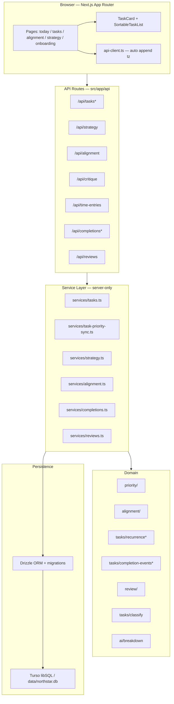
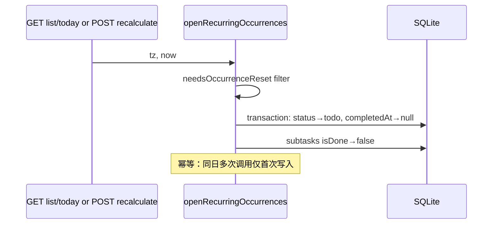

# Northstar 产品设计文档

> 基于当前代码实现的完整产品说明。Northstar 是一款以**战略对齐**和**自动优先级**为核心的 AI 驱动待办应用。

---

## 0. 当前状态（2026-06-18）

MVP 功能闭环已完成。当前实现以 4 个主导航页面为核心：Today、对齐、Tasks、Strategy；完成记录与周期快照都收敛到 Alignment 页面内。

| 能力 | 最新状态 |
|------|----------|
| 战略 / Onboarding | 5 步模板化建模；Strategy 页可编辑 North Star、horizon、每周小时与 Work 主赛道 |
| 任务 / 优先级 | 创建、AI/规则分类与估时、自动拆解、手动排序、Top 5 Today、recurring lazy reset 均已接入 |
| 完成可见性 | `task_completion_events` 不可变快照已落库；Today 有「今日已完成」折叠；Alignment 有周期完成记录 |
| Alignment | `?period=today\|week\|month\|all` 驱动 KPI、pillar drift、Work sub-tracks、完成记录与 CSV 导出 |
| Review 快照 | week/month 周期可在 Alignment 顶部保存；`#snapshots` 展示最近历史 |
| CSV 导出 | Alignment 支持 completions CSV 与 time entries CSV；导出使用当前 period 与 pillar 筛选 |
| UX 收尾 | Today 筛选空状态、Tasks 进行中空状态、错误重试与 i18n 文案已补齐 |
| 非 MVP 债务 | optimistic UI、多用户 auth、拖延雷达周期化仍保留为后续可选 |

---

## 1. 产品定位

### 1.1 核心问题

知识工作者往往任务繁多，但时间分配与长期目标脱节。Northstar 将「人生战略」显式建模为 **North Star + 战略支柱（Pillars）**，用时间记录衡量实际投入，用优先级引擎把「此刻最该做什么」推到 Today 队列顶部。

### 1.2 设计原则

| 原则 | 说明 |
|------|------|
| 战略先行 | 无策略则引导 onboarding；所有任务归属 pillar，Work 可细分 focus track |
| 自动排序 | 优先级由多因子加权计算，用户可手动拖拽微调，二者通过 `manualSortOrder` 与 `priorityScore` 联动 |
| 轻量 AI | LLM 可选（`OPENAI_API_KEY`）；无 key 时规则 fallback，不阻塞核心流程 |
| 单用户本地优先 | SQLite（Turso 或本地 `data/northstar.db`），无多租户 auth |

### 1.3 页面与导航

| 路由 | 用途 |
|------|------|
| `/` | 重定向至 `/today` |
| `/onboarding` | 5 步策略引导（horizon → brain dump critique → work track → north star → 种子任务） |
| `/today` | Top 5 今日任务（pillar 过滤 + 优先级）；底部折叠「今日已完成」 |
| `/tasks` | 全量任务板（状态分段、手动排序、创建、分类预览） |
| `/strategy` | North Star 编辑 + pillars 只读展示；完整重配走 onboarding |
| `/alignment` | **对齐单页**（长滚动）：KPI、pillar drift、work sub-tracks、拖延雷达、`#completions` 完成记录、`#snapshots` 快照；顶部 `?period=today\|week\|month\|all` 驱动全页 |

---

## 2. 架构总览



### 2.1 分层约定

| 层 | 路径 | 约束 |
|----|------|------|
| API | `src/app/api/**/route.ts` | HTTP 入口、参数解析、错误映射 |
| Service | `src/lib/services/*.ts` | `import "server-only"`，DB 读写与事务 |
| Domain | `src/lib/priority`, `alignment`, `tasks/*` | 业务逻辑，不直接访问 DB |
| UI | `src/app/**`, `src/components/**` | Client components + `apiFetch` |
| DB | `src/lib/db/` | schema、init-sql、migrations |

---

## 3. 数据模型

Schema 定义于 `src/lib/db/schema.ts`，新库 DDL 在 `src/lib/db/init-sql.ts`。

### 3.1 战略层

**`north_stars`** — 单条活跃 North Star（应用假设仅一条）

| 字段 | 说明 |
|------|------|
| `statement` | 季度/年度目标陈述 |
| `horizon` | 时间范围，如 `2026 Q2` |
| `hoursPerWeek` | 可投入小时预算 |
| `workPrimaryTrack` | Work pillar 主赛道（进大厂 / 探索方向 / 投资） |

**`strategic_pillars`** — 生活平衡模板默认 6 柱：工作、健康、关系、娱乐、琐事、缓冲

| 字段 | 说明 |
|------|------|
| `targetPct` | 目标时间占比 |
| `keywords` | JSON 字符串数组，规则分类用 |
| `focusTracks` | JSON `FocusTrack[]`，仅 Work 有子赛道 |
| `floorMinPerWeek` / `capMaxPct` | 硬约束 floor / cap |
| `isHardConstraint` | 是否标记为硬约束 |
| `sortOrder` | 展示顺序 |

**`strategy_revisions`** — 策略变更快照（revision history，当前 UI 未展示）

### 3.2 任务层

**`tasks`**

| 字段 | 说明 |
|------|------|
| `status` | `todo` \| `in_progress` \| `done` |
| `pillarId` / `focusTrack` | 战略归属 |
| `priorityScore` / `priorityFactors` / `priorityComputedAt` | 优先级引擎输出 |
| `manualSortOrder` | 看板手动顺序（0 = 顶部） |
| `intimidationScore` | 1–5，高恐吓未启动时抬高优先级 |
| `estimatedMin` | 预估时长 |
| `dueAt` | 一次性截止日期（与 recurrence **互斥**） |
| `completedAt` | 完成时间 ISO |
| `recurrenceType` / `recurrenceDays` / `recurrenceCarryOver` | 重复规则（见 §6） |

**`subtasks`**

| 字段 | 说明 |
|------|------|
| `sortOrder` | 排序 |
| `isDone` | 勾选状态；recurring reset 时清除 |

**`time_entries`**

| 字段 | 说明 |
|------|------|
| `durationMin` | 记录分钟数 |
| `source` | `manual` \| `timer` |
| `startedAt` / `note` | 可选元数据 |

时间记录**不删除**；recurring 任务 lazy reset 只清 `status` / `completedAt` / 子任务勾选。

**`task_completion_events`** — 完成快照（不可变；reopen / recurring reset **不删**）

| 字段 | 说明 |
|------|------|
| `taskId` | 关联任务 |
| `completedAt` | 完成时刻 ISO |
| `occurrenceDate` | 用户时区下的完成日 `YYYY-MM-DD` |
| `taskTitle` / `pillarId` / `pillarName` / `pillarColor` / `focusTrack` | 完成时快照 |
| `recurrenceType` | 完成时的重复类型 |

写入：`status` 非 done → done 时在事务内 INSERT；同 `(task_id, completed_at)` **幂等**（重复调用不增行）。启动迁移 `dedupeCompletionEvents` 清理历史重复行。

### 3.3 回顾层

**`review_snapshots`** — 周期回顾快照（Alignment 页 week/month 可保存；`#snapshots` 展示历史）

| 字段 | 说明 |
|------|------|
| `periodStart` / `periodEnd` | 闭区间 `YYYY-MM-DD`（用户时区） |
| `plannedPct` / `actualPct` | JSON map pillarId → % |
| `driftScore` | 各 pillar \|drift\| 之和 |
| `alignmentScore` | 与 Alignment 同公式 |
| `aiSummary` | JSON highlights（完成摘要、记录分钟；当前为规则汇总，不调用 LLM） |

---

## 4. 战略与 Onboarding

### 4.1 生活平衡模板

`src/lib/strategy/templates.ts` 定义 `LIFE_BALANCE_TEMPLATE`：

- **工作** 40%：子赛道 进大厂 50% / 探索方向 30% / 投资 20%
- **健康** 15%：floor 300 min/周，硬约束
- **关系** 15%：floor 600 min/周，硬约束
- **娱乐** 10%：cap 12%
- **琐事** 10%：cap 12%
- **缓冲** 10%

Work track preset（`WORK_TRACK_PRESETS`）在 onboarding 第三步选择，影响 `workPrimaryTrack` 与 Work pillar 的 `focusTracks` 权重。

### 4.2 Brain Dump Critique

`POST /api/critique` → `analyzeBrainDump()`（`src/lib/strategy/critique.ts`）

规则检测多职业路径、健康/家庭张力等，输出 `StrategyCritique`：

- `findings[]`：code / message / severity
- `requiresWorkTrackChoice`：是否需选定主赛道
- `requiresMeasurableNorthStar`：是否建议更可衡量的 North Star

无 LLM 依赖，纯关键词/heuristic。

### 4.3 策略持久化

`POST /api/strategy`（action: `template`）→ 全量写入模板 + pillars。

`PATCH /api/strategy` → `updateNorthStar()`：更新 statement / horizon / hoursPerWeek / Work 主赛道；同步 Work pillar 的 `focusTracks` 权重；写入 `strategy_revisions`（source: `strategy_edit`）。**不**改 pillar 占比与其它柱配置。

Onboarding 结束时 seed 4 条示例任务（LC、投资复盘、晨跑、家庭晚餐）。

---

## 5. 优先级引擎

实现于 `src/lib/priority/index.ts`。

### 5.1 加权因子

| 因子 | 权重 | 逻辑摘要 |
|------|------|----------|
| `strategicUrgency` | 0.30 | pillar drift < 0 时升高；Work 主赛道 track drift 额外加权 |
| `deadlinePressure` | 0.25 | `dueAt` 或 recurring 虚拟 deadline 越近越高 |
| `intimidationEscalation` | 0.15 | 高恐吓 + 0 分钟记录 → 升高 |
| `dependencyBlocker` | 0.10 | 当前恒为 0（预留） |
| `staleness` | 0.10 | 创建越久轻微升高 |
| `recentlyDonePenalty` | 0.10 | 当前恒为 0（预留） |

Recurring 任务的 `effectiveDue` 来自 `virtualDeadlineForPriority()`（见 §8.3）。

### 5.2 重算与手动排序

**全量重算**：`POST /api/tasks/recalculate-priorities?tz=` → `recalculatePriorities(tz)` → `openRecurringOccurrences` → `persistPriorities(tz)` → `rerankAll(..., tz)` → 写回每条 active 任务的 score / factors / manualSortOrder。

**看板拖拽**：`POST /api/tasks/reorder` → `applyManualReorderScores` — 按新顺序重写 `manualSortOrder` 与 `priorityScore`（rank → score 线性映射）。

**列表读取**：`listTasks` 在返回前调用 `syncActivePriorityFromManualOrder`，使 manual 顺序与 score 一致。

`rerankAll` 排除 `status === 'done'`；done 任务排在 active 之后，保留原 manual 相对顺序。

---

## 6. 对齐（Alignment）

实现于 `src/lib/alignment/index.ts`，`GET /api/alignment?period=&tz=` 聚合返回。

**周期范围**：顶部 `?period=today|week|month|all`（默认 week）同时驱动 pillar 对齐、Work focus tracks、KPI 记时与完成记录列表。`time_entries` 在 `all` 时不做日期过滤；其余档位按用户时区闭区间过滤。拖延雷达仍基于全量任务与时间记录。

Alignment 顶部同时提供两个导出入口：完成记录 CSV 复用当前 period 与 pillar filter；时间记录 CSV 复用当前 period，但不受 pillar filter 影响（按任务快照补 pillar / focusTrack 信息）。

### 6.1 Pillar 对齐

`computeAlignment(pillars, tasks, entries)`：

1. 按 task.pillarId 汇总 time_entries 分钟
2. 计算各 pillar `actualPct` vs `targetPct` → `drift`
3. 生成 alert：`under_floor` / `over_cap` / `under_target` / `over_target`
4. `alignmentScore = max(0, 100 - sum(|drift|) / 2)`

未归属 pillar 的时间计入 `unallocatedPct`。

### 6.2 Work Focus Tracks

`computeWorkFocusTracks(workPillar, tasks, entries)`：仅统计 Work pillar 下任务的 time entries，按 `focusTrack` 聚合，对比 `shareOfParent` 目标。

### 6.3 拖延雷达

`detectProcrastination(tasks, entries)` 标记：

- 创建 ≥7 天且 0 分钟记录
- 高恐吓（≥4）且未启动

最多返回 5 条，供 Alignment 页展示。

### 6.4 Review 快照

Alignment 的 `week` / `month` period 映射到 review period，可保存当前 live dashboard 为 `review_snapshots`。保存时同一周期更新既有快照；`#snapshots` 展示最近 12 条历史。`today` / `all` 不展示保存按钮。

---

## 7. 任务生命周期

### 7.1 创建

`POST /api/tasks` → `createTask()`：

1. Zod 校验（含 recurrence，见 §8）
2. `analyzeTaskTitle()` — 并行 classify + estimate
3. 若未指定 pillar，用 classify 结果；Work 自动 `suggestFocusTrack()`
4. `shouldAutoBreakdown(title)` 为 true 且 `autoBreakdown !== false` 时自动 AI/规则拆解子任务
5. 创建后触发 `persistPriorities`

Tasks 页创建表单支持：手动选 pillar、live classify 预览（debounce 400ms）、`TaskRecurrenceForm`。

### 7.2 更新与完成

`PATCH /api/tasks/[id]` — 支持 status、pillar、focusTrack、estimatedMin、intimidationScore、recurrence 等。

完成：`status: "done"` + 写入 `completedAt` + `task_completion_events` 快照。MVP **无 optimistic UI**，完成后 `reload()` 全量刷新。

### 7.3 子任务

| 端点 | 行为 |
|------|------|
| `GET/POST /api/tasks/[id]/subtasks` | 列表 / 新增 |
| `PATCH/DELETE /api/subtasks/[id]` | 更新标题、勾选、删除 |
| `POST /api/tasks/[id]/subtasks/reorder` | 排序 |
| `POST /api/tasks/[id]/breakdown` | AI/规则生成预览 |
| `POST /api/tasks/[id]/breakdown/apply` | 应用 diff（增删改子任务） |

`subtask-diff.ts` 计算 proposed vs existing 的 diff，UI 用 `TaskBreakdownDiff` 确认。

### 7.4 时间记录

`POST /api/time-entries` — `{ taskId, durationMin, ... }`，供 TaskCard「记录时间」使用。记录影响 alignment 与 intimidation 因子。

### 7.5 Today vs Tasks

| 页面 | 数据源 | 客户端过滤 |
|------|--------|------------|
| **Today** | `GET /api/tasks?status=today&tz=` + `GET /api/completions?since=today&until=today` | pillar filter → Top 5 `rankAndLimit(5)`；底部折叠「今日已完成」 |
| **Tasks** | `GET /api/tasks?sort=manual&tz=` | **状态分段**（进行中 / 已完成 / 全部）+ pillar filter；已完成 tab 禁拖拽 |
| **Alignment** | `GET /api/alignment?period=&tz=` + `GET /api/completions?since=&until=` + `GET /api/reviews?period=`（week/month 快照区） | 统一 period 选择器；`#completions` 逐条列表 + pillar 筛选；`#snapshots` 历史与保存（week/month） |

`/api/tasks?status=today` 返回 **priority 预排序**的 due-today 全量 + subtasks；客户端不再用 `takeTopTasks`（后者会额外排除 done，Today 路径不需要）。

Tasks 板**不做日历过滤**；**进行中** tab 排除 `done`；**已完成** tab 仅当前仍为 done 的行（recurring reset 后不在此 tab，但 **completion event 保留**）。

完成写入：`task_completion_events` 表（不可变快照）；仅 `status` 非 done → done 时 INSERT；reopen / recurring reset **不删** event。

### 7.6 Completion events API

| 方法 | 路径 | 说明 |
|------|------|------|
| GET | `/api/completions?since=&until=&pillarId=&tz=` | 按 `occurrence_date` 闭区间列表 |
| GET | `/api/completions/summary?since=&until=&tz=` | Alignment 本周完成摘要 |

`api-client.ts` 对 `/api/tasks`、`/api/subtasks`、`/api/completions` 前缀 **自动 append `?tz=`**。`PATCH /api/tasks/[id]` 与 `PATCH /api/subtasks/[id]` 解析 `tz` 用于 `occurrence_date` 计算。

---

## 8. 周期性任务（Recurring）

### 8.1 产品决策

| 决策 | 选择 |
|------|------|
| 数据模型 | **同一条任务**：新周期 lazy reset 为 `todo`，保留 time_entries 历史 |
| 类型 | `daily` / `weekly`（多选 ISO 周几 1=Mon…7=Sun） |
| 错过周期 | `recurrence_carry_over` 可配置；**仅 weekly**；默认不补做 |
| `dueAt` | 与 recurrence **互斥** |
| reset | 清 `status`/`completedAt`/子任务勾选；**不删** time_entries |

### 8.2 时区

`src/lib/tasks/timezone.ts`：

- `DEFAULT_TIMEZONE = "America/New_York"`
- `clientTimezone()` — 浏览器 IANA
- `resolveTimezone(tz)` — 缺省 → DEFAULT；非法 → `InvalidTimezoneError` → API 400
- `addLocalDays` / `startOfLocalDay` / `endOfLocalDay` — DST-safe 日历算术

`api-client.ts` 对 `/api/tasks` 前缀 URL **自动 append `?tz=`**。

### 8.3 重复规则逻辑

`src/lib/tasks/recurrence.ts`（输入 `RecurrenceTaskFields + instant + tz`）：

| 函数 | 用途 |
|------|------|
| `matchesRecurrenceDay` | 本地日是否命中 schedule |
| `isCompletedForToday` | 本周期内已完成 → Today 隐藏 |
| `needsOccurrenceReset` | lazy reset 触发（仅 `status=done`） |
| `shouldShowOnToday` | Today 可见性（含 weekly carry-over overdue） |
| `isOccurrenceOverdue` | carry-over 判定 |
| `nextScheduledAfter` | UI badge「下次」 |
| `virtualDeadlineForPriority` | 优先级虚拟 deadline = 今日 endOfLocalDay |

`recurrence.ts` **不 import** `@/lib/db/schema`，边界统一 `toRecurrenceFields()`。

### 8.4 Lazy Reset



调用点：`listTasks`、`listDueTodayTasksWithSubtasks`、`recalculatePriorities`。

### 8.5 UI

- **创建**：`TaskRecurrenceForm`（Tasks 页）
- **编辑**：TaskCard 内 recurrence 面板 + PATCH
- **展示**：`TaskRecurrenceBadge`（`nextScheduledAfter` + 完成态文案）

---

## 9. AI 能力

均需 `OPENAI_API_KEY`（可选 `OPENAI_MODEL`，默认 `gpt-4o-mini`）。无 key 时走规则路径。

| 能力 | 入口 | Fallback |
|------|------|----------|
| 任务分类 | `POST /api/tasks/classify`、`createTask` 内嵌 | `ruleBasedClassify` 关键词 |
| 时长估计 | classify 同 endpoint、`analyzeTaskTitle` | `estimate-time.ts` 规则 |
| 子任务拆解 | `generateBreakdown`、`shouldAutoBreakdown` | `ai/breakdown.ts` 模板（LC、deck、投资等） |
| 策略 critique | onboarding brain dump | 纯规则 `analyzeBrainDump` |

Classify 对 Work pillar 额外推断 `focusTrack`（`suggestFocusTrack` 规则 + LLM）。

---

## 10. API 一览

| 方法 | 路径 | 读 `tz` | 说明 |
|------|------|---------|------|
| GET | `/api/tasks?sort=&status=&tz=` | ✓ | 全量任务 + subtasks；`status=today` 返回 due-today + subtasks |
| POST | `/api/tasks` | — | 创建 |
| PATCH | `/api/tasks/[id]` | ✓ body `tz` | 更新；done 时写 completion event |
| POST | `/api/tasks/recalculate-priorities?tz=` | ✓ | 重算优先级 |
| POST | `/api/tasks/reorder` | — | 手动排序 |
| POST | `/api/tasks/classify` | — | 预览分类 + 估计 |
| POST | `/api/tasks/[id]/breakdown` | — | 拆解预览 |
| POST | `/api/tasks/[id]/breakdown/apply` | — | 应用拆解 |
| GET/POST | `/api/tasks/[id]/subtasks` | — | 子任务 CRUD |
| POST | `/api/tasks/[id]/subtasks/reorder` | — | 子任务排序 |
| PATCH/DELETE | `/api/subtasks/[id]` | ✓ body `tz` | 单个子任务；全勾完 auto-done 写 event |
| GET | `/api/completions?since=&until=&pillarId=&tz=` | ✓ | 按 `occurrence_date` 闭区间列表 |
| GET | `/api/completions/export?since=&until=&pillarId=&tz=` | ✓ | 同上筛选，返回 CSV 下载 |
| GET | `/api/completions/summary?since=&until=&tz=` | ✓ | Alignment 本周完成摘要 |
| GET/POST | `/api/time-entries` | — | 时间记录 |
| GET | `/api/time-entries/export?since=&until=&tz=` | ✓ | 周期内 time log CSV |
| GET/POST | `/api/strategy` | — | 策略读 / 全量写（onboarding） |
| GET | `/api/reviews?period=&tz=` | ✓ | 周期回顾 live 数据 + saved/history |
| POST | `/api/reviews` | ✓ body `tz` | 保存 week/month 快照（body.period） |
| PATCH | `/api/strategy` | — | North Star + Work 主赛道编辑 |
| GET | `/api/alignment?period=&tz=` | ✓ | 对齐仪表盘 + 拖延；`period` 默认 week |
| POST | `/api/critique` | — | Brain dump 分析 |

Zod schemas：`src/lib/api/tasks/schemas.ts`；tz 解析：`parse-tz-query.ts` + `tz-error.ts`。

---

## 11. 前端架构

### 11.1 数据获取

- 主路径：`apiFetch()` — 统一错误处理、dev 提示；对 `/api/tasks`、`/api/subtasks`、`/api/completions`、`/api/alignment`、`/api/reviews`、`/api/time-entries` **自动 append `?tz=`**
- Onboarding / Strategy 部分页面仍用 raw `fetch`（策略类接口不需 tz）

### 11.2 共享 Hook

`useTaskActions` — Today 与 Tasks 共用：

- `patchTask`、`changePillar`、`recalculatePriority`
- `breakdownTask` / `applyBreakdown`
- 子任务 CRUD、reorder
- `logTime`、`reorderTasks`

每次 mutation 后 `reload()`（full reload，无 optimistic）。

### 11.3 核心组件

| 组件 | 职责 |
|------|------|
| `TaskCard` | 任务卡片：分类、优先级面板、子任务、recurrence、完成/记时 |
| `SortableTaskList` | Tasks 页拖拽排序（@dnd-kit） |
| `SortableSubtasks` | 子任务拖拽 |
| `CategoryFilter` | Pillar 过滤 chips |
| `PillarBar` | Alignment 页 drift 条 |
| `alignment/*` | 对齐单页各区块（KPI、pillar、work tracks、拖延、完成记录、快照） |
| `TaskStatusFilterBar` | Tasks 页进行中 / 已完成分段 |
| `CompletionListItem` | 完成记录按日分组行 |
| `AppHeader` / `AppNav` | 顶栏导航（Today / 对齐 / Tasks / Strategy）+ 语言切换 |

### 11.4 客户端 Enrich

`enrich-tasks.ts`：

- `parseStrategyPillars` / `enrichTasksWithPillars` — 附加 pillar 名称、颜色
- `filterTasksByPillar` — 本地过滤
- `mergeFilteredTaskReorder` — 分类过滤下拖拽时合并全局顺序

---

## 12. 国际化

`src/lib/i18n/` — Context + `en.ts` / `zh.ts`。

- 默认 `html lang="zh-CN"`，`LocaleProvider` 切换
- 实体翻译：`entities.ts` 翻译 pillar 名、focus track、critique finding、budget 表等**存储中文 key**
- TaskCard、Onboarding、Alignment 等全面接入 `t.*`

---

## 13. 数据库与迁移

### 13.1 连接

`src/lib/db/index.ts`：

- 有 `TURSO_DATABASE_URL` → Turso cloud
- 否则 → `data/northstar.db` 本地文件

启动时 `initSchema`：`INIT_SQL`（`executeMultiple` 失败时容错）+ `applyMigrations`。

### 13.2 迁移策略

`applyMigrations`（app 启动与 `npm run db:migrate` 共用）：

1. `safeDropIsPinnedIfExists` — 条件 DROP 遗留 `is_pinned`
2. `dropIsEntryPointIfExists` — 条件 DROP 遗留 `is_entry_point`
3. `migrate(db, drizzle/)` — journal `0000` 为 no-op
4. `addRecurrenceColumnsIfMissing` — 条件 ADD recurrence 三列
5. `addCompletionEventsTableIfMissing` — CREATE TABLE + index
6. `dedupeCompletionEvents` — 去重 `(task_id, completed_at)`
7. `backfillCompletionEventsIfMissing` — 为历史 done 任务补 event
8. `dedupeCompletionEvents` — backfill 后再去重

| 场景 | recurrence 列 |
|------|----------------|
| 全新库 | init-sql CREATE TABLE 已含 |
| 旧库无列 | JS 条件 ADD |
| 列已存在 | PRAGMA 跳过 |

---

## 14. 测试

Vitest 覆盖核心逻辑与服务：

| 区域 | 代表测试文件 |
|------|-------------|
| 重复规则 | `recurrence.test.ts`, `recurrence-types.test.ts` |
| 时区 | `timezone.test.ts` |
| 排序 / Today | `task-sorting.test.ts` |
| 完成 event | `completion-events.test.ts`, `completion-dedupe.test.ts`, `completions-api.integration.test.ts`, `tasks-completion.integration.test.ts` |
| 优先级 | `priority/index.test.ts`, `recurring-priority.test.ts` |
| Reset 计划 | `occurrence-reset-plan.test.ts` |
| 分类 / 拆解 | `classify.test.ts`, `breakdown.test.ts` |
| 对齐 | `alignment/index.test.ts`, `alignment.integration.test.ts` |
| 回顾 | `review/period.test.ts`, `review/build-snapshot.test.ts`, `reviews.integration.test.ts` |
| 导出 | `export/completions-csv.test.ts`, `export/time-entries-csv.test.ts` |
| 策略 | `strategy/work-track.test.ts`, `strategy-update.integration.test.ts` |
| API schema | `schemas.test.ts`, `parse-tz-query.test.ts` |
| 组件 | `task-card.test.tsx`, `sortable-subtasks.test.tsx` |

Recurring 测试基准时区：`America/New_York`，冻结 `now` instant。

---

## 15. 部署与运维

```bash
npm install
cp .env.example .env.local   # TURSO_* + 可选 OPENAI_API_KEY
npm run db:migrate           # 本地 + Turso 迁移
npm run dev                  # 开发
npm run build && npm start   # 生产
npm test                     # 单测
```

Turso 空库时可 `npm run db:sync-turso` 从本地同步。

---

## 16. 已知限制

| 项 | 说明 |
|----|------|
| 单用户 | 无 auth / 多 workspace |
| Onboarding raw fetch | 创建 seed 任务不带 tz，不影响首屏 openOcc |
| Daily done 跨日 | 首次 list 请求前 Tasks 板仍显示 done，直到 openOcc |
| 无 optimistic UI | 完成/ PATCH 后 full reload |
| One-off due Today | 非 recurring 任务不做「仅 due 日显示」过滤 |
| Review save tz | `POST /api/reviews` 当前读 body.tz；客户端自动 append 的 query `tz` 不参与保存请求 |
| DST 测试 | 实现 DST-safe，无专项 transition 测试套件 |

---

## 17. 文件索引

```
src/app/
  page.tsx                 # → /today
  today/page.tsx           # Top 5 + 今日已完成折叠
  tasks/page.tsx           # 全量看板 + 状态分段 + 创建
  strategy/page.tsx        # North Star 编辑 + pillars 只读
  alignment/page.tsx       # 对齐单页（KPI + pillar + 完成 + 快照）
  onboarding/page.tsx      # 5 步引导
  api/                     # REST 路由

src/lib/
  db/                      # schema, init-sql, migrations, index
  services/
    tasks.ts               # CRUD, openOcc, list/today
    task-priority-sync.ts  # persistPriorities, manual reorder sync
    task-sorting.ts        # sort, filterTasksDueToday, rankAndLimit
    strategy.ts            # 策略读写
    alignment.ts           # alignment API 聚合
    completions.ts         # completion events 读写 / 摘要
    reviews.ts             # review 快照 build / save / list
    time-entries-export.ts # time log CSV 数据
    occurrence-reset-plan.ts
  review/                  # period + build-snapshot
  export/                  # csv-cell, completions-csv, time-entries-csv
  priority/index.ts        # 优先级引擎
  alignment/index.ts       # 对齐 + 拖延
  tasks/
    recurrence.ts          # 重复规则
    recurrence-types.ts
    completion-events.ts   # event payload / filter / summarize
    completion-ranges.ts   # since/until 预设
    timezone.ts
    classify.ts, analyze.ts, enrich-tasks.ts, subtask-diff.ts
  ai/breakdown.ts
  strategy/templates.ts, critique.ts
  api/tasks/schemas.ts, parse-tz-query.ts
  api/strategy/schemas.ts
  api/completions/parse-completions-query.ts
  api-client.ts
  hooks/use-task-actions.ts
  i18n/

src/components/
  task-card/               # TaskCard 及子组件
  task-recurrence-form.tsx
  task-recurrence-badge.tsx
  sortable-task-list.tsx
  sortable-subtasks.tsx
  category-filter.tsx
  task-status-filter.tsx
  completion-list-item.tsx
  pillar-bar.tsx
```

---

## 18. 端到端示例

### 18.1 新用户首日

1. 打开 `/today` → 无策略 → redirect `/onboarding`
2. 完成 5 步 → 写入 life balance 模板 + 4 条 seed 任务
3. `/today` 加载 `GET /api/tasks?status=today&tz=Asia/Shanghai` → openOcc → pillar filter → Top 5
4. 完成「晨跑」→ PATCH done → reload → Today 移除（非 recurring one-off done）

### 18.2 Daily recurring

1. 创建 daily 任务「冥想 10min」
2. 周一 10:00 mark done → 周一余下 Today 不显示
3. 周二首次 API 请求 → openOcc reset → Today 再显示
4. time_entries 历史保留，alignment 仍统计

### 18.3 战略欠账驱动优先级

1. 健康 pillar drift = -8%（实际投入低于目标）
2. 用户点击「重算优先级」→ `rerankAll` 抬高健康类任务 `strategicUrgency`
3. 健康任务在 Today Top 5 中靠前；TaskCard 展示 factor breakdown

### 18.4 手动微调

1. Tasks 页拖拽任务 A 到顶部 → `POST /api/tasks/reorder`
2. `manualSortOrder` 与 `priorityScore` 同步更新
3. 下次 list 时 `syncActivePriorityFromManualOrder` 保持一致
