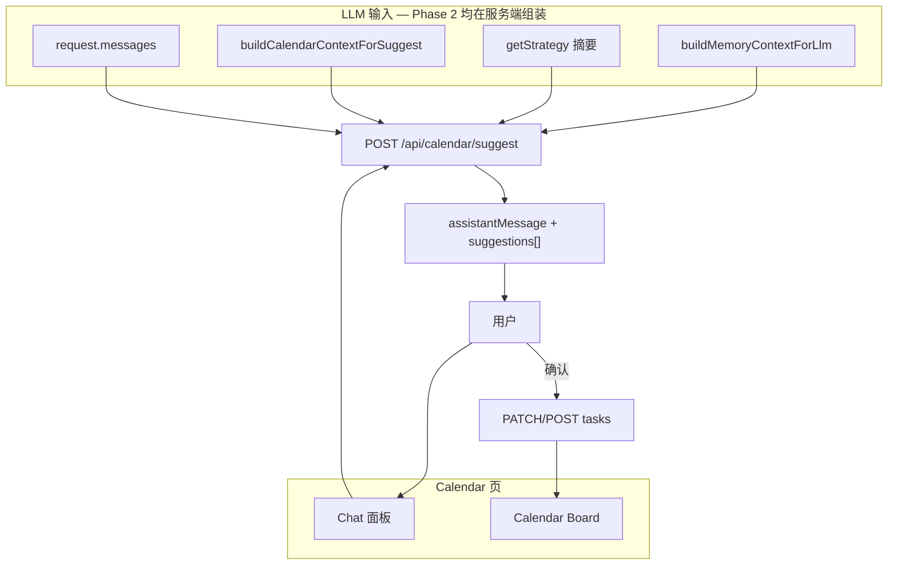

# Profile 页 + 用户 Memory

> Memory 的长期用途：用户在 **Calendar** 上与 LLM 对话，LLM 结合 **memory + 对话 + 当前日历/任务**，建议任务的 `startAt`（开始时间）与 `estimatedMin`（时长），用户确认后写入 calendar。
>
> **Scope**：Phase 1 建 memory 存储与 Profile；Phase 2 建 Calendar LLM 排程助手。Plan 已评审完毕，可进入实现。

---

## 实现 Todo

### Phase 1 — Memory 基础 + Profile（当前 scope）

| ID | 任务 | 状态 |
|----|------|------|
| db-user-memories | 新增 `user_memories`（schema + init-sql + migrations.ts + drizzle generate） | pending |
| api-schemas | `src/lib/api/memories/schemas.ts`：`onboardingMemorySchema`、memory response types | pending |
| service-memories | `listMemories`、`saveOnboardingMemories`（`batchId`）、`buildMemoryContextForLlm`、`getProfile` | pending |
| api-profile-strategy | `GET /api/profile`；strategy POST template 与 memory 同一 transaction | pending |
| onboarding-finish | `finish()` 提交 `onboardingMemory: { brainDump, critique }` | pending |
| profile-page | `/profile`：账号、语言、memory 时间线（按 batch 分组）+ i18n | pending |
| header-entry | `AuthStatus` 邮箱 → `/profile`；middleware 加 `/profile` | pending |
| tests | memories 单测 + strategy template integration + profile scoping | pending |

### Phase 2 — Calendar LLM 排程助手（后续）

| ID | 任务 | 状态 |
|----|------|------|
| calendar-context-svc | `buildCalendarContextForSuggest` — server 拉 tasks / timer / time_entries | pending |
| calendar-chat-ui | Calendar 页可折叠 chat 面板 | pending |
| calendar-suggest-api | `POST /api/calendar/suggest` | pending |
| suggest-apply-ui | 建议预览 → PATCH/POST tasks（snap startAt） | pending |
| chat-memory-write | 可选：`preference` memory，用户确认后写入 | pending |
| calendar-suggest-tests | schema、overlap、slot snap、无 API key fallback | pending |

---

## 产品愿景



**典型对话**：用户说「明天上午 LC、下午 Northstar 2h、晚上家庭晚餐」→ LLM 结合 memory（背景、进大厂、40h/周）映射到已有或新建任务，返回 snap 后的 `startAt` + `estimatedMin`。

**Onboarding → Memory**：brain dump、critique、策略摘要成为 LLM **长期背景**；Profile 只读展示同批 memory。

**与 Strategy 分工**：`/profile` 回顾 memory；`/strategy` 编辑 North Star / pillars。Phase 2 LLM 读 **live `getStrategy`**；memory 补个人叙述与历史 brain dump。`onboarding_summary` 是快照，Strategy 变更不反写 memory。

---

## 现状

- 无 `/profile`、无 `user_memories`
- Onboarding finish 只调 `POST /api/strategy` template；**brain dump / critique 未持久化**
- Calendar 有 `startAt`、`estimatedMin`、15min grid、DnD（[`calendar-time-grid.ts`](src/lib/tasks/calendar-time-grid.ts)），无 chat
- LLM 用于 classify / estimate / breakdown / critique（[`design.md`](design.md) §9），均为单次 JSON，无多轮
- [`saveStrategy`](src/lib/services/strategy.ts) re-template 时会 **delete 全部 pillars 再 insert** → 旧 `tasks.pillarId` 可能悬空（**既有债务**，另开 fix；memory 追加不受影响）
- Header [`AuthStatus`](src/components/auth-status.tsx) 邮箱不可点击

---

## 设计决策

### 存储：SQL 表 + 分 kind 格式（非 Markdown 文件）

| 方案 | 决策 | 原因 |
|------|------|------|
| SQLite / Turso `user_memories` | ✅ | auth 隔离、按 `kind` / `batchId` 查询、Profile 时间线、Turso 部署 |
| 每用户 Markdown 文件 / 单 blob | ❌ | 与架构脱节；难过滤；多 batch 历史麻烦 |
| 全结构化列 | ❌ | `preference` 等类型会持续变化 |

**按 kind 落库**：

| `kind` | `content` | `metadata` |
|--------|-----------|------------|
| `brain_dump` | Markdown / plain text | — |
| `preference` | Markdown 短段 | — |
| `critique` | 留空 | 完整 [`StrategyCritique`](src/lib/strategy/critique.ts) JSON（含 flags） |
| `onboarding_summary` | 留空 | `{ horizon, hoursPerWeek, workTrack, northStar }` |

**给 LLM**：DB 不维护单一 Markdown 文档。`buildMemoryContextForLlm()` 读取时组装 Markdown system 段落（默认 `maxChars = 6000`；locale 决定 section 标题语言）：

```markdown
## 背景
{brain_dump}

## 战略诊断
- WORK_MULTI_TRACK: ...

## Onboarding 快照
- 周期: 2026 Q2 · 40h/周 · 主赛道: 进大厂
```

截断策略：超限时优先截 `brain_dump` 尾部，保留 summary + critique codes。

### Batch 与 LLM 上下文

- 同一次 onboarding finish 共享 `batchId`；重新 onboarding **追加**新 batch，不删历史
- `buildMemoryContextForLlm` 只取 **最新 onboarding batch** + **全部** `preference`（避免 context 膨胀）

### 原子性与 API 契约

- `saveOnboardingMemories` 与 `applyLifeBalanceTemplate` 在同一 **`db.transaction`**；template 失败则 memory 不落库
- Zod：[`src/lib/api/memories/schemas.ts`](src/lib/api/memories/schemas.ts) — `onboardingMemorySchema`（`brainDump` max 20k + 完整 critique schema）
- Profile：`getProfile(userId)` 读 `users` 表（`email`, `name`, `createdAt`）；`GET /api/profile` 仅 `requireUser`

### 安全与隐私

- brain dump 可能含 PII；server log **禁止**打印 `content`
- Phase 2 日历上下文 **server 端**组装（`userId + tz + dateRange`），client 不传 task 快照，防篡改/遗漏

### 迁移

与 [Plan.md](Plan.md) Project 节一致的三件套：

1. Drizzle schema + `npm run db:generate`
2. [`init-sql.ts`](src/lib/db/init-sql.ts)
3. [`migrations.ts`](src/lib/db/migrations.ts) `CREATE TABLE IF NOT EXISTS`

---

## Phase 1：Memory 基础 + Profile

### 1. 数据模型 `user_memories`

[`src/lib/db/schema.ts`](src/lib/db/schema.ts)：

| 字段 | 说明 |
|------|------|
| `id` | PK |
| `userId` | FK → users，`ON DELETE CASCADE` |
| `batchId` | 同次 onboarding 共享；`preference` 可自用 `id()` |
| `source` | `'onboarding'` \| `'calendar_chat'` \| `'manual'` |
| `kind` | `'brain_dump'` \| `'critique'` \| `'onboarding_summary'` \| `'preference'` |
| `content` | 见上表 |
| `metadata` | 见上表 |
| `createdAt` | ISO |

索引：`idx_user_memories_user_created`；可选 `idx_user_memories_user_batch`。

### 2. Service [`memories.ts`](src/lib/services/memories.ts)

**`saveOnboardingMemories(userId, input)`**

- `batchId = id()`；transaction 内于 template 成功后插入 0–3 行：
  - `brain_dump` — `brainDump?.trim()` 非空
  - `critique` — `findings.length > 0`
  - `onboarding_summary` — 始终写入

**`buildMemoryContextForLlm(userId, { maxChars?, locale? })`** — Phase 1 实现，Phase 2 消费

**`listMemories(userId)`** — Profile；`createdAt DESC`，UI 按 `batchId` 分组

**`getProfile(userId)`** — 账号信息

### 3. API

| 路由 | 行为 |
|------|------|
| `GET /api/profile` | `{ user, memories }`；critique 返回解析后的 findings，不必暴露原始 metadata |
| `POST /api/strategy` `action: "template"` | 可选 `onboardingMemory`；transaction 内写 strategy + memory |

**Onboarding client** [`onboarding/page.tsx`](src/app/onboarding/page.tsx) `finish()`：

```ts
onboardingMemory: { brainDump, critique }  // skip analyze → critique: null
```

### 4. Profile 页 [`/profile`](src/app/profile/page.tsx)

| 区块 | 内容 |
|------|------|
| Account | 邮箱、姓名、`createdAt`、Sign out |
| Preferences | `LanguageSwitcher` |
| Memory | batch 时间线；叙事类 markdown 渲染；结构化 kind 从 metadata 格式化；链到 `/strategy` |
| 空状态 | 引导完成 onboarding |

**入口**：Header 邮箱 → `/profile`（无主导航 Tab）。[`middleware.ts`](middleware.ts) 加 `/profile/:path*`。

---

## Phase 2：Calendar LLM 排程助手

### 5. Server 日历上下文

[`buildCalendarContextForSuggest`](src/lib/services/calendar-suggest-context.ts)（`userId, tz, view, anchorDate`）：

| 数据 | 来源 |
|------|------|
| 可见日任务 | `listTasks` + [`taskAppearsOnDay`](src/lib/tasks/calendar.ts) |
| 未排程 one-off | [`isUnscheduledTask`](src/lib/tasks/calendar.ts) |
| Recurring | 按日展开 occurrence |
| 已排程块 | `startAt` + `estimatedMin` |
| Active timer | `active_time_sessions` |
| 当日已 log | `time_entries`（可选） |
| Strategy | pillars target / floor / cap / focusTracks |

Client 只传：`messages`, `tz`, `view`, `anchorDate`。

### 6. `POST /api/calendar/suggest`

**System prompt 顺序**：memory → strategy 摘要 → calendar context → 规则（15min snap、无 overlap、floor/cap、recurring 默认 09:00）

**Response**（Zod + `json_object`）：

```ts
{
  assistantMessage: string;
  suggestions: {
    taskId?: string;
    title?: string;
    startAt: string;       // normalizeTaskStartAt + snapTimeStr
    estimatedMin: number;
    pillarName?: string;
    focusTrack?: string;
    rationale: string;
  }[];
}
```

**校验**：[`normalizeTaskStartAt`](src/lib/tasks/task-dates.ts) + [`snapTimeStr`](src/lib/tasks/calendar-time-grid.ts)（[`CALENDAR_SLOT_MINUTES=15`](src/lib/tasks/calendar-time-grid.ts)）；overlap 丢弃并在 `assistantMessage` 说明。

**Fallback**：无 `OPENAI_API_KEY` → 空 suggestions + i18n 提示手动拖拽。

**Apply**

- 已有任务：`PATCH /api/tasks/:id`
- 新建：`POST /api/tasks` + [`analyzeTaskTitle`](src/lib/tasks/analyze.ts)
- UI：checkbox 批量确认 → reload calendar

### 7. Chat UI + Preference memory

- [`calendar-chat-panel.tsx`](src/components/calendar/calendar-chat-panel.tsx)：messages 存 client state；Phase 2 无 session 表
- 可选：`POST /api/memories` 写入 `preference`（`source: calendar_chat`），用户确认后持久化

---

## 测试

**Phase 1**

- `memories.test.ts`：空 brain dump；critique null；同 batch 共享 `batchId`；第二 batch；context 仅最新 batch；truncation
- strategy integration：`onboardingMemory` → `listMemories.length >= 1`；transaction 失败 → memories 空
- profile API user scoping

**Phase 2**

- suggest schema；overlap / slot snap；recurring in context；无 API key fallback

参考：[`strategy-update.integration.test.ts`](src/lib/services/strategy-update.integration.test.ts)、[`projects-tasks.integration.test.ts`](src/lib/services/projects-tasks.integration.test.ts)

---

## 已知限制

- **无 backfill**：旧 onboarding 内容不可恢复
- **Re-onboarding 删重建 pillars**：tasks 可能指向失效 `pillarId`（既有债务）
- **Phase 1 无 Calendar chat**
- **Profile v1 不可编辑/删除 memory**
- **Phase 2 对话不持久化**
- **LLM Apply 非事务**：部分失败需 UI 逐条报错

---

## 主要改动文件

**Phase 1** — `schema.ts`, `init-sql.ts`, `migrations.ts`, `drizzle/*`, `lib/api/memories/schemas.ts`, `services/memories.ts`, `api/profile/route.ts`, `api/strategy/route.ts`, `app/profile/page.tsx`, `app/onboarding/page.tsx`, `components/auth-status.tsx`, `middleware.ts`, `i18n/*`

**Phase 2** — `services/calendar-suggest-context.ts`, `lib/ai/calendar-suggest.ts`, `api/calendar/suggest/route.ts`, `components/calendar/calendar-chat-panel.tsx`, `app/calendar/page.tsx`, `i18n calendar.*`
