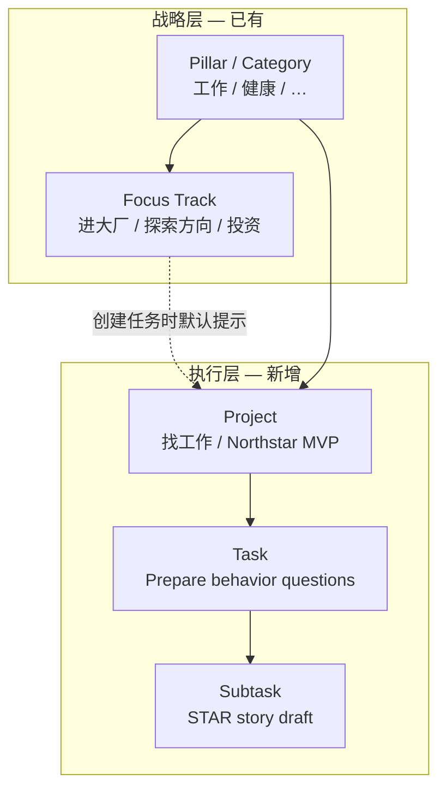
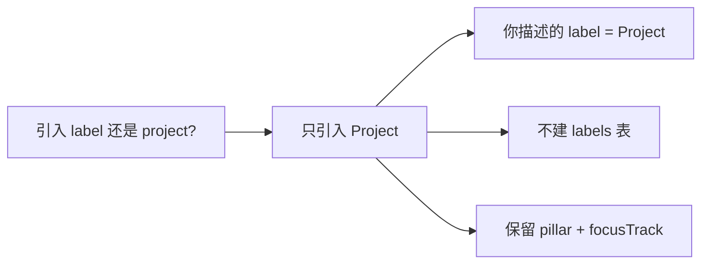

# 引入 Project 概念 — 与 Label 冗余性分析

> 在 Northstar 中引入 Work 交付物级别的 **Project** 概念，用于在 Pillar（Category）之下分组具体任务（如「找工作」下的 behavior question）。你描述的「label」与 Project 是同一层语义，不应再单独建 Label 实体；Project 与现有 focusTrack 也不重复，二者分属战略层与执行层。

## Plan Critique Log

| 轮次 | 发现的主要问题 | 处理 |
|------|----------------|------|
| R1 | 未指定 `buildTaskPatch` 中 pillar 变更时清空 `projectId`（与 focusTrack 清空同级） | 已补充 service 约束节 |
| R1 | 缺少 `enrichTasksWithProjects`、`TaskRow.projectName`、乐观更新 hook | 已补充数据流节 |
| R1 | 有 project filter 时拖拽排序未说明 `mergeFilteredTaskReorder` | 已补充 UI/reorder 节 |
| R1 | 迁移仅写 Drizzle，未覆盖 `init-sql.ts` + `migrations.ts` 增量模式 | 已补充迁移节 |
| R1 | Work pillar 检测写死「工作」字符串，与代码库 `findWorkPillar` 不一致 | 已改为 helper 约定 |
| R1 | `project.focusTrack` 语义未定（约束 vs 提示） | 已决策：仅创建时默认提示 |
| R1 | 项目名唯一性未定 | 已决策：同 user + Work pillar 下 active 名称唯一 |
| R1 | Today 页已 redirect 到 `/tasks`，Phase 1 范围需对齐现状 | 已修正 |
| R1 | v1 范围过大（color、DELETE、server filter 同时出现） | 已收窄 v1 |
| R2 | （复查）上述缺口已闭合；剩余为 Phase 2 增强项，非阻塞 | 无 major problems |

**R2 结论：plan 可进入实现阶段。**

---

## 结论：不冗余，但「label」应统一为 Project

根据你的澄清（*behavior question 属于「找工作」*），当前产品缺的是 **Category 下的执行层分组**，而不是 free-form 标签。

| 概念 | 现状 | 层级 | 职责 | 与 Project 关系 |
|------|------|------|------|----------------|
| **Pillar / Category** | 已实现 [`tasks.pillarId`](src/lib/db/schema.ts) | 战略层 | 人生平衡归属，驱动 Alignment 时间占比 | **正交**：Project 挂在 Work pillar 下，不替代 Category |
| **Focus Track** | 已实现 [`tasks.focusTrack`](src/lib/db/schema.ts) | 战略子层（仅 Work） | 进大厂 / 探索方向 / 投资，带 `shareOfParent` 目标占比 | **不重复**：战略赛道 vs 具体交付物；一个 track 可有多个 project |
| **你所说的 Label** | 不存在 | 执行层 | Category 下的具体项目（找工作） | **= Project**，用 Project 命名，不另建 `labels` 表 |
| **Subtask** | 已实现 | 任务内 | 单任务拆解 | **不重复**：Project 跨多任务分组 |

推荐层级模型：



**典型映射示例**：

- Pillar: 工作
- Focus Track: 进大厂（战略：这类工作应占 Work 时间 50%）
- Project: 找工作（执行：当前求职 initiative）
- Task: 准备 behavior questions

若同时引入 Label 实体，用户会在 UI 上看到「Category · Sub-track · Label/Project」三层命名，且 找工作 既可当 label 又可当 project — **语义重复、维护成本高**。建议：**只引入 Project，UI 文案用「项目」/「Project」，废弃 label 作为产品术语**。

---

## 与 focusTrack 的边界（避免误用）

| 维度 | Focus Track | Project |
|------|-------------|---------|
| 谁定义 | Strategy / Onboarding 模板 | 用户随时创建 |
| 数量 | 固定 3 条（Work preset） | 无上限 |
| 驱动指标 | Alignment Work sub-tracks drift | 不进入 alignment / priority 公式（v1） |
| 生命周期 | 随季度战略调整 | 随交付物启停（archive） |
| 例子 | 进大厂 | 找工作、刷 Leetcode 300、Northstar MVP |

**不要**用 Project 替代 focusTrack：后者是 [`computeWorkFocusTracks`](design.md) 的输入，改动会破坏战略对齐闭环。

### `project.focusTrack` 决策（R1 闭合）

- 字段为**可选默认提示**，不是硬约束。
- **创建任务**时：若 `task.focusTrack` 未指定且选了 `projectId`，从 `project.focusTrack` 填入（与 classify 结果 merge：显式输入 > classify > project 默认）。
- **已有任务**：不因 project 的 focusTrack 变化而强制改写 task.focusTrack。
- **校验**：`project.focusTrack` 若存在，必须是当前 Work pillar 的 `focusTracks` 之一（与 task focusTrack 校验共用 helper）。

---

## 数据模型

在 [`src/lib/db/schema.ts`](src/lib/db/schema.ts) 新增：

```ts
// projects — Work 交付物容器（v1 限定 Work pillar）
projects: {
  id, userId,
  pillarId,          // FK → strategic_pillars；v1 校验必须为 Work pillar
  name,              // 用户输入，如 "找工作"
  focusTrack?,       // 可选，创建任务时的默认子赛道
  sortOrder,
  status: "active" | "archived",
  createdAt, updatedAt,
}

// tasks 扩展
tasks.projectId?     // nullable FK → projects
```

**v1 刻意不做**：`color` 字段、跨 pillar project、一任务多 project。

**唯一性**：`(userId, pillarId, name)` 在 `status = 'active'` 时唯一（应用层校验 + unique index 可选；archive 后可复用同名）。

### Service 约束（必须在 `buildTaskPatch` / `createTask` 实现）

沿用 [`src/lib/services/tasks.ts`](src/lib/services/tasks.ts) 中 pillar/focusTrack 模式：

1. `task.projectId` 非空 → `task.pillarId` 必须等于 `project.pillarId`。
2. `pillarId` 变更且新 pillar **不是** Work（用 [`findWorkPillar`](src/lib/pillars.ts) / [`isWorkPillar`](src/lib/pillars.ts)，**禁止**硬编码 `"工作"`）→ 自动 `projectId = null`（与 focusTrack 清空同级，写在 `buildTaskPatch`）。
3. `projectId` 变更 → 校验 project 存在、属于当前 user、且 `project.status === 'active'`。
4. v1 创建 project 时校验 `pillarId === findWorkPillar(pillars)?.id`。
5. **不改动**：`task_completion_events` 快照、alignment 聚合、priority 引擎 — 时间仍按 `pillarId` / `focusTrack` 入账。

### 数据流 / 类型扩展

| 位置 | 变更 |
|------|------|
| [`src/lib/tasks/enrich-tasks.ts`](src/lib/tasks/enrich-tasks.ts) | 新增 `ProjectOption`、`enrichTasksWithProjects()`、`filterTasksByProject()` |
| `TaskRow` | 扩展 `projectName?: string` |
| [`src/lib/hooks/use-task-actions.ts`](src/lib/hooks/use-task-actions.ts) | 新增 `changeProject(taskId, projectId)` + `buildProjectOptimisticPatch()` |
| [`src/components/task-card/types.ts`](src/components/task-card/types.ts) | `onChangeProject` callback |
| UI Work 检测 | 使用 [`isWorkPillarOption`](src/components/task-card/utils.ts)，不用字面量比较 |

---

## API 与服务层

所有路由 `requireUser()` + userId 作用域（与现有 tasks API 一致）。

### v1 端点

| 端点 | 行为 |
|------|------|
| `GET /api/projects` | 列出当前用户 active projects（默认仅 Work pillar；`?includeArchived=1` 可选） |
| `POST /api/projects` | 创建（name, pillarId, focusTrack?） |
| `PATCH /api/projects/[id]` | 改名 / archive / unarchive / sortOrder |
| 扩展 `POST/PATCH /api/tasks` | 接受 `projectId`；create 时应用 focusTrack 默认逻辑 |

### v1 不做

- `DELETE /api/projects/[id]` — 用 archive 代替；避免误删历史分组。
- `GET /api/tasks?projectId=` — Tasks 页与 pillar 一样**客户端过滤**即可；server filter 留 Phase 2。

核心逻辑：[`src/lib/services/projects.ts`](src/lib/services/projects.ts)（新建）+ 扩展 [`tasks.ts`](src/lib/services/tasks.ts) 的 `createTask` / `buildTaskPatch`。

---

## UI 改动（分阶段）

> **现状**：`/today` 已 redirect 到 [`/tasks`](src/app/today/page.tsx)，Phase 1 以 Tasks 页为主入口。

### Phase 1 — 最小可用

1. **TaskCard** [`src/components/task-card/index.tsx`](src/components/task-card/index.tsx)
   - `isWorkPillarOption(selectedPillar)` 时显示 `TaskProjectSelect`（仿 [`task-category-select.tsx`](src/components/task-card/task-category-select.tsx)）
   - Badge：`工作 · 进大厂 · 找工作`（pillar · focusTrack · project）；无 project 时不显示第三段

2. **Tasks 页** [`src/app/tasks/page.tsx`](src/app/tasks/page.tsx)
   - 加载 `GET /api/projects`，创建表单在 Work pillar 下可选/新建 project
   - **筛选链**：`filterTasksByStatus` → `filterTasksByPillar` → `filterTasksByProject`（仅当 categoryFilter 为 Work 时显示 `ProjectFilter`）
   - 离开 Work category 时自动 `setProjectFilter(null)`
   - **拖拽排序**：当 `categoryFilter || projectFilter` 活跃时，`handleReorder` 必须用 [`mergeFilteredTaskReorder`](src/lib/tasks/enrich-tasks.ts)（与现有 pillar filter 逻辑合并，不能漏 project filter）

3. **i18n** [`src/lib/i18n/messages/en.ts`](src/lib/i18n/messages/zh.ts) + [`types.ts`](src/lib/i18n/types.ts)
   - `project` / `projects` / `noProject` / `createProject` / `filterByProject` / `archiveProject`
   - 不用 `label` 作产品名词（避免与 [`StrategyTemplate.label`](src/lib/strategy/templates.ts) 混淆）

### Phase 2 — 增强（可选）

- Tasks 页按 project 分组（section headers）
- Calendar project filter（[`calendar-board.tsx`](src/components/calendar/calendar-board.tsx)）
- Classify 关键词建议 project（规则 fallback）
- `GET /api/tasks?projectId=` server-side filter
- Project 完成率摘要（`done / total`）
- Completions CSV 增加 `projectName` 列（需 completion 快照扩展）

**不建议做**：独立 `/projects` 页、跨 pillar project、多 project per task。

---

## 测试与迁移

本仓库迁移为 **双轨**：[`init-sql.ts`](src/lib/db/init-sql.ts)（新库 DDL）+ [`migrations.ts`](src/lib/db/migrations.ts) 中 `addXxxIfMissing`（存量库增量）。仅跑 Drizzle 不够。

1. `schema.ts` 新增 `projects` 表 + `tasks.project_id`
2. 同步 `init-sql.ts`
3. 在 `applyMigrations()` 注册 `addProjectsTableIfMissing()` + `addTaskProjectIdColumnIfMissing()`（仿 `addCompletionEventsTableIfMissing`）
4. 可选 Drizzle SQL migration 文件（`drizzle/` 目录）

**集成测试**（仿 [`tasks-create.integration.test.ts`](src/lib/services/tasks-create.integration.test.ts)）：

- create project → assign task → 读回 `projectName`
- create task with project → 继承 `project.focusTrack` 当 task 未指定
- update pillar 到非 Work → `projectId` 清空
- archive project → 不可再 assign；已有 task 保留 `projectId` 但 picker 不展示（或展示为只读 stale）
- 同名 active project 拒绝创建

---

## 决策摘要



**推荐路径**：引入 **Project**（Work 交付物分组），**不引入 Label**；保留 Category（pillar）与 Sub-track（focusTrack）作为战略层，三者各司其职。

---

## 实现清单

- [x] Schema：`projects` 表 + `tasks.projectId`；`init-sql.ts` + `migrations.ts` 增量函数
- [x] Service：`projects.ts` CRUD；扩展 `createTask` / `buildTaskPatch` 的 project 校验与 focusTrack 默认
- [x] 数据流：`enrichTasksWithProjects`、`filterTasksByProject`、`filterTasksByPillarAndProject`；`buildProjectOptimisticPatch`
- [x] 单元/集成测试（39 passing + 12 UI todos）— 见下方测试清单
- [ ] API routes：`/api/projects`、tasks 扩展
- [ ] UI：TaskCard `TaskProjectSelect` + badge；Tasks 页 project 创建/筛选/reorder 合并逻辑
- [ ] i18n

## 测试清单（TDD — 已完成）

| 文件 | 覆盖 |
|------|------|
| `src/lib/tasks/project-domain.test.ts` | focusTrack 优先级、pillar 变更清空 project、focusTrack 校验 |
| `src/lib/tasks/project-optimistic.test.ts` | 乐观更新 patch |
| `src/lib/tasks/enrich-tasks.test.ts` | enrich/filter/组合筛选链 |
| `src/lib/services/projects.integration.test.ts` | CRUD、唯一性、archive、Work pillar 约束 |
| `src/lib/services/projects-tasks.integration.test.ts` | create/patch task + project 联动 |
| `src/lib/plan.tdd.test.ts` | UI/API 待实现 todo 契约（12 skipped） |
