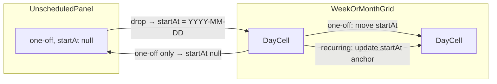
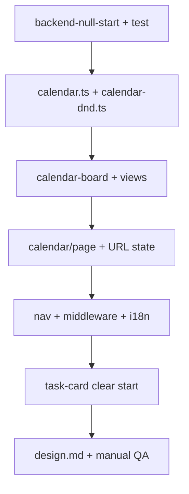
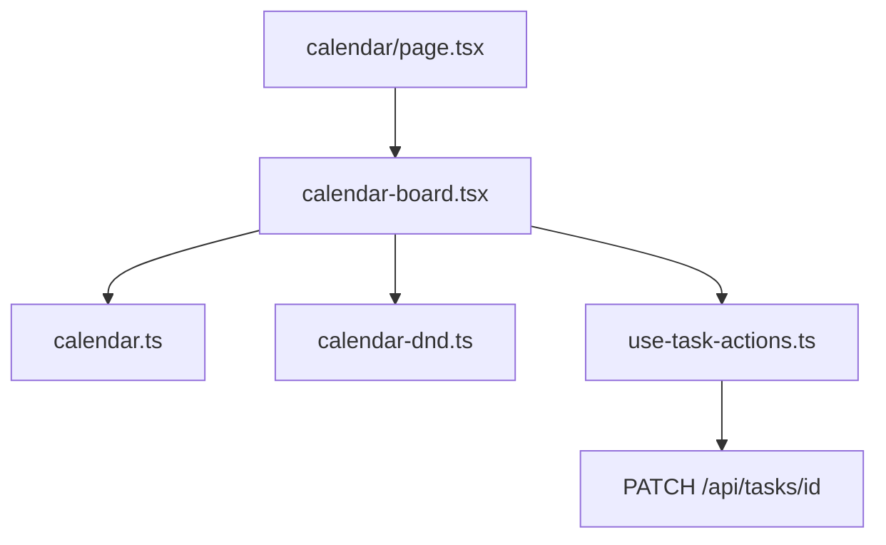

# Calendar 拖拽排期功能

新增 `/calendar` 页面，支持周/月视图切换；左侧「未安排」区域展示无 `startAt` 的一次性任务，用户可通过 @dnd-kit 拖拽到日历日期格（或拖回未安排区），通过现有 PATCH API 更新 `startAt`。

> **Plan 成熟度**：v3 ✅ — 可开工。阻塞项已关闭；剩余风险见「开放风险」。

## 实现清单

- [x] **backend-null-start** — `createTask`: 显式 `startAt: null` 时存 null；`undefined` 仍默认 now；补 integration test
- [x] **calendar-utils** — `src/lib/tasks/calendar.ts` + 单元测试（分区、周/月 grid、appearsOnDay、carry-over）
- [x] **calendar-dnd-helpers** — droppable/draggable id 解析与 `resolveDragDrop()` 纯函数 + 测试
- [x] **calendar-components** — board / week / month / day-cell / unscheduled-panel / task-chip + DnD
- [x] **calendar-page** — `/calendar`：加载、optimistic patch、`?view=&date=`、快速添加、strategy gate
- [x] **nav-middleware-i18n** — app-nav、middleware matcher、en/zh i18n
- [x] **task-card-clear-start** — TaskCard 开始日期支持「清除」（与拖回未安排一致）
- [x] **design-doc** — `design.md` 新增 §7.x Calendar 页面说明

## 目标行为



### 规则表

| 场景 | 规则 |
|------|------|
| 未安排区 | `recurrenceType === "none"` 且 `startAt == null` 且 `status !== "done"` |
| 日历 · 一次性 | 本地 `startAt` 日期 === 该格日期 |
| 日历 · 重复 | `matchesRecurrenceDay()` **或** weekly carry-over 逾期（对齐 `shouldShowOnToday` 的 overdue 分支，仅 `todo`/`in_progress`） |
| 拖拽 → 日期格 | `PATCH { startAt: "YYYY-MM-DD" }` → `normalizeTaskStartAt` → 本地 00:00 ISO |
| 拖拽 → 未安排 | 仅 **一次性** 任务；`PATCH { startAt: null }` |
| 重复任务拖拽 | 允许；只改 `startAt`（作为 anchor，**不改** recurrence）；**不可** drop 到未安排区 |
| 已完成 | 未安排区与日历均不展示 |
| 仅有 `dueAt`、无 `startAt` | 不进日历格；若需排期，从未安排区或 Tasks 页设 `startAt` |

### 重复任务 + `startAt` 的产品语义（已确认）

用户选择「重复任务可拖拽，只改 startAt」。实现语义：

- 日历上仍按 **recurrence 规则** 出现在多个日期（daily 几乎每天可见）。
- 拖拽到某日 = 更新 `startAt` anchor；**不会** 改变 recurrence 或「只出现在该日」。
- UI：重复任务 chip 带 recurrence 小标识（复用 `TaskRecurrenceBadge` 样式或简化版）。
- 拖向未安排区时：对 recurring **禁用 drop**（或 drag 结束后 noop + 无视觉反馈）。

### 现有数据 UX 说明

历史任务创建时 `startAt` 默认为 now，**未安排区初始为空**。用户可通过：(1) Calendar 快速添加（`startAt: null`）；(2) TaskCard 清除开始日期；(3) 从日历拖回未安排区 — 逐步积累 backlog。

---

## 批判性审查（v1 → v2 已修复项）

| 问题 | 严重度 | 处理 |
|------|--------|------|
| 同一 `taskId` 在月视图出现 30+ 次，@dnd-kit 要求 draggable id 唯一 | **阻塞** | 改用 `occurrence:${taskId}:${YYYY-MM-DD}`；drop 时解析 taskId |
| `closestCenter` 来自 sortable 列表，不适合网格 | 高 | Calendar 使用 `pointerWithin` 或 `rectIntersection` |
| 未安排区规则与 recurring 拖拽冲突 | 高 | recurring 禁止 drop 到 unscheduled |
| weekly carry-over 在 Today 可见但计划只用 `matchesRecurrenceDay` | 中 | `taskAppearsOnDay` 纳入 carry-over 逻辑 |
| 刷新丢失当前周/月 | 中 | URL `?date=YYYY-MM-DD&view=week\|month` |
| 无 strategy 时行为未定义 | 中 | 与 Tasks 页一致 → `/onboarding` |
| TaskCard 难以清空 `startAt` | 中 | 纳入 `task-card-clear-start` |
| `resolveTaskStartAt(null)` 测试与 create 行为不一致 | 低 | create 层分支；**不**改 `resolveTaskStartAt` 本身 |
| 改 `startAt` 不影响 priority（仅用 `dueAt`） | 信息 | 无需 recalculate；文档注明 |
| 无验收标准 | 低 | 见下文 Acceptance Criteria |
| 月视图单日任务过多撑破布局 | 低 | 每格最多 3 chip + `+N`；周视图不截断 |
| `useSearchParams` 需 Suspense | 低 | 对齐 `alignment/page.tsx` 拆分 Content |

### 开放风险（接受或后续迭代）

| 风险 | 说明 |
|------|------|
| daily recurring + 改 startAt | 用户可见「仍在每天出现」；靠 recurrence 标记与 tooltip 说明 |
| 日历与 Tasks 双端改日期 | 各页 optimistic 独立；以 PATCH 为准，切换 Tab 时 `load()` 即可 |
| 首版无 chip 内 complete | 有意 defer；避免 DnD 与按钮手势冲突 |

---

## 后端改动

### `createTask`（`src/lib/services/tasks.ts`）

```ts
// 现在
const normalizedStart = resolveTaskStartAt(input.startAt, resolvedTz);

// 改为
const normalizedStart =
  input.startAt === null
    ? null
    : resolveTaskStartAt(input.startAt, resolvedTz);
```

- `input.startAt === undefined` → 行为不变（Tasks 页 `resolveTaskStartAt` 后 POST）
- `updateTask` / `isValidTaskDateRange` 已支持 `startAt: null`

### 测试

- 新增 `createTask` integration test：`startAt: null` 入库为 null
- 现有 `task-dates.test.ts` 中 `resolveTaskStartAt(null)` **保持不变**

---

## 日历工具层

### `src/lib/tasks/calendar.ts`

| 函数 | 说明 |
|------|------|
| `isUnscheduledTask(task, tz?)` | 未安排判定 |
| `taskAppearsOnDay(task, dayInstant, tz, now?)` | one-off + recurring + weekly carry-over |
| `buildWeekDays(anchor, tz)` | 7 天，`startOfLocalWeek` 起 |
| `buildMonthGrid(anchor, tz)` | 5–6 行 × 7 列；`{ date, inMonth }` |
| `startAtForCalendarDay(dateStr, tz)` | PATCH 用 `YYYY-MM-DD` |
| `parseCalendarUrlState(searchParams, tz)` | 解析/默认 `view` + `date` |
| `stepCalendarAnchor(anchor, view, direction, tz)` | prev/next 步进 |

复用 `timezone.ts`；不引入新日期库。

### `src/lib/tasks/calendar-dnd.ts`

| 函数 | 说明 |
|------|------|
| `occurrenceDraggableId(taskId, dateStr)` | `occurrence:${taskId}:${dateStr}` |
| `unscheduledDraggableId(taskId)` | `unscheduled:${taskId}` |
| `dayDroppableId(dateStr)` | `day:YYYY-MM-DD` |
| `UNscheduled_DROPPABLE_ID` | `drop:unscheduled` |
| `resolveDragDrop(activeId, overId, task)` | 返回 `{ taskId, nextStartAt: string \| null } \| null` |

单元测试覆盖：跨日移动、拖回未安排、recurring 拒绝 unscheduled、非法 over id。

---

## UI 结构

### 路由与导航

- `src/app/calendar/page.tsx` — 薄壳 + `Suspense` 包裹 `CalendarPageContent`（对齐 `alignment/page.tsx`）
- `src/components/app-nav.tsx` — Calendar 链接
- `middleware.ts` matcher — `/calendar/:path*`

### URL 状态

| Query | 默认 | 说明 |
|-------|------|------|
| `view` | `week` | `week` \| `month` |
| `date` | 今天（本地） | anchor 日期 `YYYY-MM-DD`；prev/next 更新此值 |

模式参考 `alignment/page.tsx` 的 `?period=`。

### 布局

桌面：左未安排 + 右日历；移动端：未安排在上。顶栏：视图切换、prev/next、Today、可选 `CategoryFilter`（与 Tasks 一致，客户端 filter）。

### 组件

| 文件 | 职责 |
|------|------|
| `calendar-unscheduled-panel.tsx` | 未安排列表 + 快速添加（`POST { title, startAt: null, autoBreakdown: false }`） |
| `calendar-task-chip.tsx` | 紧凑 chip；`useDraggable`；pillar 色点 + recurrence 标记 |
| `calendar-day-cell.tsx` | `useDroppable`；当日 occurrences；月视图 `maxVisible=3` + overflow `+N` |
| `calendar-week-view.tsx` | 7 列 |
| `calendar-month-view.tsx` | 月网格；`inMonth=false` 日期 muted |
| `calendar-board.tsx` | 单一 `DndContext`、`DragOverlay`、导航、drop 处理 |

### 拖拽（@dnd-kit）

**Sensors**（与 `sortable-task-list.tsx` 一致）：

```ts
useSensor(PointerSensor, { activationConstraint: { distance: 8 } })
```

**Collision**：`pointerWithin`（网格优先命中日期格）

**Draggable 来源**：

- 未安排区：`unscheduled:${taskId}`
- 日历格：`occurrence:${taskId}:${dateStr}`（每格独立 id）

**Droppable**：

- `day:YYYY-MM-DD`
- `drop:unscheduled`

**onDragEnd**：

1. `resolveDragDrop()` → `{ taskId, nextStartAt }`
2. optimistic 更新 page `tasks` state
3. `updateTaskDates(taskId, { startAt: nextStartAt })` via `useTaskActions`
4. 失败 revert + `t.errors.updateTaskFailed` toast/inline（与 Tasks 页 `setError` 一致）

**DragOverlay**：渲染被拖 chip 副本（从 activeId 解析 task + 源日期）

**Drop 无效**：over 为 null 或 recurring → unscheduled → 静默取消，不 PATCH

### 数据加载

```ts
GET /api/tasks?sort=manual  // tz 自动 append
```

客户端：

- `enrichTasksWithPillars`
- filter `status !== "done"`
- optional pillar filter
- partition：`isUnscheduledTask` vs calendar `taskAppearsOnDay`

无需新 API。

---

## i18n

`src/lib/i18n/types.ts` 新增 `calendar` namespace + `nav.calendar`；同步 `en.ts` / `zh.ts`：

- 标题、未安排区标题/空态/快速添加
- `viewWeek` / `viewMonth` / `today` / `prev` / `next`
- 拖拽 aria-label；recurring 不可拖至未安排的提示（tooltip 可选）
- 月份标题 formatter：`calendarMonthTitle(year, month)`

---

## TaskCard 小改动

`task-metadata-badges.tsx` · `EditableTaskStartAt`：编辑态增加「清除」按钮 → `onUpdate(null)`。使 Tasks 页与 Calendar 未安排区行为一致。

---

## 测试

| 文件 | 覆盖 |
|------|------|
| `calendar.test.ts` | grid 边界、appearsOnDay、carry-over、DST |
| `calendar-dnd.test.ts` | id 解析、drop 规则、recurring → unscheduled 拒绝 |
| `tasks.integration.test.ts`（或现有） | create with `startAt: null` |
| `calendar-board.test.tsx`（可选） | mock `resolveDragDrop` + optimistic |

---

## 验收标准（Acceptance Criteria）

1. 未安排区仅显示 `recurrence=none && !startAt && active` 任务。
2. 从未安排拖到某日 → 任务出现在该日，从未安排区消失；刷新后仍正确。
3. 一次性任务在日格间拖拽 → `startAt` 更新；拖回未安排 → `startAt` null。
4. daily/weekly 重复任务在对应日期可见；可拖到另一日（更新 startAt），仍按 recurrence 多格显示。
5. 重复任务无法 drop 到未安排区。
6. 周/月切换、prev/next、Today 正确；URL `?view=&date=` 可分享/刷新保持。
7. 无 strategy 跳转 onboarding；middleware 保护 `/calendar`。
8. en/zh 文案完整；移动端布局可用。
9. 单元测试通过；无 duplicate draggable id 控制台警告。

---

## 不在首版范围

- Tasks 页创建默认改为未安排
- 时分粒度 / 时间块高度
- 新 API endpoint
- 日历上 complete/reopen/timer（点 chip 跳转 Tasks 或后续迭代）
- 修改「Tasks 板不做日历过滤」原则（Calendar 为独立页）

---

## 建议实现顺序



---

## 关键依赖


