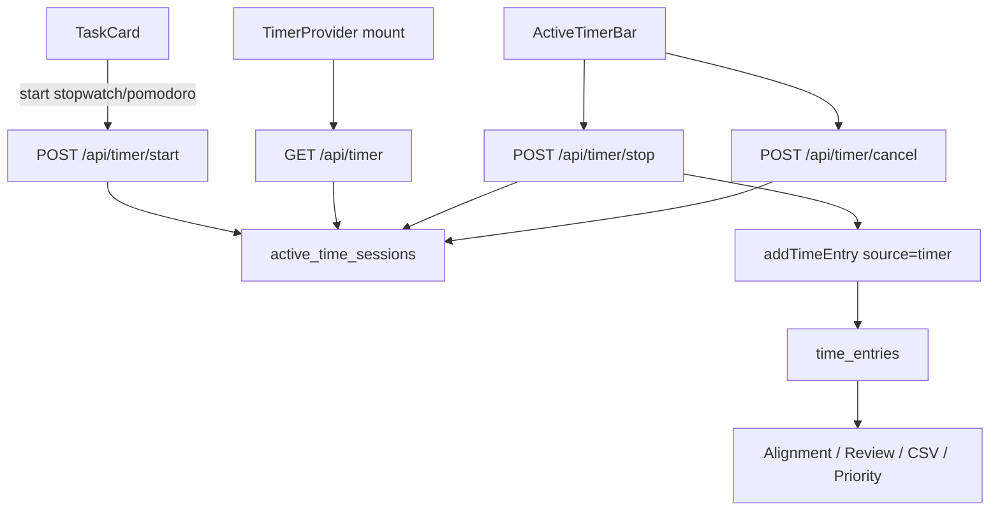

# Timer 功能计划

## 背景

Northstar 已有 append-only `time_entries`（`source: manual | timer`）和 TaskCard 一键 `Log time`，但**没有运行中计时会话**。schema 已预留 `source = "timer"`，下游 Alignment、Review、CSV、优先级引擎均已消费 `time_entries`，计时器只需在停止时正确落库即可复用整条链路。

参考：[`design.md`](design.md) §3.2、§7.4、§11.2；现有实现 [`src/lib/services/tasks.ts`](src/lib/services/tasks.ts) `addTimeEntry()`、[`src/lib/hooks/use-task-actions.ts`](src/lib/hooks/use-task-actions.ts) `logTime()`。

---

## 目标

为 Northstar 增加**服务端持久化**计时器，支持两种模式：

| 模式 | 行为 | 停止后落库 |
|------|------|------------|
| **正向计时** (`stopwatch`) | 用户手动开始，持续累计 | 实际 elapsed 分钟，`source = "timer"` |
| **番茄倒计时** (`pomodoro`) | 选定目标时长倒计时；到 0 后进入超时态，仍继续累计 | 同上：记录**实际** elapsed（非仅目标时长） |

两种模式共用同一 active session 模型；停止后写入现有 `time_entries`，不新增 Alignment / Review 专用管道。

---

## 非目标（v1）

- 休息轮次、连续 Pomodoro 统计、自动开始下一轮。
- 浏览器通知 / 声音提醒（仅页面内视觉提示）。
- 停止时选择「记录目标时长 vs 实际时长」（v1 固定记录实际 elapsed）。
- 运行中切换任务（须先 Stop 或 Cancel 当前 session）。
- 编辑 / 删除已落库的 `time_entries`（与现有 immutable 语义一致）。
- Optimistic UI；沿用现有 mutation 后 `reload()` 模式。

---

## 产品行为

### 通用

- **单用户单 session**：同一 `userId` 最多一个 `active_time_sessions` 行（DB 唯一索引保证）。
- **跨刷新恢复**：刷新、关 tab、换页面后，`GET /api/timer` 恢复任务标题、模式、开始时间、目标时长、当前 elapsed / 剩余 / 超时。
- **服务端时间为准**：elapsed / 剩余 / 落库 duration 均用服务端 `startedAt` 与 stop 时刻计算，不信任客户端时钟。
- **Cancel**：删除 active session，**不**写入 `time_entries`。
- **Stop**：事务内写入 `time_entries` 并删除 active session。
- **手动 Log time 保留**：与 timer 并行可用；不自动结束 active session。
- **任务 `done` 不阻止计时**：允许补记；UI 上 active 任务更突出计时入口即可。

### 正向计时

- 点击 Start → 创建 `mode = stopwatch`、`targetDurationMin = null` 的 session。
- UI 显示 `hh:mm:ss` elapsed。
- Stop → 落库实际分钟数。

### 番茄倒计时

- 点击 Pomodoro → 创建 `mode = pomodoro`、`targetDurationMin = N`（v1 默认 **25**；任务卡提供 15 / 25 / 50 三档，无需独立设置页）。
- UI 显示剩余 `mm:ss`；到 0 后切换为超时态 `+mm:ss`，session **不**自动结束、**不**自动落库。
- 到 0 时任务卡与 Header 做视觉强调（边框/颜色变化）；无声音。
- Stop → 落库**从 startedAt 到 stop 的实际 elapsed**（含超时部分），与正向计时相同规则。

### 分钟取整（与手动 log 对齐）

```ts
durationMin = Math.max(1, Math.round(elapsedMs / 60_000))
```

- 不足 30 秒 stop 仍记 1 分钟（与现有快速 log 粒度一致）。
- `startedAt` 写入 session 真实开始时间；`durationMin` 为取整后的值。

---

## 数据模型

### 新表 `active_time_sessions`

```ts
activeTimeSessions: {
  id: string;
  userId: string;           // NOT NULL，与业务表 user scope 一致
  taskId: string;
  mode: "stopwatch" | "pomodoro";
  startedAt: string;        // ISO，session 开始时刻
  targetDurationMin: number | null;
  note: string | null;
  createdAt: string;
  updatedAt: string;
}
```

**约束**

- `mode = "stopwatch"` → `targetDurationMin IS NULL`
- `mode = "pomodoro"` → `targetDurationMin > 0`
- `taskId` 启动前必须 `fetchTaskById(taskId, userId)` 通过

**索引**

- `UNIQUE idx_active_time_sessions_user (user_id)` — 单用户单 session
- 不需要 `task_id` 索引（按 user 查唯一行即可）

**迁移**

- 更新 [`src/lib/db/schema.ts`](src/lib/db/schema.ts)
- 更新 [`src/lib/db/init-sql.ts`](src/lib/db/init-sql.ts)
- 在 [`src/lib/db/migrations.ts`](src/lib/db/migrations.ts) 新增 `addActiveTimeSessionsTableIfMissing()`，风格对齐 `addCompletionEventsTableIfMissing()`

**与 recurring / 任务删除**

- recurring lazy reset **不**删除 active session；session 仍绑定同一 `taskId`。
- 若 stop 时任务已不存在：事务内仅删除 orphan session，返回 `410 Gone`（不落库）。
- `GET /api/timer` 若 task 已删：仍返回 session，但 `task: null`；UI 提示 Cancel。

---

## API 设计

新增 [`src/lib/services/timers.ts`](src/lib/services/timers.ts)：

| 函数 | 说明 |
|------|------|
| `getActiveTimer(userId)` | 返回 session + task 摘要（title, status, pillarId）或 `null` |
| `startTimer(input, userId)` | 校验 task；若已有 session → 抛冲突 |
| `stopTimer(userId)` | 计算 duration → 调 `addTimeEntry({ ..., source: "timer" })` → 删 session |
| `cancelTimer(userId)` | 删 session，无 entry |

`stopTimer` **复用** [`addTimeEntry()`](src/lib/services/tasks.ts)，在同一事务中完成 insert + delete session，避免半成功状态。

### Routes（均需 `requireUser()`）

| Method | Path | Body | 成功响应 |
|--------|------|------|----------|
| GET | `/api/timer` | — | `{ session: ActiveTimer \| null }` |
| POST | `/api/timer/start` | `{ taskId, mode, targetDurationMin?, note? }` | `{ session: ActiveTimer }` |
| POST | `/api/timer/stop` | — | `{ entry: TimeEntry }` |
| POST | `/api/timer/cancel` | — | `{ ok: true }` |

`ActiveTimer` 响应形状：

```json
{
  "session": {
    "id": "...",
    "taskId": "...",
    "mode": "pomodoro",
    "startedAt": "2026-06-18T15:00:00.000Z",
    "targetDurationMin": 25,
    "note": null
  },
  "task": {
    "id": "...",
    "title": "Write investor deck",
    "status": "in_progress"
  },
  "serverNow": "2026-06-18T15:12:34.567Z"
}
```

`serverNow` 供前端对齐显示；客户端每秒本地 tick，仅在 start/stop/cancel/页面 focus 时 re-fetch。

### 错误码

| 场景 | HTTP | Body |
|------|------|------|
| 未登录 | 401 | 现有 auth 错误 |
| task 不存在或非本人 | 404 | `{ error: "Task not found" }` |
| 已有 active session | 409 | `{ error: "Timer already running", session: ActiveTimer }` |
| stop/cancel 无 session | 404 | `{ error: "No active timer" }` |
| stop 时 task 已删 | 410 | `{ error: "Task no longer exists" }` |
| 非法 mode / pomodoro 缺 target | 400 | `{ error: "Invalid timer input" }` |

### 幂等

- 重复 `stop` / `cancel` 在无 session 时返回 404，不重复写 entry。
- 重复 `start` 在已有 session 时返回 409 + 当前 session，前端可引导用户先结束。

---

## 前端架构

### TimerProvider（layout 级）

在 [`src/app/layout.tsx`](src/app/layout.tsx) 内、`AppHeader` 之上挂载 `TimerProvider`：

- mount 时 `GET /api/timer`
- 暴露 `{ session, task, serverSkew, start, stop, cancel, refresh }`
- `useInterval(1000)` 驱动 display tick（仅 UI，不 ping API）
- `document.visibilitychange` → visible 时 `refresh()`，纠正 tab 后台漂移

共享工具：[`src/lib/timer/display.ts`](src/lib/timer/display.ts)

- `formatStopwatchElapsed(ms) → "hh:mm:ss"`
- `formatPomodoroRemaining(ms, targetMin) → "mm:ss" | "+mm:ss"`
- `isPomodoroOvertime(ms, targetMin) → boolean`

### 任务卡

文件：[`src/components/task-card/task-action-bar.tsx`](src/components/task-card/task-action-bar.tsx)、[`src/components/task-card/index.tsx`](src/components/task-card/index.tsx)

| 状态 | 按钮 |
|------|------|
| 无 active session | `Start timer` · `Pomodoro ▾`（15/25/50）· 保留 `Log time` |
| 当前 task 计时中 | elapsed / countdown · `Stop` · `Cancel` |
| 其他 task 计时中 | Start/Pomodoro disabled + tooltip「已在「{title}」计时」 |

Pomodoro 下拉可用原生 `<select>` 或轻量 popover；默认选中 25。

### 全局 Header

文件：[`src/components/app-header.tsx`](src/components/app-header.tsx) + 新组件 `active-timer-bar.tsx`

- 无 session：不占位
- 有 session：紧凑条 — 任务标题 · 时间 · Stop · Cancel
- 番茄 overtime：accent 背景或 pulse 边框

### 与现有 reload 的关系

- `stop` 成功后：`TimerProvider.refresh()` + 页面现有 `reload()`（Alignment KPI、优先级 intimidation 因子依赖 logged min，需 full reload）。
- `start` / `cancel`：仅 refresh timer state，**不**强制整页 reload。

### i18n

更新 [`src/lib/i18n/messages/en.ts`](src/lib/i18n/messages/en.ts) 与 [`src/lib/i18n/messages/zh.ts`](src/lib/i18n/messages/zh.ts)：

- `timer.start` / `timer.pomodoro` / `timer.stop` / `timer.cancel`
- `timer.runningOnOtherTask` / `timer.overtime` / `timer.noActive`
- `errors.startTimerFailed` / `errors.stopTimerFailed` / `errors.cancelTimerFailed`

---

## 数据流



---

## 实现顺序

1. **Schema + migration** — `active_time_sessions` 表与唯一索引
2. **Service** — `timers.ts` + 单元/集成测试
3. **API routes** — `/api/timer/*` + auth isolation
4. **Display helpers** — `formatStopwatchElapsed` / pomodoro 格式化测试
5. **TimerProvider + Header** — 全局恢复与 stop/cancel
6. **TaskActionBar** — start / pomodoro preset / 状态切换
7. **i18n + design.md** — 文档与文案
8. **手动验收** — 见下

---

## 测试计划

### 服务层 [`src/lib/services/timers.integration.test.ts`](src/lib/services/timers.integration.test.ts)

- [ ] stopwatch：start → stop 写入 entry（`source=timer`，`startedAt` 正确，`durationMin >= 1`）
- [ ] pomodoro：start(25) → stop 记录实际 elapsed（含模拟超时）
- [ ] 已有 session 再 start → 409
- [ ] cancel → 无 entry，session 清空
- [ ] 跨用户 taskId → 404
- [ ] stop 时 task 已删 → 410，session 清除，无 entry
- [ ] 重复 stop → 404

### Auth [`src/lib/services/auth-isolation.integration.test.ts`](src/lib/services/auth-isolation.integration.test.ts) 或 timer 专用

- [ ] 用户 A 不能 start 用户 B 的 task
- [ ] 用户 A 不能 stop 用户 B 的 session（无 session 404）

### Display [`src/lib/timer/display.test.ts`](src/lib/timer/display.test.ts)

- [ ] stopwatch 格式化
- [ ] pomodoro 剩余与 overtime `+mm:ss`
- [ ] `durationMin` 取整边界（29s→1, 90s→2）

### 组件（可选，高价值）

- [ ] TaskActionBar 三态按钮
- [ ] Header 在 overtime 时样式变化

### 手动验收

1. 正向计时：Start → 刷新仍显示 → Stop → Alignment「本周记时」增加
2. Pomodoro 25min：启动后显示倒计时 → 调短系统时间或 mock 测 overtime UI → Stop → CSV 中 `source=timer`
3. 任务 A 计时中，任务 B 的 Start 被禁用
4. Cancel 后 Alignment 不变
5. 计时中手动 Log time 仍可用，两条 entry 独立存在

---

## design.md 更新要点

在 §3.2 补充 `active_time_sessions` 表说明；§7.4 增加 timer API 与两种模式；§10 API 表增加 `/api/timer*`；§11 增加 `TimerProvider`。

---

## 后续增强

- Pomodoro 停止弹窗：「记录目标时长 / 实际时长」
- 休息倒计时 + session 计数
- `in_progress` 自动切换：start timer 时 PATCH task status（v1 不做，避免与 done/reopen 语义纠缠）
- 浏览器 Notification API
- 时间记录列表页（`GET /api/time-entries` 已有，UI 未接）
